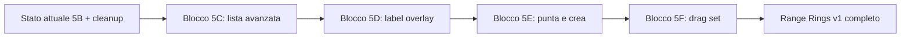

# Piano Range Rings 5C–5F (lista, label overlay, punta e crea, drag centro)

**Pubblicazione memoria orchestratore** su comando «aggiornati» (2026-04-29). Origine testuale: piano Cursor locale `range_rings_5c-5f_b5ce10b2.plan.md` (stesso contenuto sotto, senza frontmatter YAML del tool Plan).

---

# Piano tecnico Range Rings 5C-5F (lista, label, autocreate, drag)

## Contesto rilevato (locale, no remoto)

- Monolite: `coordinate_converter Claude.html`, single-file standalone.
- Stato Range Rings:
  - Persistito: `state.rangeRingSets[]` (cap 20), shape: `{ id, name, center{lat,lon}, distancesM[], unit, color, strokeWidth, opacity, labelMode, visible, createdAt }` — `labelMode` gia' nel modello, **mai usato** nell'overlay.
  - Transiente: `state._rangeRingsSelectedIds` (Set), `state.rangeRingsPickCenterMode`, `state._rangeRingsMapPickCenter`, `state.rangeRingsPanelOpen`.
- Renderer: `renderRangeRingsPanel` / `renderRangeRingsList` / `renderRangeRingsOverlay` (SVG, niente label, niente interazione).
- Helper: `buildGeodesicCircleRing`, `rangeRingSetToGeoJSON`, `rrGetCenterFromUi`, `rrCreateFromUi`, `rangeRingsEnterPickCenterMode`, `rangeRingsClearPickCenterMode`.
- Pan + pick: `attachPanHandlers` (mouse+touch separati, dead-zone 3px); `CTRL_SEL` ignora `.trr-btn`, `.trk-handle`, `.wpt-handle`, etc.
- Drag overlay esistente (pattern di riferimento per 5F): doc-level pointer events su `.trk-handle` / `.wpt-handle`, conversione client->lat/lon via `mapClientToLatLonMap`, persistenza `saveStore()` solo on-up.
- Lista attuale `#rrList` usa `.rr-row` (flex), checkbox sel + checkbox vis per riga, **diversa** dal pattern Saved Tracks / Offline Areas (tabella sticky + indicatore vis + batch bar).

---

## FASE 1 — Lista avanzata coerente (Blocco 5C)

### Confronto pattern lista esistenti

- **Waypoints** (`renderWpModalList`): tabella `<table.wp-modal-table>`, checkbox sel + select-all, **indicatore** vis (no toggle riga), rename inline (input + confirm + Esc revert via hook globale `ensureGisInlineRenameKeyboardHooks`), azioni per riga (edit/centra/delete), batch *delete-selected*.
- **Saved Tracks** (`renderSavedTracksList`): tabella `<table.saved-tracks-table>`, sel persistito in `state._savedTracksSelectedIds`, indicatore vis, rename inline + confirm, batch *show/hide selected* + *show/hide all* + *show only selected* + *delete selected*, fly-to per riga.
- **Offline Areas** (`renderOfflineAreasList`): tabella, shift-range select, batch *show/hide/delete/precache selected*, rename inline + confirm.

### Proposta lista RR 5C (modello "Saved Tracks-like")

- **Markup**: `<table class="rr-table">` dentro `.rr-table-wrap` (scroll + sticky header), colgroup + thead + tbody.
- **Colonne consigliate**:
  1. **Sel** (checkbox + select-all `#rrSelectAll`, `[data-rr-sel]`).
  2. **Vis** (indicatore solo, classe `.rr-vis-indicator is-visible|is-hidden`; cambio via batch o action per riga).
  3. **Nome** (input inline `.rr-name-inp[data-rr-rename]`, confirm + Esc revert via hook globale).
  4. **Centro** (riassunto coord, `rrCenterSummary`).
  5. **Anelli** (es. "5/10/25 km").
  6. **Quando** (`createdAt`, formato locale come Saved Tracks).
  7. **Azioni**: `Centra` (fly-to ai bounds del set), `GeoJSON` (export per riga, riusa esistente), `Modifica` (placeholder hidden in 5C, abilitato in blocchi successivi), `Elimina`.
- **Editabili subito**: solo `name` (rename inline). Anche toggle `visible` via click sull'indicatore (consentito): scelta **sicura** = lasciare toggle vis solo via batch; click sull'indicatore = no-op (per coerenza con Saved Tracks/Offline). [Decisione: indicatore puro + batch.]
- **Da rimandare** (a 5D / 5F / blocco editor): edit `color`, `strokeWidth`, `opacity`, `labelMode`, `unit`, `distancesM` (apertura editor del set fuori scope 5C), spostamento centro (5F).
- **Pulsanti per riga**: Centra, GeoJSON, Elimina. (Modifica = placeholder, abilitato dopo).
- **Azioni batch (toolbar `#rrBatchBar`)**:
  - Mostra selezionati (`btnRrShowSelected`).
  - Nascondi selezionati (`btnRrHideSelected`).
  - Mostra solo selezionati (`btnRrShowOnlySelected`).
  - Mostra tutti (`btnRrShowAll`).
  - Nascondi tutti (`btnRrHideAll`).
  - Elimina selezionati (`btnRrDeleteSelected`).
  - Esporta selezionati (riusa `exportSelectedRangeRingSetsGeoJSON`).
- **Rischio**: regressione handler delegation `#rrList.click/change` (oggi `[data-rr-sel]`, `[data-rr-vis]`, `[data-rr-exp]`, `[data-rr-del]`); va riscritta per nuovi data-attr (`[data-rr-rename]`, `[data-rr-fly]`, `[data-rr-edit]`).
- **Test**: vedi blocco 5C piu' sotto.

---

## FASE 2 — Label/titolo overlay (Blocco 5D)

### Analisi overlay attuale

- `renderRangeRingsOverlay` crea un singolo `<svg>` per `<.tile-layer>` con polyline per ring; nessun marker centro, nessuna label.
- `s.labelMode` esiste in shape ma forzato a `"off"` in `rrCreateFromUi`.

### Soluzione consigliata

- **Renderer SVG `<text>`** dentro lo stesso `<svg>` (no DOM HTML, no marker layer separato): coerente con minimal overlay attuale, zero costi prestazione aggiuntivi.
- **Posizionamento**: a fianco del **centro** (proiettato via `tileMapLatLonToPx`), offset `+10px,-6px`, classe `.rr-label`. Niente collision-detection in 5D.
- **Contenuto**: `s.name` (truncate ~40 char). Distanze sui singoli anelli **rimandate** a blocco successivo per evitare clutter.
- **Stile**: `.rr-label { font: 11px/1.2 system-ui; fill: var(--text); paint-order: stroke; stroke: rgba(255,255,255,.85); stroke-width: 2px; pointer-events: none; }` (alone bianco per leggibilita').
- **`labelMode`**: estendere semantica a `"off" | "name"` (default `"name"` per nuovi set creati in 5D; vecchi set sanitizzati restano `"off"` finche' non aggiornati). Toggle UI globale `state.rangeRingsLabelsVisible` (transiente o persistito) **rimandato**.
- **Aggiorna su pan/zoom**: gia' coperto perche' `renderRangeRingsOverlay` viene chiamato in `renderTileMap`/`refreshRangeRingsAfterStateChange`.
- **Rischio prestazioni**: trascurabile (cap 20 set, 1 testo per set).

### Cosa rimandare

- Etichette per singolo ring (distanza per ogni cerchio).
- Toggle UI label on/off (puo' arrivare insieme a 5F come "Mostra etichette").
- Collision-avoidance.

---

## FASE 3 — Auto-creazione da click (Blocco 5E)

### Analisi flusso attuale

- "Punta sulla mappa" arma `rangeRingsPickCenterMode`; al click `attachPanHandlers.onUp` (branch 3) salva `_rangeRingsMapPickCenter` e disarma. L'utente poi preme "Crea anelli" → `rrCreateFromUi`.
- `rrCreateFromUi` valida centro + distanze + unita'; in caso di errore mostra errore inline.

### Soluzione consigliata: **due pulsanti separati**, "Punta centro" e "Punta e crea"

- **Pulsante 1 — esistente** "Punta sulla mappa" (`#rrPickMapBtn`): comportamento invariato (5B). Imposta solo il centro.
- **Pulsante 2 — nuovo** `#rrPickCreateBtn` "Punta e crea" (i18n `rangeRings.pickCreate` / `rangeRings.pickCreateTip`).
  - **Pre-validazione** prima di armare: legge `#rrDistances` + `#rrUnit`, chiama `parseRangeRingDistancesInput`. Se invalide → errore `rangeRings.err.distances` e **non arma**.
  - Se valide: arma una variante di pick mode (`state.rangeRingsPickAndCreateMode = true`) — flag separato dal pick "solo centro" per branchare `onUp` in modo diverso.
- **Branch in `attachPanHandlers.onUp`**: aggiunto sopra al branch RR pick center (priorita'), simmetrico:
  - `state.rangeRingsPickAndCreateMode && !drag.moved` → `mapClientToLatLonMap` → set `_rangeRingsMapPickCenter` → invoca `rrCreateFromUi()` (modalita' `picked` gia' coerente; lui gestisce errori). Disarma flag, refresh overlay/lista.
- **Mutua esclusivita'**: `rangeRingsEnterPickAndCreateMode()` chiama `trackExitPickMode()`, azzera `mapPickMode`, `mapMeasureMode`, `state.rangeRingsPickCenterMode`. `rangeRingsClearAllPickModes()` helper unico (rifattorizzato leggero).
- **Esc**: estendere il branch Esc in `bindHotkeys` (gia' su `rangeRingsPickCenterMode`) anche su `rangeRingsPickAndCreateMode` → clear + refresh.
- **Chiusura pannello durante pick**: `closeRangeRingsPanel` gia' chiama `rangeRingsClearPickCenterMode`; aggiungere clear `rangeRingsPickAndCreateMode`.
- **Eviti waypoint/track/measure accidentali**: i branch attuali sono mutuamente esclusivi e l'inserimento *prima* di trackPick/waypointPick e' sufficiente (gia' fatto per RR pick center).

### Rationale "due pulsanti" vs toggle

- **Sicurezza**: due bottoni rendono l'intent esplicito (un click = una creazione vs un click = solo centro). Un toggle silenzioso e' piu' "magico" e l'utente potrebbe creare set per errore.
- **Coerenza UX**: piu' affine al pattern delle altre liste (azioni esplicite). Il toggle resta opzione futura senza costi se servisse.

### Rischi 5E

- Doppia variabile pick mode → necessario helper `rangeRingsClearAllPickModes()` invocato in `openWaypointModal/openTrackModal/activateTab/closeRangeRingsPanel/prepareUiBeforeAppFullReset`.
- Touch: gia' coperto perche' `attachPanHandlers` gestisce touch separati con `passive:false`.

---

## FASE 4 — Drag spostamento set (Blocco 5F)

### Analisi pattern drag esistenti

- Track / Waypoint usano **doc-level pointer events** su `.trk-handle` / `.wpt-handle` (SVG `<g>` con `data-id`). Move = update state + re-render overlay solo. Up = `saveStore()` + render full.
- `mapClientToLatLonMap` converte `clientX/Y` → lat/lon (no calcoli trig manuali sul delta).
- Pan ignora i selettori in `CTRL_SEL` che gia' include `.trk-handle` / `.wpt-handle`.

### Soluzione consigliata: **maniglia centro dedicata** (`.rr-handle`) con drag pointer

- **Aggancio**: `renderRangeRingsOverlay` aggiunge un piccolo cerchio SVG **al centro** di ogni set visibile, classe `.rr-handle`, `data-rr-set-id`. Stile: `r=6`, fill semitrasparente del colore `s.color`, contorno bianco, `cursor:grab`, `pointer-events: auto`. Visibile solo se `s.visible !== false` e (proposto) **solo quando** "Modalita' Sposta" attiva oppure il set e' selezionato in lista (per evitare clutter durante uso normale).
- **Modalita' Sposta esplicita**: nuovo flag `state.rangeRingsMoveMode` (transient). Toggle batch "Sposta selezionati" (`btnRrMoveSelected`) accende il flag e mostra `.rr-handle` solo per i set selezionati. Esc disattiva la modalita'.
- **Drag**: `pointerdown` su `.rr-handle` → `stopPropagation()` + `preventDefault()` + `mapRrDocDrag = { pid, setId, root, ... }` → doc listener in capture (stesso schema di `mapWptDocDragMove/Up`).
- **Move**: `mapClientToLatLonMap` → aggiorna `s.center = {lat,lon}` → `renderRangeRingsOverlay` (light) — niente `saveStore` durante move.
- **Up**: `saveStore()` + `refreshRangeRingsAfterStateChange()` + cleanup listener.
- **Includere `.rr-handle` in `CTRL_SEL`** del pan per evitare hijack.
- **Touch/mobile**: pointer events coprono pointerType `touch` (testato per track/waypoint).

### Alternative scartate

- Drag dal **ring**: rischio conflitto pan, performance (hit-test su polyline), confusione (utente potrebbe credere di ridimensionare il raggio). **Scartato**.
- Drag dal **centro sempre attivo** (senza modalita'): rischio click accidentali. **Scartato**.

### Cosa rimandare a blocco successivo

- Ridimensionamento singolo ring per drag.
- Maniglia rotazione (n/a per cerchi geodetici).
- Editor avanzato del set (color/icon/strokeWidth) — aprira' un sub-modal "Modifica set" da 5C bottone "Modifica".

### Rischi 5F

- Conflitto con pan se `.rr-handle` non e' in `CTRL_SEL`.
- Re-render overlay 60fps potrebbe essere costoso con molti ring/punti per set; soluzione: in move non re-renderizzare i polyline ma solo traslare il `<g>` con `transform`, ricalcolando ring solo on-up. Variante consigliata.
- Stato `rangeRingsMoveMode` deve resettarsi su Esc / chiusura pannello / cambio tab / open Track-Waypoint modal.

---

## FASE 5 — Ordine blocchi piccoli e sicuri

### Blocco 5C — Lista avanzata coerente (PRIMO)

- **Obiettivo**: tabella RR coerente con Saved Tracks / Offline Areas (sticky, batch, rename inline).
- **File/regioni**: `#sec-rangerings` HTML, CSS `.rr-row` -> nuove `.rr-table*`, JS `renderRangeRingsList`, `bindRangeRingsUI` (delegation), nuovi handler batch.
- **Funzioni nuove/modificate**: `renderRangeRingsList` (riscritta), `rrFlyToSetById`, `rrApplyVisibilityIds(ids,wantVisible)`, `rrApplyVisibilityOnlyIds(ids)`, `rrApplyVisibilityAll(wantVisible)`, `rrDeleteSetIds(ids)`; estensione delegation per `[data-rr-rename]`, `[data-rr-fly]`, `[data-rr-edit]` (placeholder hidden), `[data-rr-del]` (per riga e batch).
- **i18n**: nuove chiavi `rangeRings.col.*`, `rangeRings.batch.*`, `rangeRings.fly`, `rangeRings.renameConfirm`, IT/EN/FR.
- **Rischio**: medio (riscrittura lista). Mitigazione: dimensione contenuta (cap 20 set), pattern gia' rodato in Saved Tracks.
- **Test browser**: apri pannello, crea N set, rename inline + Esc revert, vis batch, delete batch, export selezionati invariato, fly per riga centra mappa.
- **QA tecnico**: `git status --short`, `git diff --stat`, `git diff --check -- "coordinate_converter Claude.html"`, estrazione JS inline + `node --check`.
- **Non toccare**: pick centro 5B, overlay, export GeoJSON, Mappe Offline, Track, Waypoint.

### Blocco 5D — Label/titolo overlay

- **Obiettivo**: SVG `<text>` con `s.name` accanto al centro del set.
- **File/regioni**: `renderRangeRingsOverlay` (`coordinate_converter Claude.html` ~22729-22793), CSS nuova `.rr-label`.
- **Funzioni**: aggiungere creazione `<text>` per ogni set visibile. Helper `rrLabelText(s)` (oggi = `s.name`).
- **Rischio**: basso. Mitigazione: nessuna interazione, `pointer-events:none`.
- **Test browser**: label visibile, leggibile, segue pan/zoom, no flicker. Toggle vis/nascondi rimuove label.
- **QA tecnico**: idem 5C.
- **Non toccare**: layout pannello, lista 5C, export.

### Blocco 5E — Punta e crea

- **Obiettivo**: pulsante "Punta e crea" (`#rrPickCreateBtn`) che pre-valida distanze, arma pick `rangeRingsPickAndCreateMode`, al click crea il set.
- **File/regioni**: HTML `#sec-rangerings` (nuovo bottone), JS `bindRangeRingsUI` (binding), `attachPanHandlers.onUp` (nuovo branch prima di RR pick center), helper `rangeRingsEnterPickAndCreateMode`, `rangeRingsClearPickCenterMode` rinominato/affiancato a `rangeRingsClearAllPickModes`.
- **i18n**: `rangeRings.pickCreate`, `rangeRings.pickCreateTip`, `rangeRings.err.distancesPre`.
- **Rischio**: medio (nuovo branch in pan handler). Mitigazione: pattern simmetrico a 5B; test mutua esclusivita' Track/Waypoint/Measure.
- **Test browser**: distanze invalide -> errore + niente arming; valide -> click mappa crea set; Esc disarma; chiusura pannello disarma; nessun waypoint/traccia accidentale; coexist con 5B "Punta sulla mappa".
- **QA tecnico**: idem.
- **Non toccare**: 5C lista, 5D label.

### Blocco 5F — Drag set (centro)

- **Obiettivo**: maniglia centrale `.rr-handle`, modalita' `state.rangeRingsMoveMode`, drag con doc-level pointer events.
- **File/regioni**: `renderRangeRingsOverlay` (aggiunta `<circle.rr-handle>`), nuovi `mapRrDocDrag`/`Move`/`Up`/`Cleanup` (modello `mapWptDoc*`), `bindHotkeys` (Esc), `closeRangeRingsPanel`, `prepareUiBeforeAppFullReset`, `attachPanHandlers` (`CTRL_SEL` += `.rr-handle`), batch toolbar `#rrBatchBar` (`btnRrMoveSelected`).
- **i18n**: `rangeRings.move.batch`, `rangeRings.move.tip`.
- **Rischio**: alto (interazione overlay + pan + perf). Mitigazioni:
  1. Modalita' esplicita `rangeRingsMoveMode` (no drag accidentale).
  2. Move = traslazione `<g>` via transform, ricomputo ring solo on-up.
  3. `.rr-handle` in `CTRL_SEL`.
  4. Esc/chiusura pannello/apertura altri modali resettano la modalita'.
- **Test browser**: attivazione/disattivazione modalita', drag desktop+touch, pan non hijackato, persistenza (`saveStore` on-up), label 5D segue il centro durante drag, export GeoJSON contiene nuovo centro.
- **QA tecnico**: idem.
- **Non toccare**: pattern drag track/waypoint, Mappe Offline, Track modal, Waypoint core.

---

## FASE 6 — Serve consolidamento prima di 5C?

**Risposta: NO** — partire direttamente da **5C**.

- **Motivazione**:
  1. Lo stato Range Rings e' gia' coerente (sanitize/save/load + selection transient + cap 20).
  2. Il floating panel e' stabile (5A/5A-bis/5A-ter).
  3. I pattern lista da copiare (Saved Tracks / Offline Areas) sono completi e applicabili senza refactor del core RR.
  4. Un "consolidamento pick mode orchestrator" centralizzato (es. `setActivePickMode(name)`) sarebbe utile **ma** invasivo (tocca Track/Waypoint/Measure/Map/Range Rings); rifiutato per principio "Rejected patterns" (refactor architetturale) e perche' non sblocca 5C/5D.
  5. La piccola estrazione di `rangeRingsClearAllPickModes()` puo' essere fatta **dentro** 5E senza un blocco dedicato.

**Primo blocco consigliato: 5C (lista avanzata)**.

---

## FASE 7 — Autosync orchestratore (eseguito con «aggiornati»)

- Aggiornamento `docs/orchestrator/latest.md` (sintesi piano + puntatore inbox).
- Questo file `docs/orchestrator/inbox/2026-04-29_2130_plan_range-rings-next-ui-label-autocreate-drag.md` con il piano completo.
- Commit/push **selettivo** della sola memoria orchestratore.
- **Esclusi** dal commit: `coordinate_converter Claude.html`, `docs/checkpoint.md`, `docs/session-geolocalizzazione-e-mappa.md`, `docs/roadmap.md`.
- **Niente** comando `finito`.

---

## Rischi principali (sintesi)

1. **5C — riscrittura lista**: regressione delegation handler (sel/vis/exp/del → fly/rename/edit/del/batch). Mitigazione: mantenere export per riga + i18n consolidato.
2. **5D — label overlay**: clutter visivo con tracce/waypoint sovrapposti. Mitigazione: paint-order + alone bianco; toggle globale rimandato.
3. **5E — auto-creazione**: trigger non desiderato. Mitigazione: bottone separato + pre-validazione distanze + Esc + clear su chiusura pannello.
4. **5F — drag**: conflitto pan, performance overlay, stato modalita' "Sposta" residuo. Mitigazioni: `CTRL_SEL`, traslazione `<g>` in move + ricomputo on-up, reset modalita' in tutti i punti di chiusura/cambio contesto.

---

## Conferme finali

- **Monolite NON modificato in questo turno**: confermato (solo pubblicazione memoria).
- **`finito` NON eseguito**: confermato.
- Aree esplicitamente non toccate dal piano: Mappe Offline, reset totale, CoT, geocoding, OPSEC, GPS live/watchPosition, Track modal core, Waypoint core, Converti/Favoriti/Search, export non Range Rings, `state.mapWaypoints[]`, coord-cycle, `docs/checkpoint.md`, `docs/session-geolocalizzazione-e-mappa.md`, `docs/roadmap.md`.
