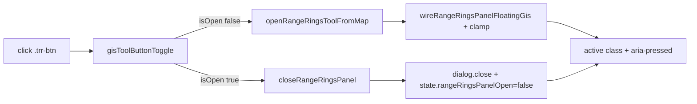

# Piano — Range Rings Blocco 1 UI/UX standardizzazione

**Stato:** pianificato in Cursor; **non ancora implementato** nel monolite.  
**File operativo previsto:** `coordinate_converter Claude.html` (nessuna modifica al momento di questo salvataggio).

**Scopo:** allineare Range Rings al pattern UI dei pannelli GIS già esistenti (toggle pulsante mappa, lista/azioni uniformi, default distanza `1, 5, 10 km`, drag con offset parziale fuori viewport tramite `gisPanelClampRect` esteso a tutti i pannelli GIS). Nessuna riscrittura massiva, nessun framework.

---

## Todo operativi (checklist implementazione)

1. **PARTE 1:** helper `gisToolButtonToggle`, listener toggle in `renderTileMap`, icona Rings senza label inline, classe `.active` / `aria-pressed` da `state.rangeRingsPanelOpen`, rimozione tile Range Rings da “Altri strumenti”.
2. **PARTE 2:** verifica I/O ghost/secondary; rimuovere `data-rr-exp` per riga (vedi PARTE 4); nessuna primary blu impropria su Import/Export.
3. **PARTE 3:** nascondere `#rrPickMapBtn` e `#rrCreateBtn`; promuovere `#rrPickCreateBtn` a primary; default `value="1, 5, 10"` su `#rrDistances` e `selected` su `<option value="km">`.
4. **PARTE 4:** i18n `rangeRings.colWhen` IT/EN/FR → Data / Date / Date; restyling azioni riga (icona Modifica, no label Elimina visibile, no `data-rr-exp`).
5. **PARTE 5:** estendere `gisPanelClampRect` con `minVisible` (default ~80px) per tutti i pannelli GIS.
6. **PARTE 6:** `rrShowInfo("rangeRings.notice.renamePending")` su rename pending; nuove keys `rangeRings.notice.renamePending`, `tip.rangeRingsEditIcon` IT/EN/FR.
7. **QA:** `git diff --stat`, `git diff --check`, `node --check` JS estratto, test manuali elenco piano.
8. **Post-implementazione:** autosync riepilogo implementazione in inbox + aggiornamento `latest.md` (da fare solo dopo il codice).

---

## File toccato (implementazione — uno solo)

- `coordinate_converter Claude.html`

## Stato corrente rilevato (da preservare dove indicato)

- Pulsante mappa `[data-role="rangerings-open"]` → oggi chiama solo `openRangeRingsToolFromMap()`, non toggle.
- Voce Range Rings nel drawer “Altri strumenti” (`data-tool-target-sec="sec.rangerings"`).
- Pannello floating RR: close X uniforme, drag/resize esistenti, `clampRangeRingsPanelRect` → `gisPanelClampRect`.
- Bug `renderRangeRingsList ↔ rrCancelPendingRename`: fix con `if (p)` prima di `renderRangeRingsList()` — **non reintrodurre ricorsione**.
- Fix hydrate `_mapTileGen` / `AbortController` / `syncOfflineDeltaViewportHints` — **non toccare** in questo blocco UI.
- Notifiche RR: `#rrError`, `#rrOk`, `#rrInfo`, `#rrDeleteConfirm`, `#rrRenameConfirm` — riusare.

## PARTE 1 — Pulsante Rings sulla mappa (toggle + leggibilità)

1. In `renderTileMap()` sostituire rendering bottone: rimuovere label testuale inline; ingrandire icona (es. `◎` via CSS `.trr-btn`); `aria-pressed` + `.active` quando pannello aperto.
2. Listener: toggle tramite helper `gisToolButtonToggle({ isOpen, open, close })`; **non** modificare listener Misura/Track/Waypoint esistenti salvo riuso volontario dell’helper dove già sicuro.
3. Rimuovere tile Range Rings dalla griglia “Altri strumenti”; mantenere keys `tools.rangerings*` per compatibilità.

## PARTE 2 — Import / Export

- Verificare assenza primary blu su Import/Export.
- Rimuovere export GeoJSON da riga tabella (`data-rr-exp`); export coperto da batch / `#rrExportAllSetsBtn` ecc.
- Opzionale: classe `ghost` su bottoni export/import se coerente post-render.

## PARTE 3 — Azioni creazione

- Nascondere `#rrPickMapBtn`; `#rrPickCreateBtn` primary; nascondere `#rrCreateBtn` se duplica flusso pick+crea.
- Default distanze `1, 5, 10` + unità `km` selezionata; logica matematica anelli invariata.

## PARTE 4 — Lista uniforme

- Label colonna: aggiornare soli valori di `rangeRings.colWhen` → “Data” / “Date” / “Date”.
- Azioni riga: icona Modifica, fly coerente, delete solo ✕ con tooltip/aria; nessun GeoJSON su riga.

## PARTE 5 — Pannello / clamp generale

- Estendere `gisPanelClampRect(rect, opts)` con `minVisible` (default ~80px) per **tutti** i pannelli GIS (decisione utente).
- Test su Track, Waypoint, Convert, Search, Favorites, Layers, Range Rings dopo implementazione.

## PARTE 6 — Notifiche e i18n

- Notifica leggera rename pending via `#rrInfo`.
- Nuove stringhe IT/EN/FR per `rangeRings.notice.renamePending` e `tip.rangeRingsEditIcon`.
- Nessun `alert` / `prompt` / `confirm` nativi; niente `data-i18n-html` non necessario.

## PARTE 7 — Vincoli

- Non toccare: hydrate tile, IDB tile offline core, Misura, Track core, Waypoint core, reset, OPSEC, GPS, geocoding, `docs/roadmap.md`, workflow `finito`.
- Non aggiungere framework/dipendenze/debug ingest.

## QA (dopo implementazione)

Vedi elenco test nel piano originale Cursor (toggle, zero set, rename, drag clamp, console pulita, ecc.).

## Diagramma toggle (riferimento)

## Rischi residui (post-implementazione)

- Clamp più permissivo globale → richiede regressione visiva su tutti i pannelli GIS.
- Rimozione tile drawer → ingresso solo da pulsante mappa (già presente).
