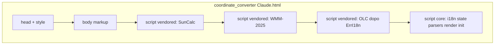

# Pass 4A — Piano Tier 1 vendored split (single-file HTML)

**Timestamp file:** `2026-05-01_0241` (da `date '+%Y-%m-%d_%H%M'`).

## Vincolo

Questo documento è **solo piano operativo**. Nessuna implementazione, nessuna modifica a `coordinate_converter Claude.html`, nessun split eseguito in questa fase. L’implementazione richiede **conferma esplicita dell’utente** prima di qualsiasi modifica al monolite.

Fonte: piano prodotto in Cursor (Plan mode) e versionato qui per memoria orchestratore / ChatGPT (`aggio`).

---

## 1. Sintesi decisionale

- **Tier 1 vendored split = sì in linea di principio**, ma **incrementale** e **prudente**: una sola estrazione per step, con QA tra uno e l’altro.
- **Primo blocco da estrarre (consigliato): SunCalc** — massimamente self-contained: una sola `const SunCalc = (function(){...})()`, zero `state`, zero DOM, zero i18n, zero dipendenze interne all’app oltre a `Math`/`Date`.
- **Roadmap §4.8** (autorità in `docs/roadmap.md`, non modificata qui): un solo file `.html`; più tag `<script>` inline; nessun `script src`; nessun `type="module"`; nessun build step; nessun npm.
- **Scenari attuali:** (a) air-gapped / classified; (b) peer-to-peer file singolo. **Tier 2** (`.js` separati) escluso senza decisione strategica.

---

## 2. Tabella candidati

| Blocco | Range righe (indicativo) | Marker inizio | Marker fine | Dipendenze IN | Simboli globali esposti | `state` | DOM | i18n | Ordine esecuzione | Compatibile `<script>` separato | Raccomandazione |
|--------|--------------------------|---------------|-------------|---------------|-------------------------|---------|-----|------|-------------------|----------------------------------|-----------------|
| **SunCalc** | **15380 – 15499** | Commento `/* Sun / moon times: SunCalc … */` (15380) → `const SunCalc = (function(){` (15382) | `})();` (15499) | Solo `Math` | `SunCalc` (`getTimes`, `getMoonTimes`, `getMoonIllumination`) | no | no | no | lazy (§16 / §25) | **Sì** | **STEP 1** — primo |
| **WMM-2025** | **15135 – 15378** | Commento `/* Embedded at SECTION 14B …` + `const WMM2025_COF` (15138) | fine `wmmMagneticField` / return (15377–15378) | `Math`, `Date` | `WMM2025_COF`, tipi `WMM_*`, `wmmGetModel`, `wmmMagneticField`, `let _wmm2025Model` (15361) | no | no | no | lazy | **Sì** | **STEP 2** — dopo QA SunCalc |
| **Plus Code (OLC)** | **14563 – 14741** | `SECTION 12b: PLUS CODE` (14563) | chiusura `decodePlusCode` (14741) | `Math`, **`ErrI18n`** (def. riga ~12367) | `OLC_*`, `encodePlusCode`, `decodePlusCode`, `looksLikePlusCode` | no | no | solo chiavi stringa `ErrI18n("err.plus…")` | **dopo** `ErrI18n` | **Sì** (con ordine) | **STEP 3** — dopo WMM |
| **QR encoder (SECTION 26)** | **36523 – 36948** | `SECTION 26: QR CODE ENCODER` (36523) | fine `qrGenerateSVG` (36948), **prima** di `SECTION 27` | `Math`, `TextEncoder` | `QR_*`, funzioni `qr*` di encoding/render | no | no | no | lazy | **Sì** (solo §26, **non** §27) | **STEP 4** — opzionale |
| **SECTION 27 — QR Modal UI** | 36950 – 37005 | — | — | DOM, `state`, `t()`, clipboard, canvas | `openQrModal`, `closeQrModal`, ecc. | **sì** | **sì** | **sì** | post-init | **No** (high risk) | **Non estrarre** in Pass 4A |
| **SECTION 1 — I18N** | ~8648 – 12376 | — | — | trasversale | `t()`, dizionari | sì | sì | **è** i18n | early | Tecnicamente possibile ma enorme | **Non** in Pass 4A |

Riferimento dimensioni monolite: **37011** righe (Pass 1 / 1.5).

---

## 3. Analisi rischi

### Low risk

- **SunCalc:** IIFE chiusa, `'use strict'` interno, zero dipendenze app.
- **WMM-2025:** algoritmo + blob coefficienti; cache `_wmm2025Model` nello stesso script vendored.

### Medium risk

- **OLC:** dipende da `class ErrI18n` definita **prima** dello script OLC. Le `const`/`class` **non** sono hoisted tra `<script>` separati.
- **QR §26:** confine netto con **SECTION 27** (UI); estrarre solo fino a riga 36948.

### High risk — non estrarre nello step iniziale

- QR UI (§27), i18n massiccia, qualsiasi blocco con `state` / DOM / wiring.

---

## 4. Architettura Tier 1 consentita

- **Stesso** `coordinate_converter Claude.html`; **più** `<script>` **inline**; **nessun** `src`; **nessun** `type="module"`; **nessun** top-level `await`.
- **Ordine:** script vendored **prima** del core (o subito dopo un eventuale micro-script «bootstrap» per classi condivise — vedi Step 3); il core usa i globali (`SunCalc`, `wmmMagneticField`, `encodePlusCode`, `qrEncode`, …).
- **Header** consigliato in cima a ogni blocco vendored:

  ```text
  // VENDORED — do not edit inline. Source: <attribuzione>.
  // Range originale nel monolite pre-split: Lstart–Lend.
  ```

- **Nessun refactor** di nomi, nessun cambio a `state`, nessuna nuova dipendenza runtime.
- **`node --check`:** estrarre lo snippet in file scratch e verificare sintassi.
- **`file://`:** nessun `import`/CDN; più `<script>` inline è supportato nativamente.

Diagramma concettuale (stesso file HTML):



*(Nota: per OLC serve `ErrI18n` già definito — vedi Opzione B sotto.)*

---

## 5. Piano incrementale

Un solo step alla volta; QA completo prima del successivo.

### Step 1 — SunCalc (LOW)

- **Obiettivo:** spostare righe **15380–15499** in un secondo `<script>` inline **prima** del `<script>` core.
- **File:** solo monolite (in implementazione futura).
- **Non toccare:** i18n, `state`, altri vendored.
- **QA:** `node --check` su scratch; grep zero `script src` / `type="module"`; browser `file://` card astro + self-check `SunCalc` in `SECTION 25`.
- **Rollback:** `git checkout` / `revert` commit atomico.

### Step 2 — WMM-2025 (LOW–MEDIUM)

- Stesso schema; includere **`let _wmm2025Model`** nello stesso script WMM.
- **QA:** magnetico + assert `wmmMagneticField` in self-check.

### Step 3 — Plus Code / OLC (MEDIUM)

- **Opzione A (sconsigliata):** caricare OLC dopo tutto il core — richiede spezzare il core in due script, complicato.
- **Opzione B (consigliata):** micro `<script>` **bootstrap** (solo `class ErrI18n` o equivalente minimo) **prima** dei vendored, poi OLC, poi core. Da concordare con l’utente allo step 3.
- **QA:** parse OLC valido/invalido/short; assert `SECTION 25` su OLC.

### Step 4 — QR encoder §26 senza §27 (opzionale)

- Estrarre **36523–36948**; lasciare §27 nel core.
- **QA:** modal QR, PNG, copy URL; assert `qrEncode` in self-check.

### Step 5 — Stop e rivalutazione

- Misurare diff, chiarezza, aderenza §4.8; decidere se altri blocchi.

---

## 6. QA checklist (Tier 1)

Per ogni step implementato (futuro):

- [ ] `node --check` su file scratch dello snippet estratto.
- [ ] `grep`: **zero** `<script src`; **zero** `type="module"`.
- [ ] Conteggio `<script>` aperto = `</script>` chiuso.
- [ ] Header `// VENDORED — do not edit inline` su ogni blocco estratto.
- [ ] Il `<script>` core mantiene `document.addEventListener("DOMContentLoaded", init);` come oggi.
- [ ] Browser: flussi elencati nel piano (magnetico, astro, QR, Plus Code, conversione base, mappa, OPSEC strict su geocoding).
- [ ] `SECTION 25` self-check senza `console.error` inattesi.

---

## 7. Rollback

- Pre-commit: `git checkout -- "coordinate_converter Claude.html"`.
- Post-commit: `git revert <hash>` (no `--force`, no `--amend` salvo policy team).

---

## 8. Raccomandazione finale

- **Procedere con Tier 1 vendored split:** **sì**, solo dopo **conferma utente** e **uno step alla volta**.
- **Primo candidato:** **SunCalc**.
- **Secondo / terzo / quarto:** WMM → OLC (con bootstrap `ErrI18n`) → QR §26 (opzionale).
- **Rinviare / non estrarre in Pass 4A:** QR UI §27, i18n massiccia, codice app intrecciato.

---

## 9. Prompt successivo suggerito (implementazione SOLO Step 1 — separato da questo piano)

> **Usare in Agent mode, sessione dedicata, solo dopo conferma esplicita dell’utente.**
>
> Implementa **solo lo step 1** del piano Pass 4A Tier 1 vendored split (**SunCalc**).
>
> - File modificabile: `coordinate_converter Claude.html`.
> - Estrai le righe **15380–15499** (commento SunCalc + `const SunCalc = (function(){...})();`) in un **secondo** `<script>` inline, **prima** del `<script>` core esistente.
> - Aggiungi header `// VENDORED — do not edit inline. Source: SunCalc by Vladimir Agafonkin (MIT). Embedded subset: getTimes, getMoonTimes, getMoonIllumination. Range originale pre-split: 15380–15499.`
> - Rimuovi il blocco duplicato dal core senza alterare il corpo dell’IIFE.
> - Verifiche: `node --check` su scratch; grep nessun `script src` / `type="module"`; browser `file://` + card astro + self-check `SunCalc`.
> - Vincoli: nessun refactor oltre lo spostamento, nessun `.js` esterno, nessun build step.
> - Commit (es.): `feat: tier1 split — vendored SunCalc inline script` + push. Aggiornare memoria orchestratore (inbox step 4B) se richiesto dal workflow.

**Non eseguire** questo prompt senza conferma utente.

---

## Nota implementazione

Qualsiasi modifica al monolite (incluso Step 1 SunCalc) è **fuori scope** del salvataggio del presente file in `docs/orchestrator/inbox/` e richiede **OK esplicito** dell’utente in una sessione Agent dedicata.
