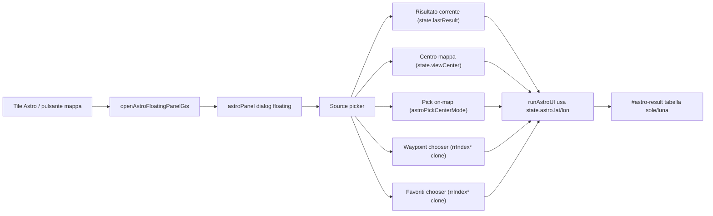

# Piano — Astro/SunCalc source picker + pannello floating GIS-first (Pass 5)

**Timestamp inbox:** 2026-05-01_0804
**Tipo:** solo documentazione (memoria orchestratore). Nessuna implementazione; `coordinate_converter Claude.html` non modificato in questo intervento.
---

# 1. Sintesi decisionale

- **Procedere:** sì, ma incrementale; nessun big-bang.
- **Architettura UI:** nuovo pannello `<dialog id="astroPanel" class="app-modal astro-panel">` — clone strutturale di [#rangeRingsPanel](coordinate_converter%20Claude.html) (8249–8258), con drag + resize + `partialMinVisible: 72`. Nessuna persistenza in `coordconv_ui_v1`.
- **Sorgente posizione:** introdotto `state.astro = { source, lat, lon, label, when, pickMode, error }` transient (no localStorage).
- **Picker Waypoint/Favoriti:** clone funzionale di `#rrSourcePickerDialog` (lista max 50 + search + lat/lon finiti); **non** duplicare Waypoint Manager / Favorite Manager.
- **Pick on-map:** nuovo `state.astroPickCenterMode` analogo a `rangeRingsPickCenterMode`, integrato nella catena Esc esistente.
- **Decisione critica:** pick on-map applica la coordinata **al solo Astro** (NON chiama `renderResults`, per evitare scrivere in `state.lastResult` e generare cronologia involontaria); pulsante secondario "Mostra sulla mappa" usa `renderMiniMap(lat, lon, false)` (resetView=false) o helper analogo già presente.



---

# 2. Stato attuale Astro

- **Markup:** `<details id="sec-astro" data-tab-key="astro">` dentro `#toolsCollapsible` ([righe 7953–7968](coordinate_converter%20Claude.html)). Solo `#astroDate` + `#btnAstro` + `#astro-result`. **Nessun** input lat/lon.
- **Apertura GIS:** tile `data-tool="astro"` → `activateToolPanel("astro")` ([righe 35867–35887](coordinate_converter%20Claude.html)) → reparent `#sec-astro` in `#toolsPanelWrap` via `gisMoveSectionTo` ([righe 32408–32413](coordinate_converter%20Claude.html)).
- **Calcolo:** `runAstroUI` ([righe 28431–28457](coordinate_converter%20Claude.html)) legge **solo** `state.lastResult` (lat/lon); `return` silenzioso se `!r || !out` o `!astroDate.value`. Header tabella `"UTC + LMT*"` hardcoded (non i18n).
- **Default data:** `syncOpsFieldsFromState()` ([righe 28491–28500](coordinate_converter%20Claude.html)).
- **State collegato:** `state.lastResult` (set in `renderResults` riga 18522, reset riga 27937), `state.toolsMenuOpen`. Nessun `state.astro*`.

**Limiti UX:**
1. Nessun feedback se `lastResult` mancante.
2. Sorgente fissa al risultato di conversione: niente centro mappa, waypoint, favorito, pick on-map.
3. Niente input manuale lat/lon nello strumento.
4. Header colonne in inglese hardcoded.
5. Nessuna area di stato/errore (vincolo §5 rule UX standard non rispettato).

---

# 3. Sorgenti posizione proposte

| Sorgente | Origine dati | Disponibilità | UI proposta |
|---|---|---|---|
| **Risultato corrente** | `state.lastResult.{lat,lon,meta}` | Solo se non null | Chip selezionato di default; mostra MGRS/DD; se assente → chip disabilitato + hint `astro.src.noResult` |
| **Centro mappa** | `state.viewCenter.{lat,lon}` (sempre presente, fallback La Spezia) | Sempre | Chip secondario; etichetta `astro.src.mapCenter` |
| **Pick on-map** | Nuovo `state.astroPickCenterMode` | Solo in GIS mode | CTA "Scegli sulla mappa"; cursore crosshair (riusa CSS `range-rings-pick-mode` o nuovo `astro-pick-mode`); Esc esce |
| **Waypoint** | `state.mapWaypoints` filtrato `Number.isFinite(lat)&&Number.isFinite(lon)` | Solo se array non vuoto | Picker dialog con search; mostra nome + DD 5 dec + (opzionale) icona/colore da `meta` |
| **Favorito** | `state.favorites` filtrato lat/lon finiti | Solo se array non vuoto | Picker dialog con search; mostra nome + DD + locality troncata |

**Note semantiche:**
- "punto a schermo" → **centro mappa** (chiarito): coincide con `state.viewCenter`, indipendente dall’ultimo marker. Evita ambiguità con "risultato corrente".
- "Mostra sulla mappa" (azione secondaria su waypoint/favorito): **non** chiama `renderResults`; usa `renderMiniMap(lat, lon, false)` per centrare senza alterare `state.lastResult`/cronologia/permalink.

---

# 4. Analisi Waypoint / Favoriti — riusare il pattern `#rrSourcePickerDialog`

Esiste già un modello identico per i Range Rings ([righe 8261–8272](coordinate_converter%20Claude.html) per il dialog; `rrIndexRrPickerFavorites` / `rrIndexRrPickerWaypoints` ai righe 29888–29911; lista max 50 ai righe 29934–29948). Va clonato — non astratto in helper generico in questo step (refactor > 50 righe richiederebbe approvazione esplicita per le rules).

**Indici (clone):**
- `astroIndexPickerFavorites()` → filtra `state.favorites` con `Number.isFinite(f.lat)&&Number.isFinite(f.lon)`; mantiene `id, name, lat, lon, locality?`.
- `astroIndexPickerWaypoints()` → filtra `state.mapWaypoints` con stesso check; mantiene `id, name, lat, lon, meta.color?, meta.icon?`.

**Render compatto** (clone `rrFillRrSourcePickerList` con cap **50**):
- Riga: nome (clamp 1 riga ellipsis) + DD 5 decimali + chip secondario "Usa".
- Action secondaria "Mostra sulla mappa" (icona ⌖) — **opzionale**; consigliato su waypoint perché allineato al pattern di `waypointsZoomTo` ([righe 35412–35428](coordinate_converter%20Claude.html)). Per favoriti: skip (nessun `favoriteZoomTo` esiste; non introdurlo qui).

**Cosa NON fare:**
- No edit/delete/import/export waypoint/favoriti dal pannello Astro.
- No nuove select native (`<select>`).
- No nuovo cap array, nessun secondo store.

**Edge cases:**
- Lista vuota (post-filter): empty-state con `astro.src.noWaypointsValid` / `astro.src.noFavoritesValid`.
- Coordinate non finite: scartate silenziosamente in indice (come fa già `rrIndex*`).

---

# 5. UX floating panel

**Markup nuovo (template):**

```html
<dialog id="astroPanel" class="app-modal astro-panel" aria-modal="false" aria-labelledby="astroPanelTitle">
  <div id="astroPanelHead" class="app-modal-head">
    <h3 id="astroPanelTitle" data-i18n="sec.astro">Alba / tramonto / luna</h3>
    <button id="astroPanelClose" class="btn-icon" aria-label="..." data-i18n-aria="...">×</button>
  </div>
  <div id="astroPanelBody" class="app-modal-body">
    <!-- 1) Posizione selezionata (header sticky) -->
    <div class="astro-pos-row" role="status" aria-live="polite">
      <span class="astro-pos-label" data-i18n="astro.pos.label">Posizione:</span>
      <span id="astroPosValue" class="astro-pos-value">—</span>
      <span id="astroPosOrigin" class="astro-pos-origin sub">—</span>
    </div>
    <!-- 2) Source picker chips -->
    <div class="astro-src-row">
      <button class="btn btn-sm" data-astro-src="result" data-i18n="astro.src.result">Risultato</button>
      <button class="btn btn-sm" data-astro-src="mapCenter" data-i18n="astro.src.mapCenter">Centro mappa</button>
      <button class="btn btn-sm btn-primary" data-astro-src="mapPick" data-i18n="astro.src.mapPick">Scegli sulla mappa</button>
      <button class="btn btn-sm" data-astro-src="waypoint" data-i18n="astro.src.waypoint">Waypoint…</button>
      <button class="btn btn-sm" data-astro-src="favorite" data-i18n="astro.src.favorite">Favorito…</button>
    </div>
    <!-- 3) Date input -->
    <div class="field-group">
      <label data-i18n="astro.date">Data</label>
      <input type="date" id="astroDate2">
    </div>
    <!-- 4) Notifiche interne -->
    <div id="astroNotices" class="rr-notices" role="region" aria-live="polite">
      <div id="astroInfo" role="status"></div>
      <div id="astroError" class="error-box" role="alert"></div>
    </div>
    <!-- 5) Azione primaria reale -->
    <div class="actions">
      <button id="btnAstro2" class="btn btn-primary" data-i18n="astro.compute">Calcola</button>
    </div>
    <!-- 6) Risultato -->
    <div id="astro-result-floating"></div>
  </div>
  <div class="gis-panel-resize-handle" data-role="gis-panel-resize" data-handle="nw"></div>
  <div class="gis-panel-resize-handle" data-role="gis-panel-resize" data-handle="ne"></div>
  <div class="gis-panel-resize-handle" data-role="gis-panel-resize" data-handle="sw"></div>
  <div class="gis-panel-resize-handle" data-role="gis-panel-resize" data-handle="se"></div>
</dialog>
```

**Riusi (cita codice esistente):**
- `gisPanelAttachDrag` ([32632–32712](coordinate_converter%20Claude.html)) + `gisPanelAttachResize` ([32713–32821](coordinate_converter%20Claude.html)) con `headId: "astroPanelHead"`.
- `gisPanelClampRectPartialVisible` ([32551–32571](coordinate_converter%20Claude.html)) con `partialMinVisible: 72` → nuovo helper `clampAstroPanelRect`.
- `gisPanelApplyLayout` + `gisPanelSyncBodySize` + `_astroPanelLayoutOpts` con `key: "astro"` (in `gPanelLayouts`).
- `wireAstroPanelFloatingGis` clone di `wireRangeRingsPanelFloatingGis` ([34049–34066](coordinate_converter%20Claude.html)).
- `openAstroFloatingPanelGis` / `closeAstroPanel` clone di `openRangeRingsFloatingPanelGis` / `closeRangeRingsPanel` ([34070–34127](coordinate_converter%20Claude.html)).
- Esc: estendere `bindHotkeys` ([17828+](coordinate_converter%20Claude.html)) — prima del ramo RR pick, controllare `astroPickCenterMode`; secondo Esc listener ([32136–32214](coordinate_converter%20Claude.html)) → aggiungere `astroPanel` nella catena di chiusura.

**Gerarchia bottoni (rule §4):**
- **Primary:** "Scegli sulla mappa" (CTA map-first quando pannello aperto su mappa) **e** "Calcola" (azione finale).
- **Secondary:** "Risultato" / "Centro mappa" / "Waypoint…" / "Favorito…".
- **Ghost:** chiusura pannello (×).
- **Danger:** assente (nulla di distruttivo).

**Mobile/responsive:**
- Soglia viewport `≤ 600px`: pannello collassa in modalità modal classica (`max-width: 100vw`, full-height), drag/resize disabilitati (mantieni `partialMinVisible` ma non handle).
- Source picker chips wrappa su 2 righe.
- Date input full-width.

**Accessibilità:**
- `aria-modal="false"` (non blocca interazione mappa).
- `role="status"` su `astroPosValue`, `aria-live="polite"`.
- Focus trap solo dentro picker dialog secondari.
- Esc chiude prima pick mode → poi picker secondario → poi pannello (catena prioritaria).

---

# 6. Stato minimo

```js
state.astro = {
  source: null,        // "result" | "mapCenter" | "mapPick" | "waypoint" | "favorite" | null
  lat: null,           // Number finito o null
  lon: null,           // Number finito o null
  label: "",           // human readable, es. "MGRS 32TPR12345 12345" o "Centro mappa"
  origin: "",          // riassunto origine es. "Waypoint: Casa"
  pickMode: false,     // true durante pick on-map
  error: ""            // chiave i18n errore corrente o ""
};
state.astroPanelOpen = false;     // transient
state.astroPickCenterMode = false; // analogo a rangeRingsPickCenterMode
```

**Init / fallback:**
- Apertura pannello: se `state.lastResult` valido → preset `source = "result"`. Altrimenti `source = "mapCenter"` (sempre disponibile).
- `runAstroUI` (refactor minimo Step A) leggerà `state.astro.{lat,lon}` con fallback `state.lastResult` per retrocompatibilità.

**Persistenza:**
- **Nessuna nuova chiave localStorage**.
- `gPanelLayouts.astro` solo in RAM (come fa oggi RR — `UI_PANEL_KEYS` riga 13472 NON include `rangeRings` né serve includere `astro`).
- `state.astro` interamente transient: rilettura al boot riparte da default.

**Cap array:** invariati (`mapWaypoints` 200, `favorites` 200).

---

# 7. i18n — chiavi nuove (IT/EN/FR)

| Chiave | IT | EN | FR |
|---|---|---|---|
| `astro.pos.label` | Posizione: | Position: | Position : |
| `astro.pos.none` | Nessuna posizione selezionata | No location selected | Aucune position sélectionnée |
| `astro.src.section` | Sorgente posizione | Position source | Source de position |
| `astro.src.result` | Risultato corrente | Current result | Résultat courant |
| `astro.src.mapCenter` | Centro mappa | Map center | Centre carte |
| `astro.src.mapPick` | Scegli sulla mappa | Pick on map | Choisir sur la carte |
| `astro.src.mapPickCancel` | Annulla scelta mappa | Cancel map pick | Annuler |
| `astro.src.waypoint` | Da Waypoint… | From waypoint… | Depuis waypoint… |
| `astro.src.favorite` | Da Favorito… | From favorite… | Depuis favori… |
| `astro.src.search` | Cerca | Search | Rechercher |
| `astro.src.use` | Usa | Use | Utiliser |
| `astro.src.zoom` | Mostra sulla mappa | Show on map | Afficher sur la carte |
| `astro.src.noResult` | Nessuna conversione attiva | No active conversion | Aucune conversion active |
| `astro.src.noWaypointsValid` | Nessun waypoint con coordinate valide | No waypoint with valid coordinates | Aucun waypoint avec coordonnées valides |
| `astro.src.noFavoritesValid` | Nessun favorito con coordinate valide | No favorite with valid coordinates | Aucun favori avec coordonnées valides |
| `astro.notice.pickActive` | Clicca sulla mappa per selezionare il punto. Esc per annullare. | Click the map to set the point. Esc to cancel. | Cliquez sur la carte pour choisir. Échap pour annuler. |
| `astro.notice.pickCancelled` | Selezione annullata. | Selection cancelled. | Sélection annulée. |
| `astro.notice.posSet` | Posizione aggiornata. | Position updated. | Position mise à jour. |
| `astro.err.noPosition` | Seleziona prima una posizione. | Select a position first. | Sélectionnez une position. |
| `astro.err.noDate` | Inserisci una data. | Enter a date. | Entrez une date. |
| `astro.err.invalidLatLon` | Coordinate non valide. | Invalid coordinates. | Coordonnées invalides. |
| `astro.col.utcLmt` | UTC + LMT* | UTC + LMT* | UTC + LMT* |
| `tip.astro.src.mapPick` | Cliccando sulla mappa imposti il punto di calcolo. | Click on the map to set the calculation point. | Cliquez sur la carte pour fixer le point. |
| `tip.astro.src.use` | Usa questa posizione per il calcolo. | Use this location for the computation. | Utiliser cette position. |

**Riuso esistenti:** `sec.astro`, `astro.hint`, `astro.date`, `astro.compute`, `astro.sunrise`, `astro.civil`, `astro.naut`, `astro.astro`, `astro.moonR`, `astro.moonS`, `astro.moonPh`, `astro.alwaysUp`, `astro.alwaysDown`, `astro.lmtFoot`, `astro.moonNA`, `tip.astro`.

---

# 8. Piano incrementale (6 step)

## Step A — Refactor minimo `runAstroUI` (no UX visibile)

- **Obiettivo:** introdurre `state.astro` con default e far leggere `runAstroUI` da `state.astro.{lat,lon}` con fallback `state.lastResult`. **Zero** cambi visibili.
- **Regioni codice:** `runAstroUI` ([28431–28457](coordinate_converter%20Claude.html)), `state` decl ([12603+](coordinate_converter%20Claude.html)), `applyUiState`/`init` ([36120–36160](coordinate_converter%20Claude.html)).
- **Non toccare:** SunCalc IIFE vendored, WMM, OLC, QR, i18n esistente, persistenza localStorage.
- **Rischio:** basso. Solo accessor refactor.
- **Test automatici:** `node --check` su estratto; conteggio `<script>` invariato (2/2).
- **Test browser:** apri Strumenti → Astro classico, conversione attiva → Calcola; tabella identica a oggi.
- **Rollback:** ripristinare `runAstroUI` originale, rimuovere `state.astro` (transient: nessun localStorage).

## Step B — Source picker base (risultato corrente + centro mappa) nel pannello floating

- **Obiettivo:** creare `#astroPanel` con header/body/handle, due chips sorgente attive (Risultato / Centro mappa), data, Calcola, area `#astro-result-floating`. Il vecchio `#sec-astro` resta come fallback non-GIS.
- **Funzioni nuove:** `openAstroFloatingPanelGis`, `closeAstroPanel`, `wireAstroPanelFloatingGis`, `_astroPanelLayoutOpts`, `clampAstroPanelRect`, `astroSetSource(kind)`, `astroSyncPosUI()`, `astroSyncOperativeInfo()`.
- **Wiring tile:** intercettare `data-tool="astro"` in `activateToolPanel` ([35867–35887](coordinate_converter%20Claude.html)) → in GIS mode chiama `openAstroFloatingPanelGis()` invece di reparent in `#toolsPanelWrap`. Comportamento non-GIS invariato.
- **Esc:** estendere `bindHotkeys` ([17828+](coordinate_converter%20Claude.html)) per chiudere `astroPanel` dopo RR e prima di drawer/modali.
- **Resize finestra:** aggiungere `clampAstroPanelRect` accanto a `clampRangeRingsPanelRect` ([32398+](coordinate_converter%20Claude.html)).
- **Non toccare:** `#sec-astro` originale (lasciato in pagina come fallback non-GIS), persistenza, IndexedDB tile, OPSEC, geocoding.
- **Rischio:** medio. Conflitti Esc handling, focus management, race condition con `gisPanelApplyLayout`.
- **Test automatici:** `<script>` count 2; `node --check` su estratto; nessun `<script src>`/`type="module"`.
- **Test browser:** apri pannello da tile Astro; chips Risultato/Centro mappa selezionabili; Calcola con risultato corrente; Calcola con centro mappa (sposta mappa, riapri pannello, conferma posizione aggiornata); drag pannello e clamp parziale fuori bordo (resta 72 px); Esc chiude pannello; resize finestra non rompe layout.
- **Rollback:** rimuovere `#astroPanel` + funzioni nuove; ripristinare branch GIS in `activateToolPanel`.

## Step C — Pick on-map

- **Obiettivo:** chip "Scegli sulla mappa" entra in `state.astroPickCenterMode = true`; primo click sulla mappa registra lat/lon; pannello resta aperto; Esc / "Annulla scelta mappa" esce.
- **Funzioni nuove:** `astroEnterPickCenterMode`, `astroClearPickCenterMode`, branch in `onUp` mappa (DOPO `_rrEditingMoveCenterMode` e `rangeRingsPickAndCreateMode`, PRIMA di `mapPickMode`).
- **CSS:** classe `.astro-pick-mode` su `.tile-map` con cursore crosshair (clone selettore RR `4537–4542`).
- **Esc handling:** in `bindHotkeys` aggiungere ramo prima di RR pick: se `astroPickCenterMode` → cancel + notice `astro.notice.pickCancelled`.
- **Coesistenza:** `astroEnterPickCenterMode` deve disarmare `mapPickMode`, `track.pickMode`, `waypointPickMode`, `mapMeasureMode`, RR pick (clone pattern `rangeRingsEnterPickCenterMode` [30396–30410](coordinate_converter%20Claude.html)).
- **Non toccare:** click mappa per altri pick (track/waypoint/RR/measure/conversion), ordine onUp esistente.
- **Rischio:** medio-alto. Touch/pinch su mobile; conflitti pick.
- **Test browser:** entra in pick → cursore crosshair; click → coordinata mostrata in pannello; Esc → esce con notice; "Annulla scelta mappa" → esce; entrare in pick mentre RR pick attivo → RR esce; conversione e altri tool intatti.
- **Rollback:** rimuovere stato + branch `onUp` + CSS classe + chip `mapPick`.

## Step D — Waypoint chooser

- **Obiettivo:** chip "Da Waypoint…" apre `<dialog id="astroWaypointPicker">` con search + lista compatta (cap 50 visibili, scroll oltre); azione "Usa" + opzionale "Mostra sulla mappa" (`waypointsZoomTo`).
- **Funzioni nuove:** `astroIndexPickerWaypoints`, `astroOpenWaypointPicker`, `astroFillWaypointPicker(query)`, `astroApplyWaypointFromPicker(id)`.
- **Riuso template:** clone `rrSourcePickerDialog` markup ([8261–8272](coordinate_converter%20Claude.html)) + `rrIndexRrPickerWaypoints` ([29897–29911](coordinate_converter%20Claude.html)) + `rrFillRrSourcePickerList` ([29934–29948](coordinate_converter%20Claude.html)).
- **Filtro:** `Number.isFinite(lat)&&Number.isFinite(lon)`; cap 50 visibili (search per oltre).
- **Empty state:** `astro.src.noWaypointsValid`.
- **Non toccare:** Waypoint Manager, `state.mapWaypoints`, `waypointsZoomTo` esistente.
- **Rischio:** basso. Pattern già collaudato.
- **Test browser:** lista mostra solo waypoint validi; search filtra in tempo reale; "Usa" chiude picker e aggiorna pannello Astro; "Mostra sulla mappa" centra senza alterare `state.lastResult`; nessuna regressione su Waypoint Modal.
- **Rollback:** rimuovere chip + funzioni picker WP.

## Step E — Favorite chooser

- **Obiettivo:** chip "Da Favorito…" apre `<dialog id="astroFavoritePicker">` con stesso pattern di Step D.
- **Funzioni nuove:** `astroIndexPickerFavorites`, `astroOpenFavoritePicker`, `astroFillFavoritePicker`, `astroApplyFavoriteFromPicker`.
- **Riuso:** clone `rrIndexRrPickerFavorites` ([29888–29896](coordinate_converter%20Claude.html)).
- **Mostra sulla mappa:** **omettere** in questo step (non esiste `favoriteZoomTo`; introdurre helper sarebbe out-of-scope; alternativa: chiamare `renderMiniMap(lat, lon, false)` direttamente — accettabile).
- **Non toccare:** Favorite Manager, `state.favorites`, `loadFavorite`.
- **Rischio:** basso.
- **Test browser:** lista favoriti validi; search; "Usa"; coerenza con WP picker.
- **Rollback:** rimuovere chip + funzioni picker FAV.

## Step F — Polish (mobile, i18n complete, QA, header tabella i18n)

- **Obiettivo:** completare le 23 chiavi i18n IT/EN/FR; sostituire header tabella `"UTC + LMT*"` hardcoded con `t("astro.col.utcLmt")`; mobile responsive (`@media (max-width: 600px)`); QA pass completo.
- **Regioni:** dizionari `I18N.it/en/fr` (range ~8836–12500), `runAstroUI` table header ([28447–28448](coordinate_converter%20Claude.html)), CSS `astro-panel`.
- **Non toccare:** SunCalc, WMM, OLC, QR, persistenza, OPSEC, geocoding.
- **Rischio:** basso.
- **Test browser:** switch IT/EN/FR; header tabella tradotto; mobile <600px usabile; tutto QA Step A–E ripassato.
- **Rollback:** ripristinare header hardcoded; rimuovere chiavi i18n nuove.

---

# 9. QA checklist

**Calcolo Astro per sorgente:**
- [ ] Risultato corrente: dopo Converti, apertura pannello → preset "Risultato" + Calcola → tabella popolata.
- [ ] Centro mappa: pannello aperto, drag mappa, ri-seleziona "Centro mappa" → label aggiornata; Calcola.
- [ ] Pick on-map: click mappa → coord mostrata; Calcola.
- [ ] Waypoint: search "casa" → seleziona → "Usa" → Calcola.
- [ ] Favorito: search → seleziona → "Usa" → Calcola.

**UX pannello floating:**
- [ ] Trascinabile da `astroPanelHead`.
- [ ] Resize 4 angoli funzionante.
- [ ] Trascinato fuori viewport: si recupera (resta strisciolina ≥72 px sempre).
- [ ] Resize finestra: clamp riapplicato.
- [ ] Esc chiude pick mode → poi picker secondario → poi pannello (catena prioritaria).
- [ ] Mobile <600px: pannello full-width, chips wrap, no drag handle.

**Coesistenza pick/altri tool:**
- [ ] Entra Astro pick mentre RR pick attivo → RR esce.
- [ ] Entra RR pick mentre Astro pick attivo → Astro esce.
- [ ] Track/waypoint/measure/conversion pick non rotti.
- [ ] "Mostra sulla mappa" su WP non altera `state.lastResult` né cronologia.

**Regressioni:**
- [ ] Range Rings panel/pick/clamp invariati.
- [ ] Waypoint Modal/lista/import/export invariati.
- [ ] Favorite Manager/lista/load invariati.
- [ ] `runAstroUI` originale (fallback non-GIS via `#sec-astro`) ancora funzionante.
- [ ] Self-check `SunCalc.getTimes` ([36523–36524](coordinate_converter%20Claude.html)) passa.
- [ ] Print report (`buildPrintReportHtml`) usa ancora `SunCalc.getTimes` correttamente ([28611–28614](coordinate_converter%20Claude.html)).

**OPSEC / vincoli architetturali:**
- [ ] Nessun `<script src>`, nessun `type="module"`.
- [ ] Conteggio `<script>` invariato (2/2).
- [ ] `node --check` su estratto OK.
- [ ] Nessun `fetch`/rete da Astro panel.
- [ ] OPSEC strict invariato.
- [ ] `coordconv_v2` localStorage schema invariato.
- [ ] Nessuna nuova `UI_PANEL_KEYS` whitelist.

**i18n:**
- [ ] Tutte le 23 chiavi nuove presenti in IT/EN/FR.
- [ ] Switch lingua aggiorna pannello aperto (estendere `gisRefreshI18n` se serve).
- [ ] Header tabella `astro.col.utcLmt` localizzato.

---

# 10. Rischi e rollback

| Rischio | Probabilità | Impatto | Mitigazione | Rollback |
|---|---|---|---|---|
| Conflitti Esc tra pannelli/picker/pick mode | Medio | UX bloccata | Test catena Esc Step C; ordinamento esplicito in `bindHotkeys` | Rimuovere ramo Esc Astro |
| `gisPanelApplyLayout` race su pannello chiuso/riaperto | Medio | Posizione anomala | Replicare `requestAnimationFrame` + clamp che fa RR | `state.astroPanelOpen` reset; chiusura forzata |
| Click mappa in Astro pick intercettato da altro tool | Medio | Pick non funziona | Test ordinamento branch in `onUp` (Astro tra RR e mapPickMode) | Rimuovere branch Astro da `onUp` |
| Mobile pannello ingestibile | Basso | UX mobile rotta | Step F dedicato; `@media (max-width: 600px)` | Disabilitare floating su mobile, fallback `#sec-astro` |
| Fallback non-GIS (`#sec-astro`) rotto da refactor `runAstroUI` | Basso | Regressione Step A | Step A è isolato e testabile da solo | Ripristinare `runAstroUI` |
| i18n chiavi mancanti in IT/EN/FR | Basso | Stringhe vuote | Step F dedicato + checklist QA | Reinserire chiavi mancanti |
| Refactor > 50 righe non approvato | Medio | Block rule §00-project-core | Ogni step è < 50 righe nuove; cloni di funzioni esistenti | Spezzare ulteriormente lo step |

**Rollback completo:** in caso di blocco, ogni step ha il suo rollback; lo Step A (refactor `runAstroUI`) è la base e l'unico che tocca codice esistente — gli altri sono additivi.

---

# 11. Raccomandazione finale

- **Procedere:** sì, partire da **Step A** (refactor `runAstroUI` con `state.astro` + fallback `state.lastResult`) — invisibile, basso rischio, abilita tutto il resto.
- **Conferma utente prima di Step B:** prima di introdurre il pannello floating chiedere all'utente se preferisce confermare la scelta architetturale "pannello floating dedicato" vs "estendere `#sec-astro` con source picker inline" (sceglie il primo nel piano, ma è la decisione strategica più importante).
- **Step D/E (Waypoint/Favorite chooser):** confermare prima di Step D se vogliono "Mostra sulla mappa" come azione secondaria standard (consigliato per WP, opzionale per Favoriti).
- **Rinviare a sessione successiva:** Step F polish può essere accorpato in coda a Step E se non emergono regressioni; altrimenti sessione dedicata.
- **Piano UI più dettagliato Waypoint/Favoriti:** **non necessario** — il template `#rrSourcePickerDialog` è già in produzione e collaudato per RR; clone diretto è sufficiente.

---

# 12. Prompt successivo suggerito (solo Step A)

Dopo conferma utente, sessione Agent dedicata con prompt minimale:

```
Obiettivo: Pass 5A Step A — refactor minimo runAstroUI.

Implementa SOLO lo Step A del piano "Astro source picker floating panel":
- introduci state.astro = { source, lat, lon, label, origin, pickMode, error };
- runAstroUI legge state.astro.{lat,lon} con fallback a state.lastResult;
- nessun cambiamento UI visibile;
- nessuna nuova chiave i18n;
- nessuna persistenza nuova.

File modificabile: SOLO coordinate_converter Claude.html.
Vincoli: no commit, no push, no finito, no orchestratore.
Test: node --check estratto; browser smoke (Astro classico ancora OK).
```

---
