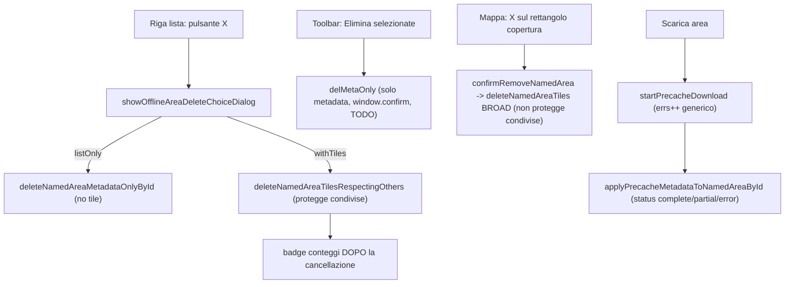

# MAJOR-2BCD-PLAN — Offline tile management (piano tecnico read-only)

**Data:** 2026-06-29  
**Tipo:** piano tecnico read-only (Plan mode)  
**Monolite analizzato:** `coordinate_converter Claude.html` @ `f59a31f`  
**Runtime VPS live (invariato):** `07ad4f4` · build 24  
**Nessun file runtime modificato in fase Plan.**

---

## 1. Stato attuale rilevato

- Repo root: `mrhz1973/cursor-coordinate-converter`; branch `main`; workspace pulito (`git status --short` vuoto).
- `git fetch origin` ok; `git rev-parse origin/main` = `git ls-remote origin main` = `f59a31f` (allineati, nessuna divergenza).
- Runtime live VPS invariato `07ad4f4` (build 24). Conferma: analisi **read-only**, nessuna scrittura.

Funzioni principali trovate (regioni in `coordinate_converter Claude.html`):

- IndexedDB tile: `getTileDB` (28980), `makeTileKey` (28992), `parseTileKeyLayerId` (28997), `idbGet` (29079), `idbPut` (29088, rigetta su `tx.onerror` → la quota propaga), `idbClearAllTiles` (29097, inghiotte), `idbClearAllTilesOrThrow` (29107), `idbDeleteKeys` (29124, per-key try/catch + `.catch(()=>0)`), `getTileBlobByKey` (29463). Store unico, value `{ b: ArrayBuffer, ct }`.
- Delete keyset: `deleteNamedAreaTiles` (29139, **broad legacy**: tutti i `TILE_LAYERS` + `sonarchart`), `collectNamedAreaTileKeys` (29160, usa `layerId` salvato o tutti gli `OFFLINE_LAYER_IDS`), `collectProtectedTileKeysFromOtherNamedAreas` (29173), `deleteNamedAreaTilesRespectingOthers` (29186, **safe**: ritorna `{deleted, candidates, keptShared}`).
- Download/precache: `fetchAndStoreTile` (29641, gate OPSEC + `idbPut`), `startPrecacheDownload` (29671, worker `catch(_){ errs++ }` a riga 29709 → **tipo errore perso**), `runOfflineAreasPrecacheQueue` (31248, `onProgress` 31302, ramo `fatal:true` 31310), `cacheTileFromDisplay` (29763, quota inghiottita 29782), `recordNetEvent` (29623).
- Metadata named areas: `state.namedAreas[]`, `normalizeOfflineArea` (30816), `applyPrecacheMetadataToNamedAreaById` (31137, deriva status 31158-31163: `fatal→error`, `aborted/err>0→partial`, `done>=total→complete`).
- Coverage verifier MAJOR-2A: `auditNamedAreaTileCoverage` (29263), `runOfflineAreaCoverageAudit` (29382), `runOfflineAreasVerifySelected` (29440), store sessione `state._offlineAreaAudit`.
- Delete: `handleOfflineAreaRowDelete` (51962) → `showOfflineAreaDeleteChoiceDialog` (51849, esiti `cancel|listOnly|withTiles`); metadata-only `deleteNamedAreaMetadataOnlyById` (32405); global `performOfflineGlobalReset` (29543) via `showOfflineGlobalClearDialog` (51893); batch `delMetaOnly` (33153, **metadata-only**, `window.confirm` 33158, TODO 33154); legacy mappa `confirmRemoveNamedArea` (31722) → `deleteNamedAreaTiles` broad (31731) con 2× `window.confirm`.
- UI lista: `renderOfflineAreasList` (32484), riga 32634-32651 (status badge 32638, audit badge MAJOR-2A 32628, pulsanti download/verify/load/fit/delete), toolbar batch 33135-33179.
- Diagnostica MAJOR-1: `diagCollectSnapshot` (41031), `diagGetBrowserStorageEstimate` (40842, usage/quota/pct), `diagScanTileCacheStats` (40862), `diagComputeWarnings` (40994, `quotaHigh` a `DIAG_QUOTA_WARN_PCT` 40999), `diagCollectOfflineAreaAudits` (41012).

Flussi attuali (sintesi):

---

## 2. Problemi concreti trovati

- **Quota/storage/error surfacing (2B):** `startPrecacheDownload` (29709) cattura ogni errore come `errs++` senza tipo → `QuotaExceededError`, errori IDB, `http`, `opsec-blocked`, abort risultano indistinguibili. L'area diventa solo "partial" senza spiegare il perché. `cacheTileFromDisplay` (29782) inghiotte la quota in silenzio (nessun segnale di sessione). Diagnostica ha `quotaHigh` ma è passivo (solo all'apertura/refresh del pannello).
- **Ambiguità UI metadata-only vs delete fisico (2C):** il dialog di riga distingue testualmente ma **senza numeri** (quante tile verrebbero cancellate vs conservate). I tre entry-point divergono: riga = safe con tile; batch = solo metadata; mappa-X = broad legacy. Comportamento non uniforme = ambiguo.
- **Rischio delete fisico / tile condivise (2D):** `confirmRemoveNamedArea` (31722) usa `deleteNamedAreaTiles` broad (tutti i layer + sonarchart) che **non** rispetta le altre aree → può erodere copertura condivisa. Nessuna **preview** pre-conferma: il path "withTiles" cancella subito; i conteggi appaiono solo dopo (`offcache.area.deleteTilesFeedback`).
- **Path legacy/duplicati:** due funzioni di delete tile (`deleteNamedAreaTiles` broad vs `deleteNamedAreaTilesRespectingOthers` safe) e tre entry-point con UX divergenti; batch ha TODO esplicito (33154).
- **Gap diagnostica (F):** snapshot non espone contatori errori/quota di precache né dati di preview delete. Utile aggiungere contatori sessione (es. ultimo precache: error per categoria, flag quotaHit).
- **Gap i18n:** serviranno nuove stringhe (categorie errore, preview conteggi, batch withTiles). **Tensione governance:** la regola 2026-06-25 congela il FR ("non aggiungere nuove stringhe FR"), ma il prompt richiede esplicitamente IT/EN/FR e il namespace `offcache.*` ha già copertura FR completa (MAJOR-2A ha aggiunto `offcache.audit.*` in FR). Va deciso al gate (vedi §5). Default proposto: seguire il prompt (IT/EN/FR) per coerenza col namespace, segnalando la deroga.
- **Punti non chiari:** `idbDeleteKeys` è fail-soft (errori per-key silenziati) → un delete fisico "riuscito" potrebbe non aver davvero rimosso tutto; per 2D conviene rendere il risultato verificabile (conteggio reale vs atteso).

---

## 3. Piano implementativo proposto

### 2B — Quota warning + cache/precache error surfacing

- **Regioni/funzioni:** `startPrecacheDownload` (29671-29723), `fetchAndStoreTile` (29641), `runOfflineAreasPrecacheQueue` (31248-31328), `applyPrecacheMetadataToNamedAreaById` (31137), `cacheTileFromDisplay` (29763), `#pcStatus` (10176) + badge riga (32638); opzionale Diagnostica `diagCollectSnapshot` (41031)/`diagComputeWarnings` (40994).
- **Tipo modifica:** classificare l'errore nel worker (es. helper `classifyTileError(e)` → `quota|idb|http|opsec|abort|other`, riconoscendo `e.name==="QuotaExceededError"` o `DOMException` code 22) e propagare contatori per-categoria in `onProgress`/risultato; estendere il record info passato a `applyPrecacheMetadataToNamedAreaById` con `errKinds`; surface in `#pcStatus` e in un campo riga (es. motivo "partial"); segnale sessione `state._tileQuotaHit` in `cacheTileFromDisplay`. Tutto **additivo**.
- **Rischio:** medio-basso (display + conteggi, nessun nuovo delete/fetch).
- **Invarianti:** nessuna nuova chiamata rete; gate OPSEC invariato; `idbPut`/`idbGet` invariati; nessun cambio schema; `state.mapWaypoints[]` intatto.
- **Controlli statici:** `git diff --check`, `node --check` su JS estratto.
- **QA minima:** forzare quota (storage pieno o piccolo) e verificare messaggio quota distinto da errore rete/OPSEC.
- **Fallback/rollback:** se classificazione incerta → categoria `other` (comportamento attuale). Revert = singolo commit.

### 2C — UI clarity metadata-only vs physical tile delete

- **Regioni/funzioni:** dialog HTML `#offlineAreaDeleteDialog` (11686-11694) + i18n `offcache.area.deleteDialog*` (12948-12953); `handleOfflineAreaRowDelete` (51962); batch `delMetaOnly` (33153) + i18n `offcache.sel.deleteConfirmMeta` (12929); badge status (32638) + `offlineAreaStatusLabel` (32365).
- **Tipo modifica:** rendere **inequivocabile** la scelta mostrando i conteggi (candidate / toDelete / keptShared) già **nel** dialog (preview, vedi 2D) accanto alle due opzioni; uniformare il copy "solo lista (le tile restano)" vs "cancella tile fisiche"; allineare il batch alla stessa semantica del dialog di riga (offrire withTiles oltre a metadata) eliminando il TODO (33154). Preferire feedback in-pannello a `window.confirm` dove già esiste un dialog `<dialog>`.
- **Rischio:** medio (UI + wiring, nessuna logica distruttiva nuova oltre al riuso di funzioni esistenti).
- **Invarianti:** default conservativo **metadata-only**; nessuna cancellazione fisica se l'utente sceglie "solo lista"; sanitizer/import/export non toccati.
- **Controlli statici:** `git diff --check`, `node --check`.
- **QA minima:** dialog mostra numeri corretti; "solo lista" non tocca le tile; batch coerente col singolo.
- **Fallback/rollback:** mantenere i due bottoni esistenti; revert isolato.

### 2D — Physical tile delete selettivo e protetto

- **Regioni/funzioni:** `deleteNamedAreaTilesRespectingOthers` (29186), `collectNamedAreaTileKeys` (29160), `collectProtectedTileKeysFromOtherNamedAreas` (29173), `handleOfflineAreaRowDelete` (51962), batch `delMetaOnly` (33153), legacy `confirmRemoveNamedArea` (31722)/`deleteNamedAreaTiles` (29139), `idbDeleteKeys` (29124).
- **Tipo modifica:** introdurre **preview pre-conferma** (nuovo helper read-only es. `previewNamedAreaTileDelete(area, excludeId)` che riusa `collectNamedAreaTileKeys` + `collectProtectedTileKeysFromOtherNamedAreas` e ritorna `{candidates, toDelete, keptShared}` SENZA cancellare); mostrare i numeri nel dialog danger prima dell'azione; estendere il path batch a delete fisico protetto (riuso della funzione safe per id selezionati, unione protezioni); **deprecare/instradare** il path legacy `confirmRemoveNamedArea` verso la funzione safe (no broad delete che ignora le condivise) oppure renderlo protetto; rendere verificabile l'esito di `idbDeleteKeys`.
- **Rischio:** **alto** (azione distruttiva). Massima prudenza.
- **Invarianti:** nessuna delete fisica senza preview + conferma danger esplicita; tile condivise sempre protette in **tutti** i path; nessuna delete in modalità metadata-only; nessun cambio schema IDB; nessun fetch.
- **Controlli statici:** `git diff --check`, `node --check`; verifica che nessun path distruttivo bypassi la preview/protezione.
- **QA minima:** preview combacia col reale; aree sovrapposte conservano le condivise; batch protetto; legacy mappa-X non erode più le condivise.
- **Fallback/rollback:** feature attivabile a step; revert del solo commit 2D senza intaccare 2B/2C.

---

## 4. Sequenza consigliata (un unico programma)

- Raccomandazione: **un solo PLAN (questo) + tre commit runtime gated e separati** (2B → 2C → 2D), ciascuno con proprio deploy + QA + gate review, sotto l'ombrello MAJOR-2BCD.
- Motivo: 2B/2C/2D toccano cache/storage/delete = categoria **DELICATA**. METHOD-BUNDLING-DEFAULT impone bundle separati per le categorie delicate ("bug delicato in mega-bundle blocca tutto il deploy"). 2D è distruttivo: un suo bug non deve bloccare 2B (sola osservabilità, basso rischio) né 2C.
- Compromesso accettabile: 2B+2C possono confluire in un commit **se** il diff resta piccolo e non distruttivo; 2D **sempre** commit separato. Ogni commit incrementa `APP_BUILD_NUM`.

---

## 5. Gate di sicurezza (prima di ogni deploy)

- Diff scope: solo `coordinate_converter Claude.html` (+ docs di chiusura fuori dal commit runtime).
- Nessuna modifica a fetch/proxy/OPSEC: `tileFetchAllowed`, `internetApiFetchAllowed`, `ensureProxyConsent`, `forceOffline`, `opsecStrict` invariati.
- Nessuna modifica a sanitizer/import/export GIS né a `state.mapWaypoints[]`.
- Nessuna delete fisica senza preview + conferma danger; tile condivise protette in tutti i path.
- Schema IndexedDB invariato (nessuna necessità emersa).
- i18n: **decisione richiesta** IT/EN/FR (prompt) vs FR congelato (governance 2026-06-25). Default proposto: IT/EN/FR coerente col namespace `offcache.*`; in alternativa IT/EN + nota deroga. Da confermare al gate.
- `git diff --check` pulito; `node --check` sul JS estratto OK.

---

## 6. Review tiered

- Classificazione bundle: **DELICATO** (cache/storage/delete).
- Review: preferibile Claude `raw@FULL_SHA` pre-deploy se disponibile; se Claude non disponibile, **review sostitutiva GPT** con checklist obbligatoria, + Claude post-hoc. 2D richiede review per la parte distruttiva.
- Checklist review sostitutiva (su diff finale): (1) nessun nuovo fetch/host; (2) gate OPSEC/forceOffline invariati; (3) nessuna delete senza preview+conferma; (4) protezione condivise in row+batch+legacy; (5) `idbPut`/`idbGet`/schema invariati; (6) sanitizer/import/export/`mapWaypoints` intatti; (7) i18n completo secondo decisione gate; (8) `node --check` OK; (9) preview = risultato reale; (10) default metadata-only conservativo.

---

## 7. QA operatore proposta (narrativa minima)

- **Quota/errori:** con storage quasi pieno, avviare un download area → verificare messaggio quota distinto (non generico "errore"); rete ok ma OPSEC strict → messaggio OPSEC distinto.
- **Metadata-only:** "solo lista" rimuove la riga, le tile restano (mappa offline ancora coperta; verifier MAJOR-2A conferma present>0).
- **Delete fisico:** "withTiles" mostra preview (candidate/toDelete/keptShared), poi conferma → tile rimosse; verifier mostra present calato.
- **Tile condivise:** due aree sovrapposte; cancellando una con tile, la sovrapposizione resta per l'altra (keptShared>0; verifier dell'altra invariato).
- **Forced offline / OPSEC strict:** nessuna rete silenziosa; download bloccato/confermato come oggi; delete/preview funzionano offline (solo IDB).
- **Regressione Mappe Offline:** lista, badge status, audit MAJOR-2A, pan/zoom, layer switch, Diagnostica (build N) senza errori console nuovi.

---

## 8. Non-goals (confermati fuori scope)

- MAJOR-2E (status partial/complete persistito da scan IDB) — rinviato.
- MAJOR-3 (import/export GIS unificato) — rinviato.
- MAJOR-4 (mission/project package) — rinviato.
- MAJOR-5A (GIS Object Workbench) — dopo 2BCD.
- Micro-UX non funzionale — stop salvo bug reale.
- Proxy / Planet-Clone / VPS services / Docker / n8n — non toccati.

---

## 9. BOZZA prompt runtime — NON ESEGUIRE ORA

Bozza per il futuro blocco runtime (da rivedere/spezzare al momento dell'esecuzione, gate DELICATO):

> **BOZZA — NON ESEGUIRE ORA**  
> BLOCCO: MAJOR-2B (runtime) — Quota + error surfacing precache/cache.  
> Implementare in `coordinate_converter Claude.html`: helper `classifyTileError`; contatori per-categoria in `startPrecacheDownload`/`onProgress`/risultato; estensione record in `applyPrecacheMetadataToNamedAreaById`; messaggi `#pcStatus`/riga distinti per quota/idb/http/opsec/abort; flag sessione `state._tileQuotaHit` in `cacheTileFromDisplay`. Additivo. Nessun fetch/OPSEC/schema/sanitizer/import-export/`mapWaypoints`. i18n secondo decisione gate. Bump `APP_BUILD_NUM`. Gate DELICATO + review tiered + `git diff --check` + `node --check`. QA scenario quota/OPSEC. Deploy GIS-only dopo PASS.
>
> (a seguire, commit separati MAJOR-2C clarity dialog/preview/batch-uniforme e MAJOR-2D physical delete con preview+conferma+protezione condivise in tutti i path, ciascuno con gate/review/QA propri.)
