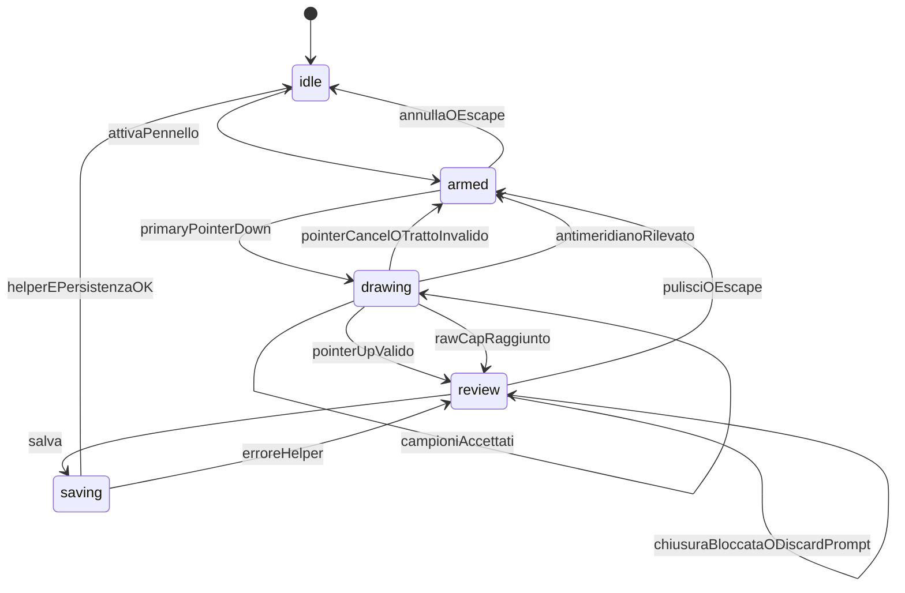

# TRACK-BRUSH-A — Piano implementazione corretto (docs-only)

> **Stato:** piano salvato in memoria orchestratore — **TRACK-BRUSH-A non aperto** — runtime invariato.
> **Classificazione:** bundle **DELICATO** unico (build target futura **39**).
> **Correzioni rispetto al Plan read-only precedente:** (1) antimeridiano fuori scope → fail-closed + backlog `TRACK-BRUSH-ANTIMERIDIAN`; (2) raw cap 4096 termina il gesto e passa a review; (3) renderer brush dedicato/transiente; (4) lifecycle UI senza nuove modali.
> **Sorgente:** report Plan TRACK-BRUSH-A nella chat Cursor immediatamente precedente, con le sole correzioni obbligatorie sotto applicate.

# TRACK-BRUSH-A — Diagnosi e piano read-only

## 1. Stato repo e read-set letto

- Repository verificato: `/workspace`, remoto `mrhz1973/cursor-coordinate-converter`.
- Pre-flight richiesto: **PASS**.

```text
git branch --show-current
main

git status --short
(vuoto)

git rev-parse HEAD
87aaca958ebb1a20e72ff37e6a8210fb7477cf4b

git rev-parse origin/main
87aaca958ebb1a20e72ff37e6a8210fb7477cf4b

git ls-remote origin refs/heads/main
87aaca958ebb1a20e72ff37e6a8210fb7477cf4b	refs/heads/main
```

- Blob del monolite a `HEAD` e al runtime tip `40c97b6` identico: `2acf77113a73f1d76d130dc2b2947c8310080f6e`.
- Build confermata in [`/workspace/coordinate_converter Claude.html`](/workspace/coordinate_converter%20Claude.html), L19602–L19606: `APP_BUILD_ID = "B5.5Z"`, `APP_BUILD_NUM = 38`, `APP_BUILD_DETAIL` invariato.
- Read-set letto nell’ordine richiesto:
  1. [`/workspace/README.md`](/workspace/README.md)
  2. [`/workspace/docs/OPERATING_MEMORY.md`](/workspace/docs/OPERATING_MEMORY.md), soprattutto §4 L48–L232 e §7 L261–L423
  3. [`/workspace/docs/work-units/WU-0005-0009-roadmap.md`](/workspace/docs/work-units/WU-0005-0009-roadmap.md)
  4. [`/workspace/docs/QA-CHECKLIST.md`](/workspace/docs/QA-CHECKLIST.md)
  5. [`/workspace/docs/HANDOFF.md`](/workspace/docs/HANDOFF.md)
  6. [`/workspace/docs/runtime/LAST_CURSOR_REPORT.md`](/workspace/docs/runtime/LAST_CURSOR_REPORT.md)
  7. regioni pertinenti del monolite
- Stato vivo coerente: TRACK-STYLE-A/FIX1/FIX2 CLOSED, TRACK-BRUSH-A non aperto e non implementato; nel monolite non esistono occorrenze `trackBrush`, `TRACK-BRUSH`, `brush` o `Pennello`.
- Incoerenza documentale osservata, non corretta per vincolo read-only: [`docs/HANDOFF.md`](/workspace/docs/HANDOFF.md) L120 etichetta `40c97b6` come “HEAD remoto”, mentre l’HEAD documentale reale è `87aaca9`; L123 identifica correttamente `40c97b6` come runtime. `ls-remote` prevale e il pre-flight resta PASS.

## 2. Classificazione rischio

**Confermata: bundle DELICATO.** La classificazione preliminare è corretta perché TRACK-BRUSH-A introduce un nuovo percorso utente che crea geometria persistita, una pipeline Pointer Events sulla mappa, stato transiente con cleanup e integrazione nel lifecycle del pannello Tracce. Anche senza schema nuovo, il gate “nuovo create-path” di OM §4 L77–L95 si applica.

- Rischi principali: doppio input pan/brush, perdita di pointer, preview stale dopo rerender, salvataggi multipli, conflitti con draft/edit/style e cap 500/50.
- Rischi esclusi per progetto: nessun sanitizer/whitelist nuovo, nessun campo persistito, nessuna rete/GPS/tile/proxy, nessuna nuova modale.
- Gate futuro: review dell’intero diff da `raw@FULL_SHA` prima del deploy; Claude se disponibile, altrimenti review sostitutiva GPT con checklist create-path/storage/lifecycle, poi QA operatore estesa.

## 3. Mappa funzioni e regioni

### 3.1 Fonte canonica saved tracks

- `state.savedTracks[]`, cap 50: [`coordinate_converter Claude.html`](/workspace/coordinate_converter%20Claude.html) L18559–L18570 e `SAVED_TRACKS_CAP` L33253.
- Draft separato `state.track`: L18491–L18494; non è la fonte persistita delle tracce archiviate.
- `ensureSavedTracksState()`: L33280–L33323; filtra array, limita a 50, normalizza metadati/punti fino a 500 e pota selezione/editor stile.
- `savedTrackSanitizeStyleOnTrack()`: L33255–L33279; riguarda solo TRACK-STYLE-A.
- `saveStore()`: L19627–L19707; whitelist saved tracks L19681–L19697.
- Load: L57506–L57509 (`stored.savedTracks` → `ensureSavedTracksState`).
- Create helper comune `savedTrackAddFromPoints(opts)`: L33724–L33766; minimo 2 punti, massimo 500, cap 50 fail-closed, nessun campo stile, **nessun** `saveStore` e nessun render.
- Call site reale del helper: import drop L26086–L26102; persistenza/render batch una volta in `importDroppedSpatialFiles()` L26180–L26184.
- `saveCurrentTrackToLibrary()`: L33767–L33825; legge `state.track`, duplica parte dello snapshot e fa direttamente push/replace + `saveStore` + render. Non va refactorizzato nel bundle brush.
- Lista: `renderSavedTracksList()` L35491–L35732.
- Overlay archivio: `renderSavedTracksOverlays()` L35734–L35834.
- Refresh aggregato: `renderTrackAll()` L38694–L38714; full-map refresh: `refreshTileMapForTrackUi()` L37832–L37844.

### 3.2 Track Builder esistente

- Aggiunta punto: `trackAddPoint()` L36921–L36951; dedup consecutivo `1e-5°`, cap 500, persistenza per punto.
- Rimozione/undo: `trackRemovePoint()` L36954–L36959; `trackUndoLastPoint()` L37159–L37169.
- Clear/nuovo: `trackClear()` L37019–L37023, `trackClearCurrentCommit()` L37536–L37544, `trackStartNew()` L37026–L37044, `trackResetCurrentOnly()` L37046–L37070.
- Inserimento testo/import nel draft: `trackAddFromText()` L37195–L37216; `spatialApplyFeatureCollectionToTrackMerge()` L25667–L25716.
- Pick mappa: `trackMapPickEditingActive()` L37237–L37244, `trackSyncPickModeUi()` L37248+, defer/doppio click L37776–L37829.
- Fine/salvataggio: `completeCurrentTrack()` L37662–L37677; `trackPromptAndSaveCurrent()` L37439–L37461; nome automatico `trackMakeAutoName()` L37428–L37436.
- Modifica geometria saved track: `beginEditSavedTrackById()` L34356–L34407; carica una copia in `state.track` e conserva `_trackEditingSavedId`.
- Centra/fly-to: `flyMapToTrackPoints()` L33668–L33704; handler corrente L38013–L38018.
- Chiusura/annullamento: `trackAbandonOrFinishDraftUi()` L37715–L37766; `closeTrackModal()` / `_closeTrackModalCore()` L55645–L55699.

### 3.3 Eventi mappa e modalità

- Root persistente: `#miniMap`; `.tile-map` e `.tile-layer` vengono ricreati da `renderTileMap()`.
- Wiring: `attachPanHandlers()` L40596–L40919 usa `mousedown`/`touchstart`, dead-zone 3 px, move/up su `window`.
- Click-mode multiplexati in `onUp`: Range Rings L40643–L40687, poligoni L40689–L40710, track/waypoint L40713–L40805, Astro L40808–L40816, Converti L40818–L40826, Workbench L40828–L40830, map pick L40831–L40839, Range Rings pick L40841–L40854, Misura L40857–L40890.
- Doppio click centro: `gisMapOnDblClickCenter()` L40547–L40585.
- Wheel: `attachWheelZoom()` L40244–L40318; wire-once su `#miniMap`.
- Drag Pointer Events esistenti: Misura L18757–L18783, draft track L19058–L19085, waypoint L19087–L19113, poligono L19166–L19243, Range Rings L19115–L19164.
- Pointer capture esiste oggi solo nei pannelli (`gisPanelAttachDrag/Resize`, L49234+), non nelle gesture mappa.
- Esc: `bindHotkeys()` L26669+, con priorità modalità; track/waypoint exit L26818–L26823.
- Non esiste cleanup tool su `blur/pagehide`; l’unico `visibilitychange` è tema, L44347–L44349.

### 3.4 Conversione coordinate

- Percorso canonico screen→geo: `mapClientToLatLonMap()` L22081–L22103. Usa `getBoundingClientRect()`, `clientX/clientY`, trasformazione live `.tile-layer`, `state.viewCenter`, zoom, clamp Web Mercator ±85.05 e `normalizeLon()`.
- Web Mercator: `lonToTileX`, `latToTileY`, `tileX2Lon`, `tileY2Lat`, `normalizeLon` L28368–L28383.
- Viewport coerente: `gisMapTileMathViewport()` L31725–L31735.
- Geo→pixel: `tileMapLatLonToPx()` L31755–L31766.
- Pixel→geo alternativo: `tileMapPxToLatLon()` L31740–L31751; non considera la trasformazione live e non va usato durante una gesture.
- Offset layer riusabile, pur con nome storico: `workbenchTileMapOffset()` L53587–L53597.

### 3.5 Rendering overlay

- Draft track `.track-overlay`, z-index 4: CSS L5056–L5064; renderer `renderTrackOverlay()` L38331–L38466.
- Saved tracks `.saved-tracks-overlay`, z-index 3: `renderSavedTracksOverlays()` L35734–L35834.
- Overlay ricostruiti dal full render: L40197–L40213.
- Refresh leggero esistente: `mapTrackDocDragMove()` L19067–L19076 ridisegna solo `renderTrackOverlay`; il poligono usa rAF L19192–L19220.
- `renderTileMap()` è costoso: ricrea `.tile-map`, tile, hydrate cache/rete e tutti gli overlay; non deve essere chiamato per campione.

### 3.6 Helper geometrici

- Distanza geodetica: `vincentyInverse()` L21136–L21173; fallback `haversine()` L21217–L21231; totale `routeDistance()` L21182–L21192.
- Dedup/cap builder: `trackAddPoint()` L36921–L36936.
- Linea senza duplicato finale: `trackLinePointsForMapRender()` L38318–L38326.
- Wrap pixel mondo: `polyMoveWorldWidthPx()` / `polyMoveShortestDeltaX()` L19250–L19259.
- **Assenti:** Ramer–Douglas–Peucker, ricampionamento uniforme di polyline, dedup screen-space, raw-buffer cap, proiezione sequenziale shortest-wrap per tracce.
- **TRACK-BRUSH-A (build 39):** non introduce helper shared shortest-wrap per le tracce esistenti; non modifica i renderer/fly-to delle tracce. Supporto completo antimeridiano = backlog separato **TRACK-BRUSH-ANTIMERIDIAN**.

### 3.7 UI e i18n

- Sezione Tracce: L10807–L10938; toolbar L10811–L10827; feedback interno L10828–L10836; punti L10841–L10859; archivio/style L10861–L10937.
- Modal floating: `#trackModal` L12233–L12251; CSS L8480–L8500 e resize L8523+.
- Pattern barra inline riusabile: `#trackSavedStyleBar` L10878–L10936, CSS L9246–L9282; feedback `role=status`, `aria-live=polite`.
- Governance i18n: nuove chiavi solo IT/EN; FR congelata. `t()` L18290–L18293 fa fallback EN per chiavi assenti in FR.

### 3.8 Lifecycle

- Apertura: `openTrackModal()` L55555–L55615; auto-arma oggi `state.track.pickMode` L55591–L55603.
- Chiusura: `closeTrackModal()` L55645–L55662; cleanup core L55665–L55699.
- Minimize: `gisMinimizePanel()` L48885–L48963; TRACK-STYLE-A viene chiuso L48958–L48960.
- Context switch: `gisTryCloseTrackModalForContextSwitch()` L55547–L55552.
- Style cleanup idempotente: `savedTrackStyleCloseForLifecycle()` L33529–L33534.
- Delete/prune: `requestSavedTracksDelete()` L33907–L33924, `deleteSavedTracksByIds()` L34316–L34347, `maybeClearCurrentTrackIfMatchesDeletedSaved()` L33849–L33858.

## 4. Create-path canonico proposto

La preferenza richiesta è compatibile con il codice reale e non richiede modifiche a sanitizer o schema:

1. Il brush mantiene solo stato transiente `_trackBrush` e produce `reviewPoints[]` validi `{lat, lon, name:"", meta:null}`.
2. `trackBrushSave()` valida nome, almeno 2 punti distinti e massimo 500.
3. Chiama **una sola volta** `savedTrackAddFromPoints({ name, points: reviewPoints, closed:false, visible:true })`.
4. Se `{ok:false}`: resta in review, mostra feedback interno (`cap` o `min_points`), nessuna persistenza.
5. Se `{ok:true}`: azzera il brush, chiama **una sola volta** `saveStore()`, poi `renderSavedTracksList()` e `refreshTileMapForTrackUi()`.
6. Non tocca `state.track`, non fa push diretto in `state.savedTracks`, non chiama `saveCurrentTrackToLibrary()` e non auto-centra (evita il secondo `saveStore()` dentro `flyMapToTrackPoints`).
7. Non passa `color`, `lineWidth`, `lineOpacity`, `lineStyle`: TRACK-STYLE-A risolve i default dinamici in `savedTrackResolveStyleProps()` L33389–L33431.

## 5. Screen-to-geo canonico

- Ricevitore: listener `pointerdown` capture, idempotente, sul nodo persistente `#miniMap`; accetta solo eventi il cui target appartiene alla `.tile-map` corrente e non a controlli/handle.
- Coordinate locali: `clientX - rect.left`, `clientY - rect.top` in CSS pixel; `devicePixelRatio` non entra perché DOM, eventi e Web Mercator lavorano nello stesso spazio CSS.
- Geo: per ogni campione accettato usare esclusivamente `mapClientToLatLonMap()`; subito dopo clamp lat a ±85.05 e `normalizeLon(lon)`.
- Preview review: `tileMapLatLonToPx()` + `workbenchTileMapOffset()` per allineare l’SVG dentro `.tile-layer`.
- Antimeridiano (**fuori scope TRACK-BRUSH-A build 39**): **non** modificare `renderTrackOverlay()`, `renderSavedTracksOverlays()`, `flyMapToTrackPoints()`; **non** introdurre un helper shared shortest-wrap per le tracce esistenti. Durante acquisizione/post-process, **rilevare** un tratto che attraversa l’antimeridiano (es. salto di longitudine normalizzata tra campioni consecutivi oltre una soglia, tipicamente >180° in delta unwrap); **rifiutarlo fail-closed** con feedback interno nel pannello Tracce; **non creare né salvare** la traccia; tornare a `armed` (o restare in review invalida senza path di salvataggio — preferito: tornare `armed` dopo cleanup del tratto). Il supporto completo (shortest-wrap preview/saved + Centra ad arco minimo) è backlog separato **TRACK-BRUSH-ANTIMERIDIAN**.
- Durante drawing la mappa è congelata; durante review pan/zoom/basemap sono ammessi e il preview viene riproiettato dal full render **solo sull’overlay brush dedicato** (vedi §9).
- Se `.tile-map` cambia identità, zoom/centro cambia o arriva resize durante drawing: annullare solo il tratto corrente, tornare `armed`, ripristinare sempre input mappa e mostrare feedback. In review il resize ridisegna, non perde geometria.

## 6. Gestione Pointer Events

- `pointerdown`: richiede fase `armed`, `ev.isPrimary !== false`, mouse con `button === 0`, target non-control; registra `pointerId/pointerType`, prima coppia screen+geo, mette fase `drawing`, applica `setPointerCapture()` su `#miniMap` quando disponibile.
- `pointermove`: solo stesso `pointerId`; usa `getCoalescedEvents()` se disponibile, altrimenti l’evento singolo; filtra prima in screen-space, converte solo campioni accettati; `preventDefault()`; aggiorna preview al massimo una volta per animation frame.
- `pointerup`: anche fuori area grazie a capture/listener document; rilascia capture e listener; se il tratto è valido entra `review`, altrimenti torna `armed` con messaggio.
- `pointercancel`/`lostpointercapture`/`window.blur`/`document.hidden`: cleanup idempotente del tratto, nessun salvataggio, ritorno `armed`.
- Secondo pointer mentre `drawing`: cancella fail-closed il tratto corrente, non sostituisce il primary pointer e non avvia pinch/pan fantasma.
- Pen: pressione, tilt e barrel button ignorati; il geometry model resta identico per mouse/touch/pen.
- Compatibilità: Pointer Events moderni soltanto; se `window.PointerEvent` manca, Pennello resta disabilitato con feedback interno, senza doppio stack mouse+touch.
- In `attachPanHandlers.onDown()` aggiungere un guard minimo che ceda al brush; in `gisMapOnDblClickCenter()` bloccare il ricentro mentre brush è `armed/drawing`; in wheel bloccare soltanto `drawing`.

## 7. State machine proposta



- `idle`: nessuna barra/preview; pan e strumenti normali.
- `armed`: barra visibile, istruzione map-first, nessun preview; primary pointer disegna; pan single-pointer disabilitato, wheel/+/- ammessi.
- `drawing`: raw preview, pointer capture, pan/zoom/basemap bloccati; Esc/pointercancel/blur → `armed` senza dati; **raw cap 4096** → fine gesto automatica → dedup/RDP → `review` + feedback limite; **antimeridiano** → reject fail-closed → `armed` + feedback, nessun salvataggio.
- `review`: preview geografico ricampionato, nome editabile e un solo primary “Salva traccia”; pan/zoom/basemap ammessi; Pulisci → `armed`; Annulla → `idle`.
- `saving`: sincrono e breve; controlli disabilitati; successo → `idle`, errore → `review`.
- Nessuno stato `cancelled` persistente: la cancellazione è una transizione con cleanup.

## 8. Strategia sampling e ricampionamento

Costanti consigliate, non persistite e non esposte in UI nel primo bundle:

- `TRACK_BRUSH_MIN_SAMPLE_PX = 5`: allineato al threshold drag poligono (5 px) e sopra il pan dead-zone (3 px).
- `TRACK_BRUSH_MIN_STROKE_PX = 8`: un click/tap non diventa traccia.
- `TRACK_BRUSH_RAW_CAP = 4096`: limite memoria/sessione **deterministico**. Al raggiungimento: **terminare automaticamente il gesto** (come un pointerup valido), **rilasciare pointer capture e listener**, eseguire **dedup e ricampionamento**, passare allo stato **review**, mostrare **feedback interno** sul raggiungimento del limite. **Vietato** continuare il gesto con acquisizione silenziosamente troncata.
- `TRACK_BRUSH_RDP_EPSILON_PX = 2.5`: semplificazione iniziale screen-space, indipendente da zoom/latitudine.
- `TRACK_BRUSH_FINAL_CAP = 500`: identico al contratto saved track.

Pipeline post-fine-gesto (pointerup **oppure** raw-cap raggiunto; stessa sequenza):

1. dedup consecutivo screen-space già in acquisizione;
2. dedup geo finale coerente con `trackAddPoint` (`1e-5°`);
3. Ramer–Douglas–Peucker **iterativo** sui campioni screen-space, conservando gli indici dei punti geo;
4. se restano più di 500 punti, ricerca binaria della minima epsilon fino al cap (massimo circa 10 passate su 4096 punti);
5. verifica primo/ultimo distinti e almeno 2 punti;
6. nessuna densificazione geodesica: aumenterebbe il numero di punti senza preservare meglio il gesto; il requisito utile è semplificazione adattiva sotto cap.

Decisioni che richiedono ratifica: valori 5 px / 4096 / 2.5 px e nessun selettore “qualità” nel primo bundle. L’approvazione di questo piano li ratifica.

## 9. Preview transiente (renderer dedicato brush)

- `state._trackBrush` non entra in `saveStore`; nessun `saveStore()` in `armed`, `drawing` o `review`.
- La preview TRACK-BRUSH-A usa un **overlay dedicato e transiente** (es. `.track-brush-overlay` / path dedicato), **non** i renderer delle tracce draft/saved né quelli di poligoni, waypoint o Range Rings.
- Sono ammessi soltanto **hook stretti** per ricreare o rimuovere l’overlay brush durante i normali render/lifecycle (`renderTileMap` / `renderTrackAll` o equivalenti punti di ricreazione overlay), senza alterare il comportamento dei renderer esistenti.
- **Invariati (byte-comportamento):** `renderTrackOverlay()` (draft), `renderSavedTracksOverlays()` (saved), renderer poligoni, waypoint e Range Rings — nessuna modifica geometrica/stile/logica in TRACK-BRUSH-A.
- Durante drawing: un solo SVG/path brush fissato alla `.tile-map`; path raw in coordinate locali, aggiornato via rAF, senza ricostruire mappa/tiles/overlay non-brush.
- Durante review: lo stesso overlay brush dedicato passa ai `reviewPoints` geografici (riproiezione locale al brush); full render lo ricrea/rimuove solo tramite gli hook stretti sopra.
- Stile preview dedicato e non persistito: accento/ciano, stroke 3 px, dash breve, `pointer-events:none`, z-index 7 (sopra track/poligoni, sotto marker/controlli), endpoint distinguibili.
- Non usare un finto `savedTrackResolveStyleProps`: l’id viene creato solo al salvataggio, quindi il colore dinamico finale non è noto.
- Cleanup idempotente: annulla rAF, rilascia capture, rimuove listener/path/classi brush, svuota raw/review, ripristina `touch-action` e pan.

## 10. UX proposta

### Opzione A — scelta raccomandata

- Pulsante secondario toggle **Pennello** dentro `.track-toolbar`, vicino a “Nuova traccia”; non `.btn-primary`.
- Barra inline `#trackBrushBar` sotto la toolbar, modellata su `#trackSavedStyleBar`, con `role=region` e feedback `role=status aria-live=polite`.
- `armed/drawing`: istruzione evidente “Traccia sulla mappa”; Annulla secondario; Pulisci ghost se esistono campioni.
- `review`: input Nome inline precompilato da `trackMakeAutoName()`, statistiche raw→finale/distanza, **Salva traccia** unico primary, Annulla secondario, Pulisci ghost.
- Nessun dialog/browser prompt; nome richiesto **dopo** il gesto, prima del salvataggio.
- I controlli builder/edit/style incompatibili vengono disabilitati o bloccati con feedback mentre il brush è attivo.

### Opzione B — non scelta nel primo bundle

- Toggle e barra compatta sulla toolbar mappa. È più map-first ma duplica lifecycle/stacking e si scontra con `#tile-track-float`/modal minimizzato. Da valutare solo dopo QA di A, non nello stesso bundle.

## 11. Matrice conflitti strumenti

- Track Builder pick / waypoint pick: `trackExitPickMode()`; se `state.track.points` è non vuoto o `_trackEditingSavedId` attivo, **bloccare** l’attivazione Pennello e chiedere di salvare/annullare il draft.
- Convert picker: `convertClearSourcePickMode("sourceChange")`.
- Range Rings one-shot/move-center: `rangeRingsClearPickCenterMode()`; se `_rrEditingSetId` o drag centro attivo, bloccare.
- Misura: `mapMeasureDocDragCleanup()`, chiusura/cancellazione del modo transiente con feedback; non persistere punti misura.
- Poligono: se drawing vuoto, `polygonCancelDraw()`; se contiene vertici o `polygonIsEditing()`, bloccare senza perdere working copy.
- Saved-track geometry edit: bloccare finché il draft non è salvato/annullato.
- Editor stile single/batch: cancellare la working preview con `savedTrackStyleCloseForLifecycle()` e segnalare l’annullamento; nessun salvataggio stile.
- Workbench pick: `workbenchExitPickMode()`.
- Map pick legacy: disarmare `state.mapPickMode` e sincronizzare UI con il pattern esistente.
- Astro pick: `astroClearPickCenterMode("sourceChange")`.
- Bbox selection e drag overlay attivi: cleanup/cancel; se una working copy dati è dirty, bloccare.
- GPS/live tracking: nessun ingresso; non chiamare geolocation e non reintrodurre `watchPosition`.
- Cambio verso un altro tool mentre brush è solo `armed`: uscita automatica sicura. In `review`: blocco + conferma inline “Scarta/Resta”, mai discard o save silenzioso.

## 12. Lifecycle e cleanup

- Apertura Track modal: non auto-attivare brush; auto-pick esistente resta finché l’utente preme Pennello.
- Chiusura modal con brush `armed` vuoto: exit automatico. Con `drawing/review`: conferma di scarto **dentro il pannello Tracce** (barra/notice inline, pattern esistente tipo `#trackSavedDeleteBar` / style bar); **nessuna nuova modale** `<dialog>`; riuso dei pattern inline esistenti; “Scarta e chiudi” danger, “Resta” secondario; **nessun discard o salvataggio silenzioso**.
- Minimize: se `drawing/review`, bloccare usando il notice interno già esistente; l’utente deve Salva/Annulla. Se `armed` vuoto, exit e minimizza.
- Esc: `drawing` cancella il tratto e torna `armed`; `review` pulisce e torna `armed`; `armed` esce a `idle`; solo dopo il modal può ricevere l’Esc globale.
- Basemap/zoom/pan: drawing congelato; mutation/rerender inatteso annulla il tratto; review riproietta.
- Geometric edit/style editor: gate come §11.
- Delete/prune saved tracks: durante drawing/review le azioni mutanti vengono bloccate; dopo salvataggio/exit riusano i percorsi attuali. `_trackBrush` non dipende da id saved e non necessita prune.
- `pointercancel`, `lostpointercapture`, blur/visibility: cleanup del solo gesto; nessuna persistenza.
- Ogni cleanup è **idempotente**: richiamabile due volte senza errore, overlay brush residuo, capture/listener stale o flag inconsistenti.
- **Conferma lifecycle UI (ratificata):** nessuna nuova modale; eventuale conferma di scarto solo nel pannello Tracce; riuso pattern inline; nessun discard/save silenzioso; cleanup idempotente.

## 13. Persistenza, sanitizer, export e OPSEC

- Nessuna modifica necessaria a `ensureSavedTracksState`, `savedTrackSanitizeStyleOnTrack`, whitelist `saveStore`, localStorage schema o load.
- Nessuna modifica a import/export: `savedTrackToFeatureCollection()` L38796–L38812 vede automaticamente la nuova traccia; export hub L53842–L53881 e Mission Package L53920–L53939 riusano lo stesso adapter.
- Nessun campo provenance nuovo; punti con `name:""`, `meta:null`.
- Nessun campo stile materializzato; default legacy dinamici finché l’operatore usa TRACK-STYLE-A.
- Nessuna rete richiesta dal brush; nessun fetch, GPS, tile, geocoding o proxy nuovo. Forced-offline funziona perché conversione/proiezione/sampling sono locali.
- `state.forceOffline`, `state.opsecStrict`, tile cache e consenso provider restano byte-invariati per logica.
- Se in implementazione emergesse una necessità reale di cambiare sanitizer/whitelist/helper shape, **STOP**: estrarre un gate DELICATO separato e chiedere nuova approvazione; l’analisi attuale non la giustifica.

## 14. Prestazioni

- Frequenza DOM: massimo un update preview per frame via rAF; nessun `renderTileMap()` su pointermove.
- Frequenza conversione: solo campioni distanti almeno 5 CSS px; coalesced events filtrati prima di screen→geo.
- Buffer: 4096 coppie screen+geo; review massimo 500; cleanup libera array, path, listener e rAF.
- Costo post-release: RDP iterativo + massimo circa 10 passate adattive, su buffer limitato; eseguito una volta, non nel frame caldo.
- SVG review: massimo 500 vertici; raw preview tipica molto inferiore al cap grazie alla soglia.
- Mobile lento: niente worker/dependency; `touch-action:none` solo in armed/drawing; review restituisce pan/zoom.
- Resize durante drawing annulla invece di ricalcolare migliaia di punti; review ridisegna dai geo points.

## 15. Test plan futuro

### A. Mouse

- Tratto normale → raw preview, review ricampionata, nessun pan concorrente.
- Click senza trascinamento → errore interno, nessuna preview salvabile.
- Pointerup fuori area → acquisito via capture, review valida con ultimo campione in-bounds.
- Esc in drawing/review/armed → transizioni definite in §12.
- Annulla/Pulisci → nessun record, overlay/listener rimossi.

### B. Touch

- Tratto singolo con primary pointer.
- Secondo dito → cancel fail-closed; nessun pointer sostituito.
- `pointercancel` → armed pulito.
- Dopo exit: pan/scroll/pinch della mappa ripristinati.

### C. Pen

- Solo primary pointer; barrel/non-primary ignorati.
- Pressione/tilt non cambiano geometria o stile.
- Nessun doppio evento mouse di compatibilità.

### D. Geometria

- Minimo 2 punti distinti; duplicati consecutivi rimossi.
- Tratto molto lungo/zig-zag → al raw cap il gesto termina e entra in review; RDP e finale ≤500, estremi preservati; feedback limite visibile.
- Attraversamento antimeridiano → **reject fail-closed**: feedback interno, nessuna traccia creata/salvata, overlay brush rimosso; renderer draft/saved e `flyMapToTrackPoints` invariati. (Supporto completo = backlog **TRACK-BRUSH-ANTIMERIDIAN**, fuori da questo bundle.)
- Raw cap 4096 a metà gesto → fine automatica, review con punti ricampionati, feedback limite; **nessuna** acquisizione continua troncata.
- Alte latitudini → clamp ±85.05, nessun NaN/Infinity.
- Resize: drawing annullato con feedback; review ridisegnata.

### E. Salvataggio

- Review statica/dinamica conferma un solo call a `savedTrackAddFromPoints` e un solo `saveStore` nel path brush.
- Traccia appare in lista e mappa, resta dopo reload.
- Oggetto localStorage non contiene `_trackBrush` né proprietà stile.
- Export singolo, hub e Mission Package invariati.
- “Modifica geometria” successiva funziona; TRACK-STYLE-A single/batch applica e persiste lo stile.
- Cap 50 e min-points restano fail-closed con feedback interno.

### F. Cleanup

- Chiusura, minimize, cambio strumento, Esc, pointercancel, blur/visibility, delete/prune e riapertura.
- Cleanup doppio idempotente.
- Nessun overlay, capture, listener, classe `touch-action` o flag stale.

### G. Regressioni

- Track Builder click/paste/import/add-current/undo/finish/save/edit/center.
- Saved tracks lista, selezione, visibilità, delete, export, editor stile single/batch.
- Waypoint, poligoni, Range Rings, Misura, Convert picker, Workbench pick.
- Pan, dblclick center, wheel/+/-/basemap e map resize.
- Forced-offline/OPSEC senza richieste nuove.

### Controlli tecnici

- `git diff --check`; diff mirato e `git status --short`.
- Assenza `<script src>` / `type="module"` nuova.
- Estrazione script inline + `node --check`.
- Assert mirati: build 39 una volta; `_trackBrush` assente dal payload; create helper/saveStore una volta; nessun campo stile nel create.
- Browser locale realistico mouse + emulazione touch/pen se disponibile.
- Review DELICATA da `raw@FULL_SHA`, deploy GIS-only e QA operatore **estesa** unica; `finito` solo dopo attestazione esatta e gate completi.

## 16. Scope esatto futura implementazione

- Solo [`coordinate_converter Claude.html`](/workspace/coordinate_converter%20Claude.html), in regioni chirurgiche:
  - CSS vicino `.track-overlay` L5056 e `.track-saved-style-bar` L9246;
  - HTML toolbar/barra Tracce L10811–L10836;
  - chiavi i18n IT/EN nelle sezioni Track; FR invariata;
  - stato transiente vicino L18557–L18570;
  - `APP_BUILD_NUM` L19605: 38 → **39 una sola volta**;
  - helper brush vicino al modulo saved-track/track, senza cambiare shape persisted;
  - rilevamento antimeridiano + reject fail-closed (niente shortest-wrap shared; niente tocco a `flyMapToTrackPoints` / `renderTrackOverlay` / `renderSavedTracksOverlays`);
  - overlay brush dedicato + hook stretti sole per create/remove overlay brush in L38694–L38714 e L40197–L40213 (senza alterare i renderer esistenti);
  - wiring Pointer Events/guard pan-dblclick-wheel vicino L40244/L40547/L40596;
  - Esc, close e minimize con hook stretti.
- `APP_BUILD_ID = B5.5Z` e `APP_BUILD_DETAIL` invariati.
- Esclusi: ulteriore TRACK-STYLE-A, export stile, import, OFFLINE-DOWNLOAD-CONTROLS, refactor generale, nuova modale, dipendenze, **supporto completo antimeridiano** (backlog **TRACK-BRUSH-ANTIMERIDIAN**).

## 17. Funzioni da non toccare

- `savedTrackSanitizeStyleOnTrack`, `savedTrackResolveStyleProps`, `savedTracksApplyStyleByIds` e logica TRACK-STYLE-A.
- `ensureSavedTracksState` e whitelist `saveStore` (salvo STOP/replan del §13).
- `saveCurrentTrackToLibrary`: nessun refactor/fusione con helper in questo bundle.
- **`renderTrackOverlay()`**, **`renderSavedTracksOverlays()`**, **`flyMapToTrackPoints()`**: invariati in TRACK-BRUSH-A; nessun helper shared shortest-wrap per tracce esistenti.
- Renderer poligoni, waypoint e Range Rings: comportamento invariato (solo eventuali guard one-line di mutua esclusione).
- Parser/import (`spatial*`, drop), export (`savedTrackToFeatureCollection`, export hub) e Mission Package.
- `state.gisTracks[]`, `state.gisPolygons[]`, waypoint schema e GIS CRUD.
- Fetch tile/cache/IDB, geocoding, proxy/provider consent, geolocation/GPS.
- Algoritmi Misura, Range Rings e Poligoni: ammessi solo guard one-line di mutua esclusione, senza alterarne dati/calcoli.
- Layout generale GIS, tab/drawer e infrastruttura modal non correlata; nessuna nuova `<dialog>`.

## 18. Decisioni ancora da approvare

L’approvazione del piano ratifica queste scelte:

1. UX Opzione A inline; nessuna toolbar mappa nel primo bundle.
2. Salvataggio diretto nell’archivio saved tracks, non nel draft `state.track`.
3. Attivazione bloccata se esiste un draft/edit geometrico con dati; nessun discard automatico.
4. Nome dopo il gesto, inline, default `trackMakeAutoName()`.
5. Costanti iniziali 5 px / 8 px / 4096 / RDP 2.5 px / finale 500, non configurabili dall’utente; al raw cap il gesto termina e passa a review con feedback (nessuna acquisizione troncata silenziosa).
6. Antimeridiano **fuori** da TRACK-BRUSH-A: rilevamento + reject fail-closed + feedback interno; nessun create/save; backlog separato **TRACK-BRUSH-ANTIMERIDIAN** per shortest-wrap/render/fly-to completi.
7. Minimize bloccato durante drawing/review; close/tool-switch con conferma interna nel pannello Tracce; nessun nuovo dialog; nessun discard/save silenzioso; cleanup idempotente.
8. Preview solo su overlay brush dedicato/transiente; renderer draft/saved/poligoni/waypoint/Range Rings invariati.

## 19. Stima dimensione e complessità diff

- Complessità: medio-alta, concentrata in input map, lifecycle e geometria transiente.
- Stima: circa **380–520 righe nette** nel monolite, prevalentemente nuove; 10–13 regioni chirurgiche e pochi hook stretti (create/remove overlay brush + guard pan/Esc/lifecycle). **Inferiore** alla stima precedente perché esclusi shortest-wrap su `renderTrackOverlay` / `renderSavedTracksOverlays` / `flyMapToTrackPoints`.
- Non è un refactor architetturale; supera comunque 50 righe, quindi questa pianificazione/approvazione preventiva è necessaria.
- Rischio dominante non è lo schema, ma cleanup pointer/modalità e regressione pan/zoom; i renderer tracce esistenti restano fuori dal diff intenzionale.

## 20. Bundle unico o separazione

**Proposta: un solo bundle DELICATO TRACK-BRUSH-A, un commit runtime, una build 39, una review, un deploy e una QA estesa.** Stato, eventi, sampling, preview, save e lifecycle sono un’unica unità testabile; separarli produrrebbe stadi non utilizzabili e duplicazione di gate.

Non includere lavori routine estranei. Separare solo se durante l’implementazione emerge una modifica inevitabile a sanitizer/whitelist/schema: in quel caso STOP e nuovo piano, non scope creep nel bundle.

## 21. Baseline Git al momento del Plan (pre-save)

```text
branch: main
HEAD:        87aaca958ebb1a20e72ff37e6a8210fb7477cf4b
origin/main: 87aaca958ebb1a20e72ff37e6a8210fb7477cf4b
ls-remote:   87aaca958ebb1a20e72ff37e6a8210fb7477cf4b
monolite HEAD blob = runtime 40c97b6 blob:
2acf77113a73f1d76d130dc2b2947c8310080f6e
```

- Runtime tip invariato: `40c97b6` · build **38**.
- TRACK-BRUSH-A **non aperto**; nessuna WU aperta da questo salvataggio.
- Questo file è il salvataggio docs-only del piano corretto; il commit che lo pubblica è selettivo su `docs/orchestrator/**` soltanto.

## 22. Conferma piano corretto

**TRACK-BRUSH-A — PIANO CORRETTO — FEATURE NON APERTA — RUNTIME INVARIATO — BUNDLE DELICATO UNICO PREVISTO — TRACK-BRUSH-ANTIMERIDIAN BACKLOG SEPARATO.**

## RIEPILOGO PIANO

1. Pre-flight remoto e workspace al Plan: PASS su `87aaca9`.
2. TRACK-BRUSH-A: assente dal runtime; piano implementabile corretto salvato qui.
3. Rischio: **DELICATO** confermato; un solo bundle futuro, build 39.
4. Create-path: `savedTrackAddFromPoints` una volta + `saveStore` una volta; schema e stile invariati.
5. Input: Pointer Events primary-only, capture, rAF, cleanup fail-closed idempotente.
6. Sampling: 5 px, raw 4096 (**fine gesto → review + feedback**), RDP adattivo, finale 500.
7. Antimeridiano: **reject fail-closed** in A; backlog **TRACK-BRUSH-ANTIMERIDIAN**; no tocco renderer/fly-to tracce.
8. Preview: overlay brush dedicato; renderer draft/saved/poligoni/waypoint/RR invariati.
9. UX/lifecycle: barra inline nel modal Tracce; conferma scarto in-pannello; nessuna nuova modale; nessun discard/save silenzioso.
10. Limite documentale osservato (non corretto qui): HANDOFF L120 etichetta runtime come HEAD remoto.
