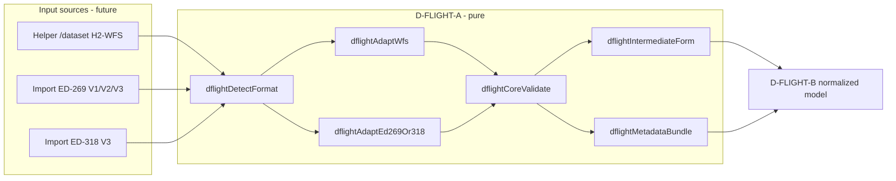

# D-FLIGHT-A — READ-ONLY IMPLEMENTATION PLAN / PARSER-ADAPTER CONTRACT

**Tipo:** piano operativo (Plan mode) pubblicato in Agent mode  
**Data:** 2026-08-12  
**HEAD al momento del piano:** 96defdd63b9802c8f6a21e678ae7ae444a2eb117  
**Decision gate:** D-FLIGHT-A PLAN COMPLETE — NO PRODUCT DECISION REQUIRED  
**Raccomandazione:** A3-light (core comune + adapter WFS + adapter ED-269/318)  
**Categoria futura:** ROUTINE  
**Monolite:** non modificato  
**Helper VPS:** non toccato  

---

## 0. Decision Gate (sintesi iniziale)

**`D-FLIGHT-A PLAN COMPLETE — NO PRODUCT DECISION REQUIRED`**

Il parser/adapter può essere implementato correttamente **oggi** come core puro in-memory, **senza** scegliere il canale di acquisizione dati (helper H2 vs import file): entrambi i canali producono/consumano un JSON che D-FLIGHT-A sa riconoscere e normalizzare in una *intermediate form* neutra. La scelta del canale resta demandata a blocchi successivi (B/C/D/E/F) senza impatto sull'API pubblica di A.

Dettaglio in §17.

---

## 1. Baseline / Pre-flight

| Voce | Valore |
|---|---|
| Repo root | `C:/Users/mrhz/Documents/AI/GitHub/cursor-coordinate-converter` |
| Branch | `main` |
| `git status --short` | vuoto |
| HEAD locale | `96defdd63b9802c8f6a21e678ae7ae444a2eb117` |
| `origin/main` (tracking) | `96defdd63b9802c8f6a21e678ae7ae444a2eb117` |
| `git ls-remote origin refs/heads/main` | `96defdd63b9802c8f6a21e678ae7ae444a2eb117` |
| Divergenza `origin/main...HEAD` | `0 0` |
| `git diff --stat` | vuoto |
| Monolite runtime live | `ac3a0eaefd334e20f3e4ed3085668c70c5dbf1c9` · build `157` (invariato) |
| Helper VPS | `goi-dflight-helper` @ `bc80604` · live `READY` · `:8010` (invariato) |

Baseline pulita. HEAD = `origin/main` = `git ls-remote`. Nessuna divergenza, workspace vuoto.

---

## 2. Documenti letti (read-set)

1. `README.md` — bootloader + read-set
2. `docs/OPERATING_MEMORY.md` §1–6 + parte §7 (handoff/close, gating D2bis, Fase F3, autosync)
3. `docs/work-units/WU-0013-uas-geozone-dflight.md` (intera)
4. `docs/work-units/WU-0005-0009-roadmap.md` (solo verifica puntamento WU-0013)
5. `docs/QA-CHECKLIST.md` (procedura QA tre-gate + template ChatGPT D2)
6. `docs/HANDOFF.md` (intero)
7. `coordinate_converter Claude.html` — inventario completo via [Monolith Inventory](8ef58a68-ebbc-4b94-a63f-8339952229e3)
8. `infra/dflight-helper/goi_dflight_helper.py` — letto per intero direttamente
9. `infra/dflight-helper/config.example.toml`

Inoltre: confronto incrociato con il report [Helper Contract Report](908d4e9e-dc16-449b-9109-68b1ba4528d4) (coincide con la lettura diretta).

---

## 3. Regioni del monolite individuate (per riuso futuro, NON per modifica ora)

Riferimenti di linea tratti da [Monolith Inventory](8ef58a68-ebbc-4b94-a63f-8339952229e3). File: `coordinate_converter Claude.html`.

### 3.1 `state` (L21515–L21764)

`const state = { ... }` top-level. **Non** contiene `showDflightZones`, `_dflightDataset`, `dflightDataset`, né alcun campo D-Flight/UAS/geozone. Campi pertinenti: `forceOffline` (L21521), `opsecStrict` (L21537), `track` (L21664), `mapWaypoints` (L21666), `gisPolygons` (L21669), `gisTracks` (L21668), `cartoArchiveRecords` (L21750). Cap pertinenti: `GIS_POLYGON_CAP=50` (L21508), `CARTO_ARCHIVE_CAP=2000` (L25431), `TRACK_POINTS_CAP=2000` (L42393), `POLYGON_RING_VERT_CAP=500` (L65774).

### 3.2 Utility JSON

**Assenti** come funzioni nominate: `cloneJson`, `safeParseJson`, `jsonStringifyStable`, `deepEqual`. Pattern inline: `JSON.parse(JSON.stringify(x))` (es. `gisClonePlain` L49309). **Non esiste** uno stable/deterministic JSON serializer (JSON.stringify è insertion-order dependent).

**Implicazione D-FLIGHT-A:** se servirà hashing canonico lato client, andrà aggiunto un mini-serializer `sort_keys + separators` (≈10 righe, no deps).

### 3.3 Coordinate / finite-number

`Number.isFinite(x)` inline dappertutto. Named helper riutilizzabili:
- `validateLatLon(lat, lon)` (L25927) — range `[-90,90]/[-180,180]`
- `normalizeLon(lon)` (L35687) — wrap in `[-180,180]`
- `gisSanitizeCoordinate(coord)` (L49336) — accept `[lon,lat(,z)]`, round 7 dp, normalize lon
- `gisSameCoord(a,b)` (L49349) — eps `1e-7`
- `gisImportHubIsValidCoord(lon,lat)` (L32398) — finite + range

### 3.4 Sanitizers (L49304–~L49528)

`gisSanitizeGeometry/Properties/Feature` accettano **solo** kind `"polygon"`/`"track"`. `gisSanitizeGeometry` (L49353) **respinge MultiPolygon, Point, GeometryCollection, Circle**. D-FLIGHT-A **non** deve instradare geometrie proprie attraverso `gisSanitizeGeometry` così com'è: servono validatori D-Flight-scoped.

### 3.5 Helper geometrie

- `cartoGeomToSvgPathD(geom, root, tx, ty)` (L24487) — Polygon + MultiPolygon (IIFE-scoped) → futura dipendenza C, non A.
- `drawCartoIgmOverlay(tileMap)` (L24514) — template overlay SVG, dipendenza C.
- `cartoIgmBboxFromGeometry(geom)` (L24650) — bbox da Polygon/MultiPolygon.
- `polygonGeodesicMidpointLonLat(a,b)` (L66099) — Vincenty, puro, riusabile.
- `sphericalPolygonArea(pts)` (L27241), `vincentyInverse/Direct` (L27175 / L27279) — puro, riusabile per Circle polygonization futura.

### 3.6 Bbox

`cartoValidateBbox` (L23197), `cartoBboxOverlap` (L23223), `cartoPointInRing` (L23229), `gisFitBboxPanelAware` (L40611). **Assente** unione/merge generico bbox: logica inline.

### 3.7 Hashing browser

**Assente** SHA-256, `crypto.subtle`, `canonicalHash`. L'unico SHA-256 è un attributo HTML *baked-at-build* (`data-sha256` su `#cartoIgmEmbeddedData` L14798), mai ricalcolato a runtime.

### 3.8 Render lifecycle (solo come futuro hook)

`renderTileMap(lat, lon, zoom)` L52391 · `refreshTileMapForTrackUi()` L50755 · `tileMapLatLonToPx` L40168 · `tileMapPxToLatLon` L40153 · `gisMapTileMathViewport` L39967.

### 3.9 Layers menu / overlay

`carto.layerMenuSection = "Cataloghi"` (i18n L15931 IT). Toggle IGM costruito dinamicamente dentro `renderTileMap` con `data-role="open-carto-igm"` (L52695), wiring click L53128. `#offlineTilePanel` statico a L12107.

### 3.10 Self-test

- `runSelfCheck()` L79354 (singolare, `console.assert`, nessun harness strutturato, copre UTM/MGRS/Vincenty/WMM/QR/GPX/CoT/GIS-persistence-roundtrip).
- `cartoDiagSelfTest()` L23485 (scoped IGM, ritorna `{ok, checks:[{name,ok,detail}]}` frozen) — **pattern più vicino a un harness strutturato** ed è il modello raccomandato per D-FLIGHT-A.

### 3.11 Regione idonea per inserimento futuro

Anchor consigliato (in futuro, **non ora**): **subito prima di `SECTION 14G: BADGE` a L33546**, cioè dopo la chiusura di `MAJOR-3-b1: Unified GIS Import Hub` (L32376–~L33545). Motivo: cluster parser rimane coeso; resta prima delle sezioni di presentazione/UI; scope top-level (no IIFE da attraversare); niente collisione con GIS Hub (L61271) o routing (L67143).

### 3.12 Collisioni di nomi

Ricerca case-insensitive `dflight / uas / geozone / ed-269 / ed269 / ed-318 / ed318`: **ZERO** match nel monolite. Qualsiasi prefisso naturale (`dflightParse…`, `DFLIGHT_*`) è sicuro.

### 3.13 i18n / build label

`const I18N` L14941 (it/en/fr; **EN+FR frozen** per rule 32). `APP_BUILD_ID="MAP-ZOOM-FOCUS-ANCHOR-A-FIX1"`, `APP_BUILD_NUM=157` (L22972/L22975), `applyAppBuildLabel()` L22977; bump manuale.

---

## 4. Contratto helper `GET /dataset` e `GET /status`

Estratto da lettura diretta di `infra/dflight-helper/goi_dflight_helper.py` + `config.example.toml`. **Nessuna chiamata VPS.**

### 4.1 `GET /dataset` (routing: `do_GET` L1187–L1216)

- Path match: `self.path.split("?",1)[0] == "/dataset"` (query ignorata).
- Origin: `_check_origin()` (L1161) — se `Origin` presente e non in allowlist → **403** `{error:"origin_forbidden"}`. `Origin` assente → ok.
- Su `current.json` mancante / invalido → **503** `{error:"no_dataset", status:"EMPTY"}` (L1198).
- Su dataset valido: legge `current.json` *raw bytes*, lo parsa, **re-serializza** con `json.dumps(fc, ensure_ascii=False, allow_nan=False)` (L1202). **Importante:** il body non è byte-identico al file su disco — è una rappresentazione unicode-ensure_ascii=False, NaN rifiutati.
- Status **200**, `Content-Type: application/json; charset=utf-8`, `Content-Length`.
- Header custom:
  - `X-GOI-DFlight-Sha256: <canonical_sha256>` (L1204)
  - `X-GOI-DFlight-Fetched-At: <fetched_at ISO-Z>` (L1205)
  - `X-GOI-DFlight-Feature-Count: <feature_count>` (L1206)
  - `Access-Control-Allow-Origin: <origin>` solo se Origin in allowlist (L1208 via `_cors_headers`)

### 4.2 Shape del body `/dataset`

GeoJSON **FeatureCollection**. Campi osservati/attesi:
- `type: "FeatureCollection"`
- `timeStamp: <iso string>` (top-level; **NON** entra nel canonical hash; volatile)
- `features[]`: ogni feature → `{ type:"Feature", id:<fid GeoServer instabile>, geometry:{type, coordinates}, properties:{...} }`
- `properties.id` = **chiave stabile** (stringa). È l'unico campo garantito unico e non-vuoto dal validatore helper.
- `properties` note (campione `NO_FLY_ZONE` WU §22.3): `id, name, quota_max, rule, status, regola, type, subtype, lower_limit_m, upper_limit_m, valid_from, valid_to, priority, description, descrizione, owner, note`. **Tutti opzionali** lato validatore helper (solo `id` è obbligatorio).
- `geometry.type` ∈ **{`"Polygon"`, `"MultiPolygon"`}** soltanto (costante `ALLOWED_GEOM_TYPES` L38).
- `geometry.coordinates`: lon/lat finite, range helper `lon ∈ [-30, 60]`, `lat ∈ [20, 80]` (da `config.example.toml`).

### 4.3 `GET /status` (funzione `status_payload` L951–L969)

JSON 200. Campi:

| Campo | Tipo | Note |
|---|---|---|
| `service` | str | `"goi-dflight-helper"` |
| `helper_version` | str | `HELPER_VERSION` (L34, `"0.1.1"`) |
| `status` | enum | uno tra `EMPTY`, `READY`, `CHECKING`, `STALE`, `ERROR` (L39–L43); `CHECKING` quando `_busy` |
| `dataset_available` | bool | `current_fc is not None` |
| `typename` | str | es. `"D-FLIGHT:NO_FLY_ZONE"` |
| `canonical_sha256` | str\|null | dal `current.meta.json` |
| `feature_count` | int\|null | |
| `byte_count` | int\|null | |
| `fetched_at` | iso-Z\|null | |
| `last_check_at` | iso-Z\|null | |
| `last_change_at` | iso-Z\|null | |
| `last_error_category` | str\|null | una tra `http/auth/parse/validation/cap/empty/network/busy/cooldown/csrf/bind/rollback` |
| `cooldown_remaining_sec` | int | max(0, `cooldown_sec` − elapsed) |
| `single_flight_busy` | bool | `self._busy` |

### 4.4 `POST /refresh` (per contesto, non rilevante per A puro)

Codici (`do_POST` L1219–L1248): **200** ok, **409** busy, **429** cooldown (+`retry_after_sec`), **502** qualsiasi altro `HelperError` upstream, **400** body malformato, **403** Origin non ammessa, **404** path sconosciuto. **`503` non è usato** da `/refresh`.

### 4.5 Validator helper (`validate_feature_collection` L520–L570)

Invariante che **D-FLIGHT-A può assumere** sull'input helper (pre-condizione), ma che **deve ri-verificare fail-closed** per robustezza (l'helper è una sorgente remota):

1. `byte_count` ∈ (0, `byte_cap=26214400`]
2. `fc` è object
3. `type == "FeatureCollection"`
4. `features` è list non-vuota, `len ≤ feature_cap=5000`
5. ogni feature è object con `properties` object
6. `properties.id` presente e non vuoto → str
7. `properties.id` **univoco** nella collection (set)
8. `geometry` è object
9. `geometry.type ∈ {"Polygon","MultiPolygon"}`
10. tutte le coordinate finite, lon ∈ [-30, 60], lat ∈ [20, 80] (walk ricorsiva `_walk_coords` L503)

### 4.6 Hash canonico helper (`canonical_sha256` L590–L617)

- Filtra feature con `properties.id` non vuoto
- **Sort** per `str(properties.id)`
- Per ogni feature: `{ id:str, geometry:{type, coordinates:_canon_val}, properties:_canon_val }`
- `_canon_val`: `round(v,10)` per float, ricorsivo su list/dict, dict con chiavi **sorted**
- Payload: `json.dumps(canonical_features, ensure_ascii=False, sort_keys=True, separators=(",",":"), allow_nan=False)`
- SHA-256 esadecimale del payload UTF-8
- **Esclude** `timeStamp` top-level, `bbox` top-level, `feature.id` (fid GeoServer), e ogni altra chiave top-level
- **Stabile** (WU §22.4): fingerprint canonico ≠ hash raw transport

### 4.7 `current.meta.json` (L713–L729, L849–L861)

Shape:

```json
{
  "schema_version": 1,
  "helper_version": "0.1.1",
  "source_typename": "D-FLIGHT:NO_FLY_ZONE",
  "source_srs": "EPSG:4326",
  "fetched_at": "<iso-Z>",
  "last_change_at": "<iso-Z>",
  "canonical_sha256": "<hex>",
  "byte_count": <int>,
  "feature_count": <int>,
  "source_time_stamp": "<iso str|null>",
  "source_update_sequence": null
}
```

### 4.8 `viewparams` (`build_viewparams` L466–L469)

`f"start_nfz:{YYYY-MM-DDTHH:MM};end_nfz:9999-12-31T00:00;"` — **con punto-e-virgola finale**. È il filtro applicato upstream; non influenza la shape del dataset restituito (sempre FeatureCollection).

### 4.9 CORS

`origin_allowlist` default vuota (`config.example.toml` L32). `Access-Control-Allow-Origin` **mai** `*`: solo exact-match se Origin in allowlist; altrimenti niente header (richiesta same-origin o non-browser). **Implicazione D-FLIGHT-A/F:** la allowlist va popolata in `D-FLIGHT-F` (integrazione client/helper), non in A.

---

## 5. Differenze WFS vs ED-269 / ED-318

### 5.1 INPUT H2-WFS (dal helper — **sorgente primaria prevalidata**)

- Top-level: GeoJSON `FeatureCollection` (V3-like ma con proprietà GeoServer, non ED-318 schema).
- Stable id: `properties.id` (stringa GeoServer).
- Geometria: `Polygon` o `MultiPolygon`, lon/lat EPSG:4326.
- Quota: `properties.lower_limit_m` / `properties.upper_limit_m` (già in metri, riferimento non dichiarato — assumere AMSL come default operativo ma marcare `reference=UNKNOWN`).
- Temporalità: `properties.valid_from` / `properties.valid_to` (ISO string; semantica non documentata nel campione).
- Restriction: `properties.rule` / `properties.regola` / `properties.status` (enum libere GeoServer; non mappate 1:1 a ED-269 `restriction` enum).
- Authority: `properties.owner` (testo libero; **non** strutturato come `zoneAuthority[]` ED-269).
- Altri: `quota_max`, `type`, `subtype`, `priority`, `description`, `descrizione`, `note`, `name`.
- **Multi-volume per zona:** non nativo WFS — ogni feature = un volume orizzontale; una "zona" logica può essere rappresentata da più feature con stesso `name` ma `id` diverso. La clusterizzazione per zona è responsabilità di B.

### 5.2 INPUT ED-269 (import file — V1 / V2)

- **V1** = array top-level `[UASZone, ...]`.
- **V2** = `{ title, description, features:[UASZone, ...] }`.
- Stable id: `identifier` (string(7), es. `NFZ6546`) + `country` → `zone_id`.
- Geometria: `geometry[].horizontalProjection` (`Polygon` GeoJSON **oppure** `Circle {center:[lon,lat], radius:m}`). **Circle non esiste in WFS.**
- Quota: `geometry[].uomDimensions {M|FT}`, `lowerLimit`, `lowerVerticalReference {AGL|AMSL}`, `upperLimit`, `upperVerticalReference`.
- Temporalità: `applicability[]` (TimePeriod con `permanent`, `startDateTime`, `endDateTime`, `schedule[]`).
- Restriction: enum ED-269 (`PROHIBITED`/`REQ_AUTHORISATION`/`CONDITIONAL`/`NO_RESTRICTION`).
- Authority: `zoneAuthority[]` strutturato (`name, email, phone, siteURL, purpose, intervalBefore`).
- Reason: `reason[]` enum (≤9 valori EUROCAE).
- `extendedProperties` → raw-only.
- **Multi-volume nativo** via `geometry[]` array.

### 5.3 INPUT ED-318 (import file — V3 FeatureCollection)

- Top-level: `{ type:"FeatureCollection", title, metadata:{validFrom, issued}, features:[Feature] }`.
- Ogni Feature ha `properties` in schema ED-318 (campi `layer` per verticalità parallela, `extent` per bbox, `type`/`restriction`/`reason` enum).
- Geometria: `Polygon`, `MultiPolygon`, `GeometryCollection` (quest'ultimo **non** in WFS helper né in ED-269 base).
- Circle: come ED-269 (come `horizontalProjection` in `geometry`).

### 5.4 Tabella comparativa

| Aspetto | H2-WFS | ED-269 V1/V2 | ED-318 V3 |
|---|---|---|---|
| Top-level | `FeatureCollection` | array / `{features:[]}` | `FeatureCollection` + `metadata` |
| Stable id | `properties.id` | `identifier`+`country` | feature `id`/`properties.identifier` |
| Geometria orizz. | Polygon/MultiPolygon | Polygon/**Circle** | Polygon/MultiPolygon/**GeometryCollection**/Circle |
| CRS | EPSG:4326 | CRS84 (lon,lat) | CRS84 |
| Quota | `lower/upper_limit_m` (m, ref UNKNOWN) | `lowerLimit/upperLimit + uomDimensions + VerticalReference` | `layer.upper/lower + Reference + uom` |
| Temporalità | `valid_from`/`valid_to` (string) | `applicability[]` TimePeriod + `permanent` | `metadata.validFrom` + per-feature |
| Restriction | `rule`/`regola`/`status` (libere) | enum EUROCAE | enum EUROCAE |
| Authority | `owner` (text) | `zoneAuthority[]` struct | `zoneAuthority[]` struct |
| Multi-volume | 1 feature = 1 volume | `geometry[]` array nativo | `geometry[]` o GeometryCollection |
| Reason | n/a | enum `reason[]` | enum `reason[]` |
| Campi non equivalenti | `quota_max`, `priority`, `subtype`, `descrizione` | `region`, `regulationExemption`, `uSpaceClass`, `otherReasonInfo`, `restrictionConditions` | `metadata.issued`, `extent` precomputato |

**Rischio di inventare semantica:** alto se si tenta di mappare 1:1 WFS→ED-269. **Strategia raccomandata:** non forzare la parità; normalizzare solo i campi che sono **direttamente** o **derivabili senza ambiguità** (§9); conservare tutto il resto come `raw_properties` e `raw_geometry_extras`.

---

## 6. Opzioni A1 / A2 / A3

### A1 — Solo adapter WFS helper

- **Scope:** parser dedicato per FeatureCollection GeoServer D-Flight (Polygon/MultiPolygon, `properties.id` stable).
- **Vantaggi:** minimo scope; input già prevalidato lato helper; nessuna gestione Circle/GeometryCollection; category certo ROUTINE.
- **Costo:** se in futuro serve import ED-269/318, va scritto un secondo adapter parziale (duplicazione).
- **Compatibilità B–F:** ok per B/C/D che consumano WFS; **sblocca solo parzialmente** la parity ED-269 (utile per operatori con export ED-269 esterno).
- **Scope creep:** basso.

### A2 — Solo parser ED-269/318 import

- **Scope:** parser per V1/V2/V3 (file import manuale); nessuna integrazione helper.
- **Vantaggi:** massima fedeltà allo standard EUROCAE; supporto Circle/GeometryCollection; non dipende da helper VPS.
- **Costo:** serve comunque un adapter WFS quando D-FLIGHT-F collegherà il helper; due parser comunque.
- **Compatibilità B–F:** ok per import; **non** consuma il helper già pagato e live.
- **Scope creep:** medio (Circle, multi-volume, TimePeriod).

### A3 — Core comune + adapter distinti WFS e ED-269/318 (raccomandata, in forma **light**)

- **Scope:** un nucleo comune minimo (detection + validation + intermediate form + checksum metadata) e **due** adapter sottili (uno per H2-WFS, uno per ED-269 V1/V2/V3).
- **Vantaggi:**
  - D-FLIGHT-A diventa effettivamente "pure parser/adapter core" come da obiettivo del prompt;
  - sblocca sia il canale helper (D-FLIGHT-F futuro) sia l'import manuale (utile per parity EUROCAE e OPSEC totale);
  - il confine A vs B resta netto (A = parse/detect/validate/normalize-to-intermediate; B = semantic enrichment + temporal evaluation + clustering per zona);
  - nessuna duplicazione: validator bbox/coordinate/finite-number sono nel core comune;
  - la quantità di codice "comune" è piccola (detector + intermediate-form + validator primitives) — non è una mega-astrazione.
- **Costo:** ~2× righe rispetto ad A1; ma entrambi gli adapter sono sottili perché il payload difficile è nel core.
- **Compatibilità B–F:** eccellente; B consuma l'intermediate form senza sapere se il sorgente era WFS o ED-269.
- **Scope creep:** **controllato** dal vincolo "A non interpreta" (no temporal enum, no Vincenty Circle→Polygon in A).

### 6.1 Raccomandazione tecnica

**A3-light.** Cioè:

- **Core comune** ma **minimo**: detection, schema-level validation fail-closed, finite-number/coordinate/bbox primitives, intermediate form, metadata checksum pass-through.
- **Adapter WFS** come薄tile (mappa `properties.id`/`name`/`lower_limit_m`/`valid_from`/`rule`/`owner` ecc.; conserva `raw_properties`).
- **Adapter ED-269/318** come薄tile (gestisce V1/V2/V3, `identifier`, `geometry[]` multi-volume, `Circle` come *rappresentazione semantica conservata*, `applicability[]` come raw).
- **NO** Vincenty Circle→Polygon in A: Circle resta come `{type:"Circle", center:[lon,lat], radius_m}` nell'intermediate form; conversione geometrica demandata a C (overlay SVG) o a un helper futuro.
- **NO** valutazione temporale `ACTIVE/FUTURE/EXPIRED/ALWAYS/UNKNOWN` in A (§11): resta raw.

Questa opzione rispetta il vincolo del prompt: A resta **piccolo, puro, senza rete/storage/UI** e riduce concretamente la duplicazione futura.



---

## 7. Raccomandazione

Implementare **D-FLIGHT-A come A3-light** (core comune + due adapter sottili). **Non** Vernicy/Vincenty in A, **non** interpretazione temporale in A, **non** rete/storage/UI in A.

---

## 8. Confine A vs B

**A (parser/adapter, representation-aware):**
- Detection formato (WFS / ED-269 V1/V2/V3 / ED-318 / sconosciuto → fail-closed)
- Validazione strutturale fail-closed (JSON ben formato, schema minimo)
- Validazione geometrica (Polygon/MultiPolygon/GeometryCollection/Circle accettati come *forme*, coordinate finite, lon/lat range)
- Estrazione *valori grezzi* in una **intermediate form representation-neutral**
- Pass-through di metadati sorgente (canonical_sha256 dal helper, oppure SHA-256 del raw import file, source_time_stamp, fetched_at, byte_count, feature_count, typename)
- **No** semantic enrichment, **no** valutazione ACTIVE/FUTURE, **no** conversione Circle→Polygon, **no** clustering zone, **no** UI

**B (normalized model, semantic):**
- Clusterizzazione multi-volume → zona logica (più feature WFS con stesso `name`, oppure `geometry[]` ED-269)
- Mappatura `rule`/`regola`/`status` (WFS) → enum ED-269 `restriction` (con `UNKNOWN` fall-closed)
- Valutazione temporale `ACTIVE_NOW/FUTURE/EXPIRED/ALWAYS/UNKNOWN`
- Normalizzazione unità (FT→M, AGL/AMSL)
- Circle → Polygon (Vincenty) per rendering
- Authority struct parsing
- reason/restrictionConditions normalization

**Decisione chiave:** A restituisce una **intermediate form** representation-neutral (non già normalized objects). Questo evita un doppio modello inutile e mantiene B libero di evolvere la semantica senza rompere A.

### 8.1 Intermediate form di A (contratto)

```js
// Output di D-FLIGHT-A — puro, serializzabile, no side-effect
{
  format: "h2-wfs" | "ed269-v1" | "ed269-v2" | "ed318-v3",
  feature_count: <int>,
  intermediate_features: [
    {
      source_stable_id: <string>,           // properties.id | identifier | feature.id
      name: <string|null>,                  // properties.name | UASZone.name
      geometry_kind: "Polygon" | "MultiPolygon" | "GeometryCollection" | "Circle",
      geometry: <GeoJSON-like | {type:"Circle",center:[lon,lat],radius_m:number}>,
      vertical_raw: {                        //Solo PARSATO, non interpretato
        lower_value, lower_unit, lower_reference,
        upper_value, upper_unit, upper_reference  // ciascuno null se assente
      },
      temporal_raw: {                        // Solo PARSATO, non valutato
        valid_from: <iso|null>,
        valid_to: <iso|null>,
        permanent: <bool|null>,
        schedule_raw: <array|null>           // pass-through ED-269 schedule[]
      },
      restriction_raw: <string|null>,        // properties.rule | UASZone.restriction
      reasons_raw: <array|null>,
      authority_raw: <object|array|null>,    // owner text | zoneAuthority[]
      message: <string|null>,
      raw_properties: <object>               // tutte le proprietà originali intatte
    }, ...
  ],
  metadata: {
    source_typename: <string|null>,
    source_srs: <string|null>,
    source_time_stamp: <iso|null>,
    canonical_sha256: <hex|null>,            // dal helper X-Header (H2-WFS)
    import_file_sha256: <hex|null>,          // calcolato da A su raw bytes (import)
    fetched_at: <iso|null>,
    last_change_at: <iso|null>,
    byte_count: <int|null>,
    detected_format: <string>,
    parser_version: <string>                 // es. "dflight-a/1"
  },
  raw_input_unchanged: <oggetto/array originale, NON mutato da A>
}
```

**Invariante:** `raw_input_unchanged` deve essere `===` all'input originalmente passato (A non muta mai l'input). Test di non-mutazione obbligatorio (§13).

---

## 9. Mapping campi concettuali (WU §9) ↔ sorgenti reali

| Campo WU §9 | WFS path | ED-269/318 path | Classifica A |
|---|---|---|---|
| `provider_id` | n/a (costante `"dflight"`) | n/a | fisso `"dflight"` in A |
| `zone_id` | `properties.id` (uno per volume; zona = cluster B) | `identifier`+`country` | diretto |
| `name` | `properties.name` | `UASZone.name` | diretto |
| `zone_type` | `properties.type` (libero) | enum `COMMON`/`CUSTOMIZED` | raw → B normalizza |
| `restriction` | `properties.rule`/`regola`/`status` | enum ED-269 | raw → B normalizza |
| `reasons` | n/a | `UASZone.reason[]` | raw (WFS: assente) |
| `volumes[]` | ogni feature = 1 volume | `geometry[]` array | A restituisce array flat; B clusterizza |
| `bbox` | derivabile da geometry | derivabile / ED-318 `extent` | DERIVED in A (compute da coordinate) |
| `applicability[]` | `valid_from`/`valid_to` raw | `applicability[]` TimePeriod | raw → B normalizza |
| `permanent` | n/a WFS | `applicability[].permanent` | raw (WFS: null → B decide) |
| `temporal_state` | **NON in A** (valutazione B) | **NON in A** | rinviato a B |
| `zone_authority[]` | `properties.owner` (text) | `zoneAuthority[]` struct | raw → B normalizza |
| `message` | `properties.note`/`description` | `UASZone.message` | raw → B |
| `source_updated_at` | helper `fetched_at`/`source_time_stamp` | metadata `issued`/`validFrom` | diretto dai metadata |
| `source_url` | n/a (decisione F) | n/a | rinviato a F (OPSEC) |
| `source_checksum` | helper `canonical_sha256` (X-Header) | SHA-256 raw file (calcolato da A) | **diretto** |
| `raw_properties` | intero `properties` | intero `UASZone` | diretto |

**Categorie:**
- **diretto** = A estrae e passa
- **raw → B normalizza** = A estrae valore grezzo, B interpreta
- **DERIVED in A** = A calcola (es. bbox da coordinate) in modo deterministico
- **rinviato** = appartiene a blocco successivo, **non** in A
- **NON in A** = valutazione semantica (es. temporal_state), solo B

**Non si inventano valori.** Dove un campo WFS non ha equivalente ED-269 (es. `reasons`, `permanent`), A restituisce `null`/`[]` e **non** sintetizza.

---

## 10. Geometrie supportate / rinviate

### 10.1 Acceptance parser in A

| Tipo | WFS | ED-269 | ED-318 | A lo accetta? |
|---|---|---|---|---|
| `Polygon` | sì | sì | sì | **sì** |
| `MultiPolygon` | sì | raro | sì | **sì** |
| `GeometryCollection` | no | no | sì | **sì** (pass-through) |
| `Circle` (ED-269 custom) | no | sì | sì | **sì come `{type:"Circle",center:[lon,lat],radius_m}`** |
| `Point`/`LineString`/`MultiLineString` | respinti da helper | n/a | n/a | **no** (fail-closed) |

### 10.2 Regole geometriche (in A)

- Coordinate finite (`Number.isFinite`); NaN/Infinity → reject.
- Lon ∈ [-180, 180] (accettazione più larga dell'helper; A è input-tolerant per import ED-269 esteri).
- Lat ∈ [-90, 90].
- **Warning** (non reject) se fuori range helper [-30,60]/[20,80]: A non blocca ma marca `metadata.range_warning`.
- Ring Polygon: minimo 4 posizioni (primo = ultimo per chiusura esplicita). Se <4 → reject. Se non chiuso → A chiude in modo deterministico (append primo punto).
- Bbox: calcolato da A per ogni feature e per la collection; conservato in intermediate form.
- Geometrie vuote (`coordinates: []`) → reject (fail-closed).
- Geometrie malformate (tipo noto ma struttura errata) → reject con `error_category:"geometry"`.
- Cap: `DFLIGHT_FEATURE_CAP = 5000` (costante A, allineata al helper). > 5000 → reject.

### 10.3 Circle

A **non** poligonizza. Conserva `{type:"Circle", center:[lon,lat], radius_m:<number>}`. La conversione in Polygon (Vincenty, 32-64 vertici) è responsabilità di C (overlay SVG) o di un futuro normalizzatore geometrico. **Vincenty non entra in A.**

### 10.4 MultiPolygon / GeometryCollection

Pass-through in `geometry_kind` e `geometry`. A itera per validare coordinate e calcolare bbox, ma non appiattisce. B potrà decidere se trattare ogni sub-polygon come volume separato.

### 10.5 D-FLIGHT-A **non** renderizza SVG

Nessuna dipendenza da `cartoGeomToSvgPathD` in A. Solo C userà quello.

---

## 11. Temporale / verticale (parsato, non interpretato)

### 11.1 Cosa A *parsa* (raw)

- WFS: `valid_from`, `valid_to` (ISO string); nessuna interpretazione.
- ED-269: `applicability[].permanent` (YES/NO), `startDateTime`, `endDateTime`, `schedule[]` (pass-through).
- Verticale: `lowerLimit`, `upperLimit`, `uomDimensions` (M/FT), `lowerVerticalReference`/`upperVerticalReference` (AGL/AMSL). WFS: `lower_limit_m`/`upper_limit_m` (m, reference UNKNOWN).

### 11.2 Cosa A **non** fa

- **Non** converte FT→M (B).
- **Non** risolve "SFC/GND" → 0 AGL (B).
- **Non** calcola `temporal_state` (`ACTIVE`/`FUTURE`/`EXPIRED`/`ALWAYS`/`UNKNOWN`) (B).
- **Non** valuta `schedule[]` day/time (B).
- **Non** normalizza timezone (assume UTC come da standard; pass-through).

### 11.3 Contratto A

`vertical_raw` e `temporal_raw` sono **solo contenitori di valori grezzi** estratti. La valutazione è esplicitamente nel dominio di B (§8).

---

## 12. Metadata / checksum model

A **non inventa** una semantica unica per hash diversi. Passa tutto a B tramite `metadata`.

| Sorgente hash/metadata | Provenienza | Come A lo tratta |
|---|---|---|
| `canonical_sha256` helper | `X-GOI-DFlight-Sha256` header | pass-through diretto (solo per H2-WFS) |
| `import_file_sha256` | A calcola SHA-256 del raw bytes input (import file) | A lo calcola e firma `parser_version` |
| `source_time_stamp` | helper meta / WFS `timeStamp` top-level / ED-318 `metadata.issued` | pass-through |
| `fetched_at` | helper `X-GOI-DFlight-Fetched-At` | pass-through |
| `last_change_at` | helper meta | pass-through |
| `byte_count` | helper meta / `raw.length` (import) | pass-through / compute |
| `feature_count` | compute in A (dopo dedup fail-closed) | compute |

**Due hash distinti e non miscelati:**
- Se input da helper: `canonical_sha256` (helper) è autoritativo; `import_file_sha256` = null.
- Se input da import file: `import_file_sha256` (A) è autoritativo; `canonical_sha256` = null.

**SHA-256 in A (browser):** il monolite **non** ha SHA-256 nativo (§3.7). A deve includere un'implementazione minima. Due opzioni in forma **ROUTINE**:
- **(a) `crypto.subtle.digest("SHA-256", bytes)`** (Web Crypto, async, disponibile in secure context e `file://` moderni; gestito con `await`).
- **(b)** mini SHA-256 JS (≈90 righe, sincrono, no deps) come fallback se `crypto.subtle` assente.

Raccomandazione: **(a) preferita con fallback (b)**. Entrambe le opzioni sono **pure** e non introducono rete/storage. Siccome A sarà esposto come API **sincrona** per il resto del monolite, ma SHA-256 subtle è async, A esporrà due entry point:
- `dflightParse(input, metadata)` sincrono (restituisce intermediate form; `import_file_sha256` calcolato solo se `crypto.subtle` assente → fallback (b))
- `dflightParseAsync(input, metadata)` async (preferito; usa subtle.digest; usato da D-FLIGHT-B/C se await)

---

## 13. State / side-effect policy

D-FLIGHT-A = **funzioni PURE**.

**Non introduce in A:**
- `state._dflightDataset`
- `state.showDflightZones`
- `localStorage`
- `IndexedDB`
- `saveStore`
- `fetch` / `XMLHttpRequest` / helper URL
- Origin handling
- Qualsiasi scrittura su `state`

**Side-effect ammessi:**
- lettura di input passato come argomento (non da `state`)
- creazione di nuovi oggetti JS (intermediate form)
- `console.warn` per anomalie non bloccanti (es. out-of-range warning)
- `crypto.subtle.digest` (async, no storage)

**Workbench / Oggetti GIS:** **FROZEN**. A non tocca `gisPolygons`/`gisTracks`/`cartoArchiveRecords` né li pianifica.

**Determinismo:** stessa input + stessi metadata → stesso intermediate form byte-identico (test §17).

**Non-mutazione:** `raw_input_unchanged` testato con `Object.is(raw_original, output.raw_input_unchanged) === true`.

---

## 14. L10N

D-FLIGHT-A **zero nuove stringhe UI**. Eventuali errori interni sono **codici tecnici** (`error_category:"geometry"`, `error_category:"schema"`, ecc.), non copy UI. EN/FR frozen (rule 32). Nessuna nuova chiave i18n.

---

## 15. Test strategy (in-monolite, no npm)

### 15.1 Pattern

Estendere `runSelfCheck()` (L79354) **oppure** seguire il pattern `cartoDiagSelfTest()` (L23485) con return strutturato `{ok, checks:[{name,ok,detail}]}`. Quest'ultimo è preferito: consente a D-FLIGHT-F di chiamare `dflightSelfTest()` e loggare risultato strutturato, senza inquinare `runSelfCheck` generale.

### 15.2 Fixture

**Sintetiche e minimali**, nessun dataset D-Flight reale nel repo. Generate inline come stringhe JSON costanti nel modulo di test. Esempi: 1 Polygon 2 feature; 1 Circle; 1 malformed; ecc. <50 righe di fixture totali.

### 15.3 Matrice test minima

| # | Caso | Esito atteso |
|---|---|---|
| T1 | WFS FeatureCollection 2 feature Polygon valide | parse OK, format=`h2-wfs`, 2 intermediate_features |
| T2 | WFS con `properties.id` mancante | reject `error_category:"schema"` |
| T3 | WFS con `properties.id` duplicato | reject `error_category:"schema"` |
| T4 | WFS con Polygon 3 posizioni (non chiuso) | A chiude automaticamente, parse OK con warning |
| T5 | WFS con coordinate NaN | reject `error_category:"geometry"` |
| T6 | WFS con lat > 90 | reject `error_category:"geometry"` |
| T7 | WFS con MultiPolygon valido | parse OK |
| T8 | WFS empty features[] | reject `error_category:"schema"` |
| T9 | WFS 5001 feature | reject `error_category:"cap"` |
| T10 | ED-269 V1 array 1 zone Circle | parse OK, format=`ed269-v1`, geometry_kind=`Circle` |
| T11 | ED-269 V2 header+features | parse OK, format=`ed269-v2` |
| T12 | ED-318 V3 FeatureCollection con GeometryCollection | parse OK, format=`ed318-v3` |
| T13 | formato sconosciuto (es. `{foo:"bar"}`) | reject `error_category:"format"` |
| T14 | nessun side-effect su `state` (snapshot prima/dopo) | `state` invariato |
| T15 | non-mutazione input (`Object.is`) | `true` |
| T16 | determinismo: 2 chiamate con stessa input → stesso output serializzato | byte-identico |
| T17 | metadata `canonical_sha256` pass-through da helper metadata | uguale all'input |
| T18 | metadata `import_file_sha256` calcolato da A (fallback sync SHA-256) | stringa esadecimale 64 char |
| T19 | WFS con `timeStamp` top-level volatile | `canonical_sha256` non influenzato (se A ricalcolasse) — solo verifica che metadata riporti correttamente |
| T20 | Circle non poligonizzato in A | intermediate form ha `geometry.type === "Circle"` |

Se ED-318 / Circle venissero rinviati a un blocco futuro, la matrice si riduce (T10/T11/T12/T20 rimossi) — **nessun test finto**.

### 15.4 Harness

`dflightSelfTest()` ritorna `{ok, checks:[...]}`. Chiamato da `runSelfCheck()` con `console.assert`. Non esposto in UI (D-FLIGHT-A non ha UI).

---

## 16. Categoria / review

### 16.1 Categoria confermata

**ROUTINE** (post-helper, come da WU §15). A è parser puro in-memory: **non** introduce:
- rete / OPSEC / tile / proxy
- cache / storage persistito
- sanitizer globale (non tocca `gisSanitizeGeometry`)
- create-path persistito
- lifecycle modale/dialog
- nuovo endpoint

Quindi resta ROUTINE. **Nessuno scope drift**.

### 16.2 Bundle

METHOD-BUNDLING-DEFAULT: D-FLIGHT-A è un singolo commit ROUTINE, un gate, una QA. **No hop Claude** (ROUTINE). Review downstream **opzionale** (Claude non disponibile → review sostitutiva GPT con checklist solo se emerge categoria delicata — qui non prevista).

### 16.3 Coerenza con WU-0013 §15

WU classifica D-FLIGHT-A `ROUTINE (post helper)`. Confermato.

---

## 17. Implementation scope futuro (per il commit D-FLIGHT-A)

Chirurgico, singolo commit.

### 17.1 Regioni del monolite

- **Inserimento:** prima di `SECTION 14G: BADGE` (L33546), dopo chiusura `MAJOR-3-b1` (~L33545). Nuova sezione etichettata `/* ===== D-FLIGHT-A — pure parser/adapter (in-memory) ===== */`.
- **Modifiche nulle** a: `state` (L21515–L21764), `gisSanitize*` (L49304–L49528), `cartoGeomToSvgPathD` (L24487), `renderTileMap` (L52391), `runSelfCheck` (L79354) **eccetto** append di una chiamata `dflightSelfTest()` in coda a `runSelfCheck`.
- **Riutilizzo (read-only):** `Number.isFinite` (inline), `normalizeLon` (L35687) **solo se** A sceglie di normalizzare lon in intermediate form (raccomandato: no, lascia raw per OPSEC determinismo).

### 17.2 Funzioni nuove (in A)

- `dflightDetectFormat(input)` → `"h2-wfs" | "ed269-v1" | "ed269-v2" | "ed318-v3" | null`
- `dflightCoreValidate(input, format, opts)` → `{ok, features, errors}`
- `dflightAdaptWfs(fc)` → `intermediate_features[]`
- `dflightAdaptEd269Or318(obj)` → `intermediate_features[]`
- `dflightComputeBbox(geom)` → `[w,s,e,n] | null`
- `dflightSha256Sync(bytes)` → hex (fallback mini impl)
- `dflightSha256Async(bytes)` → Promise<hex> (crypto.subtle)
- `dflightParse(input, metadata)` sincrono → intermediate form
- `dflightParseAsync(input, metadata)` async → intermediate form (con SHA-256 subtle)
- `dflightSelfTest()` → `{ok, checks:[...]}`

### 17.3 Funzioni esistenti riusate (read-only)

- `Number.isFinite` (inline pattern)
- `cartoIgmBboxFromGeometry` (L24650) come **riferimento** per logica bbox (ma A scrive una sua versione D-Flight-scoped per non accoppiarsi all'IIFE IGM)

### 17.4 Funzioni esistenti NON da modificare

- `gisSanitizeGeometry/Properties/Feature` (L49353/L49379/L49416) — whitelist troppo stretta
- `cartoGeomToSvgPathD` — solo C
- `drawCartoIgmOverlay` — solo C
- `state.*` — nessun campo nuovo

### 17.5 State invariato

`state` resta senza campi D-Flight. Eventuale `state._dflightDataset`/`state.showDflightZones` sono responsabilità di **B/D** (normalized + toggle), non A.

### 17.6 Test statici

- `dflightSelfTest()` come da matrice §15.3
- Aggiunta una riga in `runSelfCheck` (L79354) per richiamarlo

### 17.7 Build bump futuro

`APP_BUILD_NUM` 157 → 158; `APP_BUILD_ID = "D-FLIGHT-A"`; `APP_BUILD_DETAIL` one-liner. Manuale, in fase di commit.

### 17.8 node --check

Dopo implementazione: estrazione `<script>` inline + `node --check` come da procedura README. Obbligatorio in `finito`.

---

## 18. Automated Browser QA strategy

### 18.1 Natura del blocco

D-FLIGHT-A è **parser puro**, **non** ha UI visibile. Tuttavia WU-0013 §15 richiede Automated Browser QA da D-FLIGHT-A+. La strategia reale:

### 18.2 Opzione raccomandata: `NOT APPLICABLE` giustificato

Se A viene implementato strettamente come da §17 (nessuna UI, nessun binding DOM, nessun toggle), la sua superficie browser è **inesistente**. Automated Browser QA viene dichiarata:

```
AUTOMATED BROWSER QA D-FLIGHT-A NOT APPLICABLE — pure parser/adapter, no UI/DOM/network surface
```

motivazione esplicita: A non introduce elementi DOM, non modifica `state`, non chiama rete, non altera rendering. Verifica `node --check` + `dflightSelfTest()` coprono l'acceptance tecnica.

### 18.3 Opzione alternativa (raccomandata se si vuole una superficie browser minima)

Esporre `window.GOIDflight = { parse, parseAsync, selfTest }` (pattern speculare a `window.GOICartoIndex`). Allora Automated Browser QA **PUÒ** essere eseguita:

- Carica URL runtime con `?v=<short-sha>`
- `Runtime.evaluate` `window.GOIDflight.selfTest()` → verifica `{ok:true, checks: tutti ok}`
- `Runtime.evaluate` `window.GOIDflight.parse(<fixture inline>)` → verifica forma intermediate
- Capture Console errori (deve essere vuoto)
- Screenshot opzionale (non significativo: A non ha UI)

Questa opzione **non introduce UI visibile**, ma fornisce una superficie browser verificabile tramite `Runtime.evaluate`. **Si raccomanda questa alternativa** perché dà evidenza automatica reale e mantiene la regola WU "Automated Browser QA da D-FLIGHT-A+".

### 18.4 Scelta

Implementazione futura deve esporre `window.GOIDflight` (§18.3) così Automated Browser QA è **PASS** con fixture inline, non `NOT APPLICABLE`. Allineato a WU-0013 §15.

### 18.5 Casistiche Automate Browser QA

| Caso | Verifica |
|---|---|
| Load `?v=<sha>` | HTTP 200, no Console error |
| `window.GOIDflight` presente | `typeof === "object"` |
| `selfTest()` → `{ok:true}` | tutti i check T1–T20 PASS |
| `parse(wfsFixture)` → intermediate form | `format==="h2-wfs"`, `feature_count===2` |
| `parse(malformedFixture)` → reject | `error_category` presente |
| `parseAsync(wfsFixture)` await | SHA-256 hex 64 char |
| OPSEC: `state.forceOffline=true` non influisce su A | A non guarda `state` |
| Network: zero richieste verso `:8010` o d-flight durante A | `Network.requestWillBeSent` filtro pulito |

---

## 19. Findings

### 19.1 Helper `/dataset` non byte-identico a `current.json`

`do_GET` L1202 re-serializza con `json.dumps(..., ensure_ascii=False, allow_nan=False)`. Il body HTTP **non è** byte-identico al file su disco. **Implicazione:** se D-FLIGHT-F volesse verificare integrità transport lato client, deve confrontare il `X-GOI-DFlight-Sha256` header (che è il `canonical_sha256` calcolato sulla *fc* oggetto, non sul transport), non rifare SHA-256 del body ricevuto. **A passa il `canonical_sha256` direttamente come metadata.**

### 19.2 WFS `valid_from`/`valid_to` semantica non documentata

Il campione `NO_FLY_ZONE` ha questi campi come ISO string, ma la semantica (UTC? locale? `permanent`?) non è dichiarata. **A li passa raw; B decide.** Nessuna assunzione.

### 19.3 ED-269 `Circle` non poligonizzabile in A senza Vincenty

Vincenty è già nel monolite (`vincentyDirect` L27279), ma usarlo in A violerebbe il vincolo "A non interpreta". Circle resta semantico; C o un futuro normalizzatore lo convertiranno.

### 19.4 `gisSanitizeGeometry` troppo stretto per D-Flight

Whitelist `polygon`/`track` respinge `MultiPolygon`/`GeometryCollection`/`Circle`. D-FLIGHT-A **non** deve passare attraverso `gisSanitizeGeometry`. Validatori D-Flight-scoped nel core comune.

### 19.5 SHA-256 nativo assente

Monolite non ha SHA-256. A deve aggiungerlo (subtle + fallback mini). ROUTINE perché: no rete, no storage, funzione pura.

### 19.6 `properties.id` = chiave stabile, non `feature.id`

Confermato da WU §22.3 e dal validatore helper (L544–L550). A usa `properties.id` come `source_stable_id` per H2-WFS; per ED-269/318 usa `identifier` (+`country`).

---

## 20. `git status --short`

```
(vuoto)
```

## 21. `git diff --stat`

```
(vuoto)
```

Nessuna modifica al repo. Nessun file toccato. Piano read-only conforme al prompt.

---

## 22. Note operative (fuori dal prompt §S ma rilevanti)

- **Non auto-aprire D-FLIGHT-A:** WU §15/§21 richiede prompt esplicito. Questo piano **non** è autorizzazione a implementare.
- **Quando si aprirà D-FLIGHT-A** (prompt runtime futuro), il prompt dovrà includere la coda `finito` pre-autorizzata (ROUTINE bundle) e `BLOCK-ID = D-FLIGHT-A`.
- **Helper VPS** resta `CLOSED / PASS`; **non toccare** in D-FLIGHT-A.
- **L10N:** nessuna stringa UI nuova in A.
- **Workbench / Oggetti GIS:** FROZEN.
- **Categoria ROUTINE** con `window.GOIDflight` superficie browser per Automated Browser QA PASS (§18.3).

---