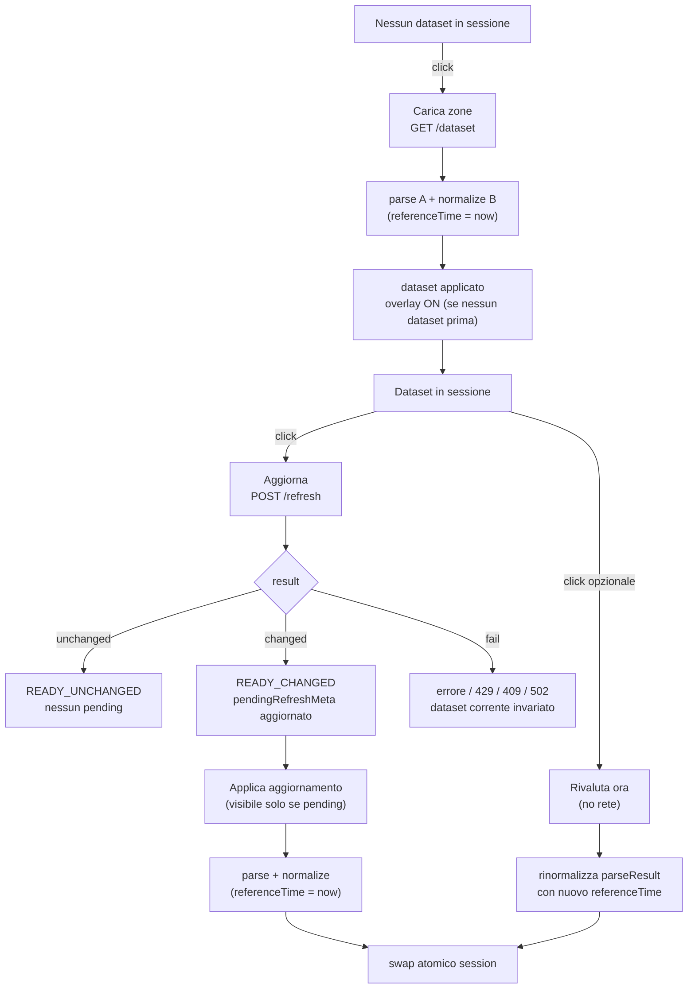
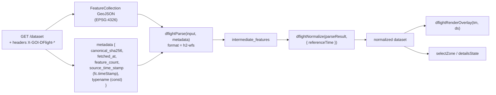
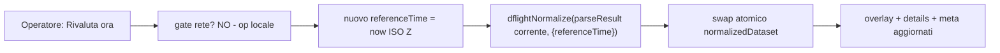
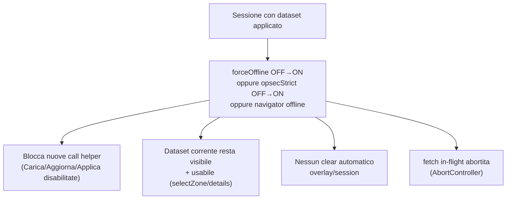

# Piano operativo — D-FLIGHT-F (DELICATE)

**Blocco:** `D-FLIGHT-F`
**Tipo:** PLAN READ-ONLY — DELICATE — pubblicato in memoria orchestratore
**Data pubblicazione:** 2026-08-12 06:43 (locale)
**Baseline repo al momento del plan:** `da2058eef4906c37098b0682ff8dd4c4cf1a730c`
**Runtime GIS tip (invariato):** `a37b912` / build 160 / `APP_BUILD_ID=D-FLIGHT-CDE`
**Gate autorevole:**

```text
D-FLIGHT-F PLAN COMPLETE — DELICATE BUNDLE — NO PRODUCT DECISION REQUIRED
```

**Scope di questa pubblicazione:** sola memoria `docs/orchestrator/**`. Nessuna implementazione, nessun deploy, nessuna config VPS, nessun POST /refresh, nessun `finito`.

**Nota anti-self-reference (F3):** SHA/push/HEAD di questo commit autosync = EXTERNAL_ONLY — non autorati qui.

---

# D-FLIGHT-F — READ-ONLY IMPLEMENTATION PLAN (CLIENT HELPER / NETWORK / OPSEC / SESSION DATA)

> Plan mode read-only. Nessuna modifica file/repo/VPS. Nessun commit, push, deploy, POST /refresh, restart, upstream contact, credential read.

---

## 1. Pre-flight + read-set (verificato)

- Repo root: `C:/Users/mrhz/Documents/AI/GitHub/cursor-coordinate-converter` — OK.
- Branch: `main` — OK.
- `git status --short`: vuoto.
- HEAD = origin/main = `git ls-remote origin refs/heads/main` = **`da2058eef4906c37098b0682ff8dd4c4cf1a730c`** — tutte uguali alla baseline attesa (`da2058e`), divergenza `0 0`.
- Pre-flight **PASS**.

Read-set consumato (tutti read-only):

- [README.md](README.md), [docs/OPERATING_MEMORY.md](docs/OPERATING_MEMORY.md) §4 e §7, [docs/work-units/WU-0013-uas-geozone-dflight.md](docs/work-units/WU-0013-uas-geozone-dflight.md), [docs/work-units/WU-0005-0009-roadmap.md](docs/work-units/WU-0005-0009-roadmap.md) (WU-0013), [docs/QA-CHECKLIST.md](docs/QA-CHECKLIST.md), [docs/HANDOFF.md](docs/HANDOFF.md).
- [infra/dflight-helper/README.md](infra/dflight-helper/README.md), [infra/dflight-helper/goi_dflight_helper.py](infra/dflight-helper/goi_dflight_helper.py), [infra/dflight-helper/config.example.toml](infra/dflight-helper/config.example.toml), [infra/dflight-helper/tests/test_helper.py](infra/dflight-helper/tests/test_helper.py) + fixtures.
- [coordinate_converter Claude.html](coordinate_converter Claude.html) regioni A+B+CDE, network/OPSEC helpers, proxy pattern `getNavProxyHost()` (linea ~38467), `ROUTING_GRAPHHOPPER_ENDPOINT` (linea ~69869).
- [docs/orchestrator/inbox/2026-08-12_0148_riepilogo_d-flight-cde-implemented.md](docs/orchestrator/inbox/2026-08-12_0148_riepilogo_d-flight-cde-implemented.md) — evidenza storica coerente con OM §7.

---

## 2. VPS / helper live inventory (read-only SSH `ionos-n8n`)

| Voce | Valore osservato |
|---|---|
| `goi-dflight-helper.service` | active / enabled |
| Bind | `100.114.7.53:8010` (Tailscale IPv4) — confermato `ss -ltnp` (`python3` pid 2609686) |
| Altri servizi co-located | `:8000` (`goi-gis-app`), `:5000` (Planet-Clone flask), `:8989` GraphHopper (java), `:8990` GH admin (localhost) |
| `GET /status` | 200 — `READY`, `dataset_available: true`, **`feature_count: 849`**, `byte_count: 7360227`, `canonical_sha256: 88d564a65152…67f7`, `fetched_at: 2026-08-11T21:40:52Z`, `last_change_at` uguale, `last_error_category: null`, `cooldown_remaining_sec: 0`, `single_flight_busy: false` |
| LKG `current.json` | presente (`-rw-r--r-- goi-dflight`, 7360227 byte, 21:40) |
| `current.meta.json` | presente, coerente (sha 88d564a6…; `source_time_stamp: 2026-08-11T21:40:52.187Z`; `source_update_sequence: null`) |
| LKG `previous.*` | **non presente** (nessun refresh changed dopo il primo load) |
| `state.json` | presente (121 byte) |
| `tmp/` | presente |
| Config path | `/etc/goi-dflight/config.toml` |
| `server.origin_allowlist` | **`[]`** (vuota — browser Origins sono denial fino a F) |
| Porta 8010 | bind Tailscale only, no `0.0.0.0` |
| Startup network policy | `Environment=GOI_DFLIGHT_CONFIG=/etc/goi-dflight/config.toml`; `LoadCredential=dflight_username:/etc/systemd/dflight-credentials/dflight_username` + `dflight_password`; `ExecStart=/usr/bin/python3 /opt/goi-dflight-helper/current/goi_dflight_helper.py`; `ReadWritePaths=/var/lib/goi-dflight /run/goi-dflight`. Codice `DFlightHelper.__init__` → `cache.startup_consistency()` (no network, fallback `previous` se `current` corrupt). **NO network al boot** verificato da codice (`test_no_network_on_startup`). |
| Credential files | `/etc/systemd/dflight-credentials/dflight_username` / `dflight_password` (perm `0400` root) — **non letti** (OPSEC prompt) |
| `/opt/goi-dflight-helper/current` | `REVISION` + `__pycache__` + `goi_dflight_helper.py` |

Helper è in stato **primo LKG**: mai refresh_changed da deploy → niente `previous`. `--rollback` helper CLI restituirebbe `rollback` (previous missing) — coerente con WU-0013 §21bis finding.

---

## 3. Helper API — contratto reale (da codice `goi_dflight_helper.py`)

Tutte le route passano `_check_origin()` prima di qualsiasi logica: se `Origin` è presente e non in allowlist → **403 `{"error":"origin_forbidden","error_category":"origin"}`** senza header CORS. Se `Origin` assente (CLI/tailnet curl) → allowed senza CORS headers.

### `OPTIONS /{status,dataset,refresh}` (preflight)

- Origin assente o non allowlist → **403**, nessun CORS header.
- Origin allowlist → **204**, `Access-Control-Allow-Origin: <exact>`, `Access-Control-Allow-Methods: GET, POST, OPTIONS`, `Access-Control-Allow-Headers: Content-Type`, `Content-Length: 0`.
- **Niente `Access-Control-Allow-Credentials`** (helper non emette mai credenziali browser).

### `GET /status` → 200

```json
{
  "service": "goi-dflight-helper",
  "helper_version": "0.1.1",
  "status": "EMPTY|READY|CHECKING|STALE|ERROR",
  "dataset_available": <bool>,
  "typename": "D-FLIGHT:NO_FLY_ZONE",
  "canonical_sha256": "<hex64>|null",
  "feature_count": <int>|null,
  "byte_count": <int>|null,
  "fetched_at": "<ISO Z>|null",
  "last_check_at": "<ISO Z>|null",
  "last_change_at": "<ISO Z>|null",
  "last_error_category": "<cat>|null",
  "cooldown_remaining_sec": <int>,
  "single_flight_busy": <bool>
}
```

`status` mappa `CHECKING` quando `_busy` (refresh in corso). Header CORS solo se Origin allowlist. **Nessun secret** nel payload (validato da `test_status_has_no_secrets`).

### `GET /dataset` → 200 (LKG corrente)

- Body: il `FeatureCollection` GeoJSON persisted in `current.json` (esattamente ciò che A parse).
- `Content-Type: application/json; charset=utf-8`.
- `Content-Length` imposto.
- Headers dedicati: **`X-GOI-DFlight-Sha256`** (canonical), **`X-GOI-DFlight-Fetched-At`** (ISO Z), **`X-GOI-DFlight-Feature-Count`** (stringa).
- Se `current.json` invalido/assente → in-memory `helper.current_fc = null` + **503 `{"error":"no_dataset","status":"EMPTY"}`**.
- **Non** espone `last_change_at` né `last_error_category` su /dataset (richiede `GET /status` separato).
- Mancano: `source_time_stamp`, `typename`, `source_srs` dal body/headers `/dataset`. `source_time_stamp` è nel body GeoJSON (`fc.timeStamp` top-level), come gestito da `dflightCoreValidate` → `metaA.source_time_stamp`. `typename` è costante (`D-FLIGHT:NO_FLY_ZONE`) e può essere hardcoded lato client come metadato provider noto, oppure derivato da `/status` (campo `typename`).

### `POST /refresh` → 200 / 409 / 429 / 502 / 403

Logica `refresh()`:

1. `single_flight_busy` → **409 `{"refreshed": false, "reason": "busy", "error_category": "busy"}`** (non consuma cooldown).
2. `cooldown_remaining_sec > 0` → **429 `{"refreshed": false, "reason": "cooldown", "retry_after_sec": <int>, "error_category": "cooldown"}`** (non consuma cooldown; **non** resetta timer).
3. Altrimenti: **accetta** → stampa `last_attempt_at = now` **prima** di qualsiasi contatto D-Flight → esegue auth + WFS (con viewparams `start_nfz:<utc-minute>;end_nfz:9999-12-31T00:00;`).
4. SHA canonico del nuovo payload confrontato con `current_meta.canonical_sha256`:
   - uguale → **`READY_UNCHANGED`** (non riscrive `current.json`, preserva `previous`).
   - diverso → **`READY_CHANGED`** (atomic replace: scrive tmp → fsync → preserva `previous` da vecchio current → `os.replace` → scrive meta).
5. Successo → **200 `{"refreshed": true, "status": "READY_CHANGED|READY_UNCHANGED", "canonical_sha256": "<hex>"}`**. Consuma cooldown (300 s).
6. Fallita (auth/network/http/parse/validation/cap) → **502 `{"refreshed": false, "error_category": "<cat>"}`**. `last_error_category` registrato; `_api_status` → `STALE` (se LKG esiste) o `ERROR`. **Consuma cooldown** (timer già partito).

**Niente `Retry-After` header** — il `retry_after_sec` è nel body JSON 429. **Nessun busy/cooldown su POST non-/refresh.** Body max 4096 byte (`_read_body`); body vuoto accettato.

### Headers `X-GOI-DFlight-*` effettivamente prodotti

- `X-GOI-DFlight-Sha256` (su /dataset 200)
- `X-GOI-DFlight-Fetched-At` (su /dataset 200)
- `X-GOI-DFlight-Feature-Count` (su /dataset 200)

Nessun altro `X-GOI-DFlight-*`. `last_change_at` / `last_error_category` / `cooldown_remaining_sec` sono solo in `/status` body.

---

## 4. CORS / origin contract

- GIS live: `http://100.114.7.53:8000`.
- Helper: `http://100.114.7.53:8010`.
- **Cross-origin per porta** (scheme+host identici, port diversa → origine distinta).
- Smoke dal vivo: `Origin: http://100.114.7.53:8000` su `/status` → **403** (allowlist vuota). Preflight OPTIONS dalla stessa origin → **403**.

### Deployment contract minimo (CORS)

| Modifica richiesta | Dove |
|---|---|
| Aggiungere `http://100.114.7.53:8000` a `server.origin_allowlist` | `/etc/goi-dflight/config.toml` |
| Restart `goi-dflight-helper.service` | richiesto (TOML letto a `__init__`; `serve()` bind fisso) |

**Nessuna patch codice helper**: `cors_response_headers` e `do_OPTIONS` sono già exact-match + no-wildcard + no-credentials. Lo smoke post-config deve mostrare:

- `OPTIONS /status` con `Origin: http://100.114.7.53:8000` + `ACRM: GET` → 204 + `ACAO: http://100.114.7.53:8000`.
- `GET /status` / `/dataset` con `Origin: http://100.114.7.53:8000` → 200 + `ACAO: http://100.114.7.53:8000`.

**Decisione: localhost non aggiunto per comodità.** Il runtime live è solo tailnet. Se in futuro serve dev/test con helper locale, si aprirà un blocco separato (oggi non necessario). Nessuna apertura pubblica, nessuna wildcard, nessun `Origin: null` consentito (`origin_allowed` ritorna `False` per `null` non in allowlist).

---

## 5. Helper base URL client (`dflightHelperBaseUrl()`)

Riuso del pattern `getNavProxyHost()` (linea ~38467): derivazione da `location.hostname` + porta fissa `8010`, no IP hardcoded. Coerente con `ROUTING_GRAPHHOPPER_ENDPOINT` (`http://100.114.7.53:8989`) ma **preferred derivazione** anziché IP costante, per evitare IP literali sparsi.

Shape raccomandata (concettuale, non implementata ora):

```js
const DFLIGHT_HELPER_PORT = 8010;
function dflightHelperBaseUrl(){
  try {
    const h = (typeof location !== "undefined" && location.hostname)
      ? String(location.hostname).trim() : "";
    if (!h) return null;          // file://  → null → nessuna chiamata
    return location.protocol + "//" + h + ":" + DFLIGHT_HELPER_PORT;
  } catch(_) { return null; }
}
```

Proprietà vincolanti:

- `file://` → `hostname == ""` → `null` → **nessuna chiamata helper**.
- `http://100.114.7.53:8000` → `http://100.114.7.53:8010` (co-located helper tailnet).
- `http://localhost:8000` (dev opzionale, solo se helper locale attivo e Origin in allowlist) → `http://localhost:8010`. Non richiede IP hardcoded; allowlist VPS resta `["http://100.114.7.53:8000"]` per il runtime live.
- Nessun IP literal nel monolite (allineato al principio `getNavProxyHost`).

---

## 6. Network / OPSEC gate — inventario + helper scoped

Gate globali esistenti nel monolite:

- `state.forceOffline` (persisted).
- `state.opsecStrict` (persisted).
- `isEffectivelyOnline()` = `navigator.onLine && !state.forceOffline` (linea ~38355).
- Pattern "consent" tailnet-proxy: `ensureNavProxyConsent()`, `ensureGsatConsent()`, `ensureBsatConsent()`, `ensurePersonalProxyConsent()` — session-only, resettati su cambio OPSEC.
- `internetApiFetchAllowed()` = `!forceOffline && !opsecStrict` (modello fail-closed totale sotto opsecStrict; pattern Open-Meteo / Nominatim).

**Contratto WU-0013 §17 + §22.7 vincolante per D-Flight:**

- `forceOffline` → **BLOCCA** helper.
- `opsecStrict` → **BLOCCA** helper (no consent dialog, no eccezione; D-Flight è sensibile: nessuna chiamata helper sotto opsecStrict, come `internetApiFetchAllowed`).
- browser offline → **BLOCCA**.
- dataset già caricato resta visualizzabile/interrogabile offline.
- nessuna cancellazione overlay/session solo perché la rete viene bloccata.

Helper scoped raccomandato:

```js
function dflightClientNetworkAllowed(){
  if (state.forceOffline) return false;
  if (state.opsecStrict) return false;
  return isEffectivelyOnline();   // navigator.onLine && !forceOffline
}
```

Nessun nuovo campo `state.*` persistente. Nessun riuso del consent pattern tailnet-proxy (D-Flight != Navionics/Esri/Sonar: le call helper implicano potenziale upstream D-Flight, troppo sensibili per consent parziale). Allineato a §22.7 ("cooldown indicativo 30–60 min" lato server, non lato client).

**Non altera i gate globali esistenti.** Aggiunge solo `dflightClientNetworkAllowed()` come predica dedicata D-Flight.

---

## 7. No network at boot — prova

Verifiche sul monolite corrente (`a37b912`):

- Regione CDE: nessun `fetch(`, nessun `XMLHttpRequest`, nessun `` verso `:8010` o `*.d-flight.it`. `dflightSelfTestAllCDE` includes `CDE_no_network_static` assertion (linea ~36182).
- `gisInit` / `renderTileMap` / `dflightRedrawOverlayFromSession` / apertura `#dflightPanel` / `#dflightDetailsPanel` / `selfCheck` di A+B: nessuna chiamata helper. Render SVG richiama solo `_dflightOverlaySession.dataset` ( già in memoria o null).

**CTA che F definirà come azione esplicita (uniche sorgenti di rete D-Flight lato client):**

1. **Carica zone** → `GET /dataset` (carica LKG corrente dal helper).
2. **Aggiorna** → `POST /refresh` (richiede aggiornamento cache helper; **NON sostituisce** il dataset visualizzato se SHA cambia).
3. **Applica aggiornamento** → `GET /dataset` post-refresh changed (solo se `pendingRefreshMeta` indica SHA diverso da quello in sessione).
4. **Rivaluta ora** (locale, vedi §15) → **NON usa rete**.

Nessun timer/polling. Nessuna chiamata su pan/zoom, apertura pannello, layer toggle (il toggle D-Flight non scatena fetch: se `_dflightOverlaySession.dataset` è null, il toggle resta OFF con hint "Carica un dataset").

---

## 8. UX load / refresh / apply — analisi + raccomandazione

Pannello CDE reale ([coordinate_converter Claude.html:13853-13876](coordinate_converter Claude.html)):

```13853:13876:coordinate_converter Claude.html
<dialog id="dflightPanel" class="app-modal dflight-panel" aria-labelledby="dflightPanelTitle" aria-modal="false">
  ...
  <p id="dflightPanelStatus" class="dflight-status hint" role="status" aria-live="polite">Nessun dataset caricato</p>
  <label class="offcache-hintchk" id="dflightVisibleLabel">
    <input type="checkbox" id="dflightVisibleToggle">
    <span>Mostra zone sulla mappa</span>
  </label>
  <p id="dflightNoDatasetHint" class="hint" hidden>Carica un dataset normalizzato (API o futuro helper) per attivare il layer.</p>
  <h3 class="hint" ...>Legenda restriction</h3>
  <ul id="dflightLegendList" class="dflight-legend" ...></ul>
</dialog>
```

F aggiunge una sezione CTA in `#dflightPanelBody` (NON nuovo modal; non-modale `aria-modal=false` già esistente). Etichette IT-only (rule 32 freeze).

### Raccomandazione: flusso a 3 CTA + Rivaluta locale



**Raccomandazione unica**: adottare il flusso a 3 CTA distinte (Carica / Aggiorna / Applica aggiornamento condizionale) + Rivaluta ora. Garantisce il vincolo "mai perdere il dataset corrente per un errore di refresh/parse/normalize":

- `Aggiorna` (POST /refresh) **non** rimpiazza automaticamente la session: scrive solo `pendingRefreshMeta` se SHA diverso. Il dataset visualizzato resta invariato.
- `Applica aggiornamento` compare solo se `pendingRefreshMeta.canonical_sha256 !== _dflightClientSession.canonicalSha`. Esegue pipeline completa in un colpo atomico (§16).
- Rivaluta è locale pura (§15).

---

## 9. Initial load behavior

**Decisione**: dopo `Carica zone` PASS, il dataset è **applicato e reso visibile** automaticamente (overlay ON). Motivazione:

- L'azione "Carica zone" è già esplicita (no network implicita): l'operatore sta chiedendo di vedere le zone.
- Coerente con la preferenza WU-0013 §J ("l'azione esplicita 'Carica zone' può applicare e mostrare il layer").
- Se l'utente vuole il dataset caricato ma nascosto, può toggolare OFF il checkbox "Mostra zone sulla mappa" esistente.

Se tuttavia esiste già un dataset in sessione e l'utente fa "Applica aggiornamento", la visibilità corrente viene **preservata** (se era OFF resta OFF; se era ON resta ON).

---

## 10. Refresh / cooldown semantics

`POST /refresh` è **upstream-changing/sensitive**. Solo da CTA esplicita (`Aggiorna`). Vincoli:

- `result.status === "READY_UNCHANGED"` → feedback "Nessun cambiamento"; nessun pending.
- `result.status === "READY_CHANGED"` → `pendingRefreshMeta = { canonical_sha256: result.canonical_sha256, fetched_at: <from /status post-refresh>, feature_count: <from /status post-refresh> }`. **Dataset corrente invariato.**
- **429** → feedback "Aggiornamento troppo ravvicinato; riprova tra {retry_after_sec}s". Non autoretry.
- **409 busy** → feedback "Aggiornamento già in corso". Non autoretry.
- **502** → feedback "Aggiornamento fallito: {error_category}". Dataset corrente invariato.
- **timeout / network / DNS** → feedback "Helper non raggiungibile".
- **Origin 403** → feedback "Origine non autorizzata (config helper)"; suggerisce verifica CORS.

**Cooldown client**: non richiesto. Il cooldown server (300 s) è già autorevole (`test_cooldown_reject_does_not_reset_timer`: una reject di cooldown **non resetta** il timer; `test_failed_refresh_triggers_cooldown`: fallimenti consumano slot). Nessun retry automatico aggressivo, nessun polling/timer.

**Pipeline post-refresh changed**: `Aggiorna` **non** chiama `/dataset` automaticamente. L'operatore vede "Aggiornamento disponibile (SHA)" e decide se premere `Applica aggiornamento`.

---

## 11. Client session ownership

Shape minima (modulo-level, session-only, NON in `state.*`):

```js
let _dflightClientSession = null;
// {
//   parseResult,            // risultato dflightParse (ok true)
//   normalizedDataset,      // risultato dflightNormalize (ok true) — passato a CDE
//   referenceTime,          // ISO Z usato per normalize
//   canonicalSha,           // from helper headers / meta
//   fetchedAt,              // from helper headers / meta
//   featureCount,           // from helper headers / meta
//   typename,               // "D-FLIGHT:NO_FLY_ZONE" (costante provider)
//   pendingRefreshMeta,     // null | { canonical_sha256, fetched_at, feature_count }
//   lastError               // null | { category, message, at }
// }
```

**VIETATO** (conforme a WU-0013 §L):

- `state._dflightDataset`.
- `saveStore()` di qualsiasi campo D-Flight.
- `localStorage`.
- `IndexedDB`.

Esclusione da `saveStore()`: il modulo `_dflightClientSession` è `let` module-level, non in `state`, quindi non toccato da `saveStore`. Verificare nel test harness che la allowlist `saveStore` (linea ~25472) non includa mai `_dflight*`.

---

## 12. Cache / persistence verdict

**Verdetto**: **NO client persistence in D-FLIGHT-F.**

Helper H2 fornisce già:

- `current.json` LKG (ready, 849 feature).
- `previous.json` (dopo primo refresh_changed) per rollback helper-side.
- atomic replacement con `fsync` + `os.replace`.
- restart persistence (validato `startup_consistency()`).
- canonical SHA-256 stabile.

Nessuna necessità non coperta dal helper. IndexedDB/localStorage D-Flight = ridondanza + aumento superficie OPSEC. Rinviata indefinitamente. Allineato a WU-0013 §M.

---

## 13. Data pipeline reale (helper → A → B → CDE)



### Passaggio metadata helper → parser A (CRITICO)

`dflightParse(input, metadata)` ([coordinate_converter Claude.html:34312](coordinate_converter Claude.html)) accetta già `metadata.canonical_sha256`, `metadata.fetched_at`, `metadata.source_time_stamp` come campi opachi pass-through a `metaA`, che B propaga in `dataset.metadata.source_checksum.canonical_sha256` e `dataset.metadata.source_updated_at` (linea ~35104, 35142-35146). **Nessun wrapper sostanziale richiesto**.

Mapping F (client → `metadata` parser A):

| Header helper / costante | Campo `metadata` parser A |
|---|---|
| `X-GOI-DFlight-Sha256` | `canonical_sha256` |
| `X-GOI-DFlight-Fetched-At` | `fetched_at` |
| `X-GOI-DFlight-Feature-Count` | `feature_count` (consumer-side check) |
| `body.timeStamp` (GeoJSON top-level) | `source_time_stamp` (estratto da A in `dflightCoreValidate`) |
| `"D-FLIGHT:NO_FLY_ZONE"` (const provider) | `typename` |

F estrae solo headers + passa `body` a `dflightParse(body, { canonical_sha256, fetched_at, feature_count, typename })`. **Nessuna modifica semantica ad A o B.** Test di regressione A+B (`dflightSelfTestAll` 60/60) deve restare PASS.

---

## 14. ReferenceTime

`dflightNormalize` richiede `options.referenceTime` esplicito ([coordinate_converter Claude.html:35155](coordinate_converter Claude.html)) tramite `dflightParseReferenceTime`.

F è il livello applicativo che fornisce `referenceTime`:

- **Al momento dell'applicazione** (Carica / Applica aggiornamento / Rivaluta ora): `referenceTime = new Date().toISOString()` (ISO UTC Z).
- **Metadata visibile "valutato a"**: il pannello mostra `referenceTime` (aggiornato via `dflightSyncPanelUi`).
- **Comportamento dopo sessioni lunghe**: il `temporal_state` delle zone è frozen al `referenceTime` applicato. Una zona che era `ACTIVE_NOW` resta `ACTIVE_NOW` finché l'operatore non preme `Rivaluta ora` (o Carica/Applica nuovo dataset). Nessun timer automatico.

### CTA `Rivaluta ora` (inclusa in F per decisione operatore)



**Proprietà**:

- **NON** usa rete: lavora su `_dflightClientSession.parseResult` già in memoria.
- Se `parseResult` è null → disabilitata.
- Rinormalizza → swap atomico → overlay redraw + meta refresh.
- Coerente con la raccomandazione WU-0013 §O ("CTA locale esplicita a timer automatici").

---

## 15. Atomic client apply / rollback

```js
function dflightApplyDataset(fc, helperMeta){
  // 1. fetch completo (già fatto dal chiamante)
  // 2. parse
  const parseResult = dflightParse(fc, {
    canonical_sha256: helperMeta.sha,
    fetched_at: helperMeta.fetchedAt,
    feature_count: helperMeta.featureCount,
    typename: "D-FLIGHT:NO_FLY_ZONE"
  });
  if (!parseResult.ok) return { ok: false, stage: "parse", error: parseResult };
  // 3. normalize
  const referenceTime = new Date().toISOString();
  const normalized = dflightNormalize(parseResult, { referenceTime });
  if (!normalized.ok) return { ok: false, stage: "normalize", error: normalized };
  // 4. snapshot backup (session-only)
  const prev = _dflightClientSession;
  // 5. swap session
  _dflightClientSession = {
    parseResult, normalizedDataset: normalized, referenceTime,
    canonicalSha: helperMeta.sha, fetchedAt: helperMeta.fetchedAt,
    featureCount: helperMeta.featureCount, typename: "D-FLIGHT:NO_FLY_ZONE",
    pendingRefreshMeta: prev && prev.pendingRefreshMeta || null,
    lastError: null
  };
  // 6. render + UI
  return { ok: true, prev };
}
```

**Rollback minimo session-only**: snapshot `prev` tenuto nello scope del chiamante; se swap + render fallisce (raro: solo eccezioni in `dflightDrawOverlayDom`/`dflightSyncPanelUi`), si ripristina `_dflightClientSession = prev` e si rimuove il nuovo overlay DOM.

**Failure contract**:

- fetch fail → dataset corrente invariato; errore in-pannello.
- parse fail → dataset corrente invariato; errore in-pannello; **nessun clear**.
- normalize fail → dataset corrente invariato; errore in-pannello; **nessun clear**.
- render fail → snapshot rollback; overlay può restare vuoto, ma `_dflightClientSession` preserva il precedente.

`dflightClearOverlay` non viene mai chiamato in automatico sulle failure di pipeline.

---

## 16. Status / metadata UI

In `#dflightPanel` (non nuovo modal). Aggiornare `dflightSyncPanelUi` per mostrare:

- `#dflightPanelStatus` (esistente): testo dinamico:
  - nessun dataset → "Nessun dataset caricato" (già presente).
  - dataset caricato → "849 zone · SHA 88d564a6… · Caricato 2026-08-11 21:40 UTC · Valutato a {referenceTime}".
  - pending → "Aggiornamento disponibile (SHA {prefix})".
  - errore → "Errore: {category}" (con `aria-live=polite` già sul `<p>`).
- Sezione CTA (button row, classi `.btn` esistenti): `Carica zone` (primary), `Aggiorna`, `Applica aggiornamento` (visibile solo se pending), `Rivaluta ora` (ghost/subtle).
- Disabilitazione CTA rete se `!dflightClientNetworkAllowed()` (Carica/Aggiorna/Applica disabilitate; Rivaluta resta sempre abilitata se c'è dataset).
- Hint `#dflightNoDatasetHint` già esistente ("Carica un dataset…").

**Stringhe nuove: solo IT** (rule 32 freeze). Passare per `dflightScopedT` (linea ~35533) con nuove chiavi `dflight.cta.load`, `dflight.cta.refresh`, `dflight.cta.applyUpdate`, `dflight.cta.reeval`, `dflight.status.loaded`, `dflight.status.pending`, `dflight.status.error`, `dflight.error.helperUnreachable`, `dflight.error.cooldown`, `dflight.error.busy`, `dflight.error.refreshFailed`, `dflight.error.originForbidden`. **Nessuna modifica** a `t()` globale. EN/FR non toccati.

---

## 17. HTTP client

Inventario esistente:

- `fetch` con `AbortController` + timeout: pattern Nominatim (`fetchJsonWithTimeout`, ~37110) e Open-Meteo (~40170). Entrambi usano `AbortController` + `setTimeout`.
- Nessun helper HTTP generico riusabile "as-is" per helper tailnet: pattern fetch va replicato in un helper dedicato D-Flight (scope hygiene + gate OPSEC scoped).

Definizione `dflightHelperFetch(path, init)` (concettuale):

```js
async function dflightHelperFetch(path, init){
  if (!dflightClientNetworkAllowed()) {
    return { ok: false, error: "network_blocked", category: "opsec" };
  }
  const base = dflightHelperBaseUrl();
  if (!base) return { ok: false, error: "no_helper_base", category: "config" };
  const ctl = new AbortController();
  const to = setTimeout(() => ctl.abort(), DFLIGHT_HELPER_TIMEOUT_MS);
  try {
    const resp = await fetch(base + path, Object.assign({
      method: "GET",
      mode: "cors",
      credentials: "omit",         // mai credenziali browser verso helper
      cache: "no-store",
      redirect: "error",
      signal: ctl.signal
    }, init || {}));
    return { ok: true, resp };
  } catch (e) {
    return { ok: false, error: (e && e.name === "AbortError") ? "timeout" : "network", category: "network" };
  } finally {
    clearTimeout(to);
  }
}
```

Proprietà:

- `credentials: "omit"` sempre (helper non emette `Access-Control-Allow-Credentials`).
- `cache: "no-store"`: ogni `/dataset` / `/status` è live.
- `redirect: "error"`: nessun redirect silenzioso.
- `mode: "cors"`: required per cross-origin.
- Timeout: 30 s per /dataset (7 MB), 5 s per /status, 35 s per POST /refresh (helper può impiegare tempo su auth + WFS).
- Headers: solo `Accept: application/json` per GET; `Content-Type` non richiesto (POST /refresh body vuoto accettato).
- **MAI** `Authorization`, `Cookie`, bearer, token D-Flight dal browser.
- **MAI** URL `*.d-flight.it` dal browser.

**Mappatura errori**:
- `AbortError` → `timeout`.
- `TypeError` (network/CORS) → `network`.
- HTTP 403 → `origin_forbidden` (verifica allowlist).
- HTTP 503 /dataset → `no_dataset`.
- HTTP 429 /refresh → `cooldown` + `retry_after_sec` dal body.
- HTTP 409 /refresh → `busy`.
- HTTP 502 /refresh → `refresh_failed` + `error_category` dal body.

---

## 18. Secret / data leak check (piano di verifica)

Piano obbligatorio per la future implementazione:

1. `rg -n "dflight_username|dflight_password|client_secret|Authorization.*Bearer|www\.d-flight\.it|/auth-iam/|/api-gateway/pre-flight" 'coordinate_converter Claude.html'` → **deve** restituire 0 match (verificato ora: 0 match per credenziali/URL diretti; `100.114.7.53` appare solo in `ROUTING_GRAPHHOPPER_ENDPOINT`).
2. Console: nessun `console.log` di body / headers helper con `Authorization` (helper non li manda mai al browser; F non deve loggare `X-GOI-DFlight-*` values a livello di secret — sono pubblici, ma limitare rumore).
3. DevTools Network: l'unico host contattato è `http://100.114.7.53:8010` (helper). Nessuna richiesta a `*.d-flight.it`. Nessuna richiesta con `Authorization` header.
4. Helper: autenticazione D-Flight server-side (LoadCredential), non esposta via API. `test_status_has_no_secrets` valida `/status`.

---

## 19. OPSEC transitions

Comportamento quando il gate cambia durante sessione:



**Hook raccomandato**: registro callback su cambio OPSEC (esiste già `state._onOpsecChange` array, linea ~39301). F aggiunge:

```js
state._onOpsecChange.push(function dflightOpsecBlock(){
  // Disabilita CTA rete, aggiorna status; non tocca _dflightClientSession.
  try { dflightSyncPanelUi(); } catch(_){}
});
```

**Fetch in-flight**: quando il gate cambia e c'è una fetch `/dataset` o `/refresh` pendente, chiamare `AbortController.abort()` sul controller shared del modulo (uno solo alla volta: F serializza le operazioni rete via un token di sessione).

---

## 20. Helper unreachable — fail-soft GIS

- Mappa base continua (OSM/Navionics/etc. come prima).
- CDE continua col dataset session corrente (se caricato).
- `dflightClientNetworkAllowed()` può essere true ma fetch fallire → feedback "Helper non raggiungibile (100.114.7.53:8010)"; dataset precedente resta.
- Se nessun dataset: niente overlay, GIS normale.
- **Nessun crash**: ogni operazione F è in try/catch; errori terminano in `_dflightClientSession.lastError` + `dflightSyncPanelUi`.

---

## 21. file:// / localhost

- `file://` → `dflightHelperBaseUrl()` ritorna `null` → nessuna chiamata helper; CTA rete disabilitate con hint "Apri da tailnet o localhost".
- `http://100.114.7.53:8000` → supportato (runtime live; CORS allowlist da configurare).
- `http://localhost:8000` → supportato solo se helper locale/tailnet è attivo su `localhost:8010` e `http://localhost:8000` è in allowlist helper. **Non** aggiungere per comodità: la allowlist live resta `["http://100.114.7.53:8000"]`. Dev test con `localhost` verrà gestito in blocco separato se richiesto.

Nessun allargamento CORS per scenari non necessari.

---

## 22. Helper config deploy (futuro, NON ora)

Pianificazione config-only (codice helper invariato):

1. **Backup**: `cp /etc/goi-dflight/config.toml /etc/goi-dflight/config.toml.bak-$(date +%Y%m%d-%H%M%S)`.
2. **Modifica minima**: in `[server]`, `origin_allowlist = ["http://100.114.7.53:8000"]`.
3. **Validation**: `python3 /opt/goi-dflight-helper/current/goi_dflight_helper.py --config /etc/goi-dflight/config.toml --check-config` → `config_ok`.
4. **Restart**: `systemctl restart goi-dflight-helper.service` → active/enabled.
5. **Startup cache load**: verificare `journalctl -u goi-dflight-helper.service -n 50` → `event=server_start` + `event=meta_rebuilt` o `READY` da `/status` (no `event=refresh_*` → no upstream contact).
6. **Status invariato**: `GET /status` → stessi `canonical_sha256` / `feature_count` / `fetched_at` / `last_change_at` (no refresh eseguito).
7. **Dataset 849/LKG preservato**: `ls -la /var/lib/goi-dflight/current.json` invariato; `previous.*` assente (come ora).
8. **CORS smoke dall'Origin GIS** (da VPS o client tailnet):
   - `curl -sS -X OPTIONS -H "Origin: http://100.114.7.53:8000" -H "ACRM: GET" -D - -o /dev/null http://100.114.7.53:8010/status` → 204 + `ACAO: http://100.114.7.53:8000`.
   - `curl -sS -H "Origin: http://100.114.7.53:8000" -D - -o /dev/null http://100.114.7.53:8010/status` → 200 + `ACAO`.
   - `curl -sS -H "Origin: http://evil.test" -D - -o /dev/null http://100.114.7.53:8010/status` → 403, nessun ACAO.

**NON eseguito in questo turno** (read-only).

---

## 23. Implementation / review gate

D-FLIGHT-F è **DELICATE** (OPSEC + rete + helper/CORS + config VPS). Sequenza futura:

1. **Implementazione codice** (solo `coordinate_converter Claude.html`).
2. **Controlli statici**: `git status --short`, `git diff --stat`, `node --check` su JS estratto, no `<script src>` / `type="module"`.
3. **Commit + push runtime**: bump `APP_BUILD_NUM` 160 → 161, `APP_BUILD_ID = "D-FLIGHT-F"`.
4. **STOP PRE-DEPLOY**.
5. **Review downstream richiesta** dal protocollo repo sull'intero diff F (bundle DELICATO). Se Claude disponibile → `raw@FULL_SHA` byte review con checklist OPSEC/rete/proxy/CORS/storage. Se Claude non disponibile → **REVIEW GPT-SOSTITUTIVA REQUIRED** (OM §4 Regola G) con checklist per-categoria.
6. **Solo dopo review PASS** → deploy GIS + config helper/CORS VPS (§22).
7. **Technical smoke**: HTTP 200, byte/SHA match, service active.
8. **Automated Browser QA PRE-OPERATORE** (Regola D2bis): vedi §27.
9. **QA umana ChatGPT** (Regola D2): vedi §28.
10. **`QA D-FLIGHT-F PASS operatore`** → Regola H auto-`finito`.

**Cursor NON auto-deploya F prima della review.**

---

## 24. Bundle / split verdict

**D-FLIGHT-F PLAN COMPLETE — DELICATE BUNDLE — NO PRODUCT DECISION REQUIRED.**

Resta **un bundle unico DELICATE** coerente:

- integrazione client (parser A + normalize B + overlay CDE esistenti);
- network gates (OPSEC scoped helper);
- helper CORS config deployment (config-only, codice helper invariato);
- session-only data ownership;
- load/refresh/apply + Rivaluta locale.

**Non** richiede:
- patch codice helper sostanziale (CORS già implementato come exact-match + no-credentials; basta config TOML);
- nuovo storage browser (verdetto §12: NO client persistence);
- migrazione persistente;
- nuova architettura proxy (helper H2 è già proxy autenticato).

Nessuno split necessario.

---

## 25. Build / file scope futuro

- `APP_BUILD_NUM`: 160 → **161**.
- `APP_BUILD_ID`: `"D-FLIGHT-F"`.
- File repo attesi: **solo `coordinate_converter Claude.html`**.
- Config VPS: fuori commit (`/etc/goi-dflight/config.toml`, deployment-controlled).
- [infra/dflight-helper/**](infra/dflight-helper/) **byte-invariato** (codice helper sufficiente così com'è).

---

## 26. Test matrix (32 casi minimi)

| # | Caso | Esito atteso |
|---|---|---|
| 1 | No network at boot | zero chiamate `:8010` prima di azione esplicita |
| 2 | `dflightHelperBaseUrl()` su tailnet | `http://100.114.7.53:8010` |
| 3 | `dflightHelperBaseUrl()` su file:// | `null` |
| 4 | CORS exact origin (GIS) | 200/204 + `ACAO: http://100.114.7.53:8000` |
| 5 | CORS origin non allowlist | 403, no ACAO |
| 6 | Load LKG via GET /dataset | 200 + headers + body GeoJSON 849 feature |
| 7 | Parse A su body /dataset real | `parseResult.ok === true`, format `h2-wfs` |
| 8 | Normalize B con referenceTime | `normalized.ok === true`, zone_count 849 |
| 9 | Render real 849 dataset | path count >0; visibile in Italia; no crash |
| 10 | `X-GOI-DFlight-Sha256` pass-through | `dataset.metadata.source_checksum.canonical_sha256 === "88d564a6…67f7"` |
| 11 | `feature_count` header ↔ body features.length | match |
| 12 | Toggle ON/OFF | overlay show/hide; details close su OFF |
| 13 | `forceOffline` blocks GET /dataset | CTA disabilitate; nessuna fetch tentata |
| 14 | `opsecStrict` blocks GET /dataset | come sopra; nessun consent dialog |
| 15 | `navigator.onLine === false` | CTA disabilitate |
| 16 | Dataset già caricato + forceOffline ON | dataset resta visibile; selectZone/details ok |
| 17 | Dataset già caricato + opsecStrict ON | come sopra |
| 18 | Helper unreachable (port down) | feedback "Helper non raggiungibile"; GIS normale; dataset precedente ok |
| 19 | Malformed body (/dataset corrupt) | parse fail; dataset precedente invariato; errore in-pannello |
| 20 | Parse fail retains old dataset | nessun clear overlay/session |
| 21 | Normalize fail retains old dataset | nessun clear |
| 22 | Refresh changed (mock 200 READY_CHANGED) | pendingRefreshMeta popolato; dataset corrente invariato |
| 23 | Refresh unchanged (mock 200 READY_UNCHANGED) | nessun pending; feedback "Nessun cambiamento" |
| 24 | Refresh 429 (mock) | feedback cooldown; dataset invariato; no autoretry |
| 25 | Refresh failure (mock 502) | feedback refresh_failed; dataset invariato |
| 26 | Pending update non auto-applicato | dataset resta vecchio finché operatore non preme Applica |
| 27 | Applica aggiornamento atomic swap | nuovo dataset renderizzato; referenceTime aggiornato |
| 28 | Rivaluta ora (no rete) | `temporal_state` ricalcolato; referenceTime nuovo; overlay redraw |
| 29 | No credentials in browser Network | zero `Authorization`, `Cookie`, bearer verso helper |
| 30 | No direct `*.d-flight.it` browser request | zero entry `d-flight.it` in Network |
| 31 | Helper restart preserves LKG | `/status` post-restart: stesso sha/feature_count/fetched_at |
| 32 | A+B+CDE regressioni | `dflightSelfTestAll` 78/78 PASS; `dflightSelfTestAllCDE` includes `CDE_no_network_static` |
| 33 | Workbench unchanged | Oggetti GIS FROZEN; nessuna scrittura `state.gis*` |
| 34 | No browser persistence | `_dflightClientSession` non in `state`; `saveStore` allowlist non include `_dflight*` |

---

## 27. Automated Browser QA futura

URL: `http://100.114.7.53:8000/coordinate_converter%20Claude.html?v=<runtime-short-sha>` (post-deploy GIS + post-config helper/CORS).

Casi Automated Browser QA:

- Load GIS; `build 161` nel footer/title.
- `AUTOMATED BROWSER QA D-FLIGHT-F` casi minimi:
  - Console: zero errori al boot; zero `:8010` / `d-flight.it` in Network prima di CTA.
  - Click `Carica zone` → **una** chiamata `GET /dataset` su `:8010`; 200; nessun'altra chiamata helper.
  - 849 feature applicate; SVG visibile sull'Italia.
  - Legend popolata; details su click zona reale (es. NFZ).
  - Metadata pannello: SHA prefix + count + fetched_at + referenceTime.
  - Toggle OPSEC strict → zero nuove chiamate; dataset visibile.
  - Toggle forceOffline → zero nuove chiamate; dataset visibile.
  - Helper network solo `:8010`; zero `d-flight.it`.
  - Console pulita post-interazioni.
- Refresh: **massimo UNA** prova upstream controllata se necessaria e se cooldown lo permette (status `cooldown_remaining_sec === 0`). Se 429 → feedback gestito; non generare refresh ripetuti solo per QA.

Esiti ammessi: `AUTOMATED BROWSER QA D-FLIGHT-F PASS` / `FAIL — <finding>`.

---

## 28. Human QA futura (ChatGPT)

Una sola QA finale ChatGPT, dopo Automated Browser QA PASS. ChatGPT (non Cursor) emette la QA umana a tre righe `Dove:` / `Azione:` / `Risultato atteso:`. Scope minimo atteso:

- carica dataset reale (Carica zone);
- overlay zone visibile sull'Italia;
- legenda/details reali;
- refresh/apply UX (se cooldown permette);
- offline/OPSEC gate (dataset resta visibile);
- regressione mappa (basemap + nav + waypoint).

Cursor NON scrive la QA umana.

---

## 29. Findings (read-only)

1. **CORS allowlist vuota** in produzione (`origin_allowlist = []`). Live GIS origin è denial: confermato da smoke (403 su OPTIONS e GET con `Origin: http://100.114.7.53:8000`). Richiede config deploy in F (§22).
2. **`previous.json` assente** (mai refresh_changed da deploy H2). `--rollback` helper CLI restituirebbe `previous missing` (coerente con WU-0013 §21bis). Non blocca F: il client usa solo `/dataset` (current LKG); il previous è meccanismo helper-side per resilience post-future refresh.
3. **`last_change_at` non in /dataset headers** — solo in `/status` body. Se la UI vuole mostrarlo, F deve fare `GET /status` oltre a `/dataset`. Raccomandazione: mostrare solo `fetched_at` (header /dataset) nella UI base; `last_change_at` opzionale via /status separata.
4. **Cooldown 300 s server-side** è autorevole; `test_cooldown_reject_does_not_reset_timer` garantisce che reject non resetta il timer. Nessun cooldown client necessario.
5. **`source_time_stamp` nel body GeoJSON** (`fc.timeStamp`) — già gestito da `dflightCoreValidate` → `metaA.source_time_stamp`. F non deve estrarlo manualmente; A lo gestisce.
6. **`typename` costante** (`D-FLIGHT:NO_FLY_ZONE`) — può essere hardcoded nel modulo F come metadato provider noto (anche disponibile in `/status.typename`).
7. **Tailnet IP `100.114.7.53`** appare hardcoded solo in `ROUTING_GRAPHHOPPER_ENDPOINT` (linea ~69869). Per F si raccomanda di **non** aggiungere un altro IP literal: derivare da `location.hostname` (pattern `getNavProxyHost`).
8. **`dflightClientNetworkAllowed()`** deve essere la **unica** porta per tutte le chiamate helper. Nessuna chiamata diretta `fetch(...)` verso `:8010` al di fuori di `dflightHelperFetch`.
9. **Nessuna credenziale D-Flight nel monolite**: verificato `rg` zero match per `dflight_username|dflight_password|client_secret|Authorization.*Bearer|www\.d-flight\.it|/auth-iam/|/api-gateway/pre-flight`.
10. **L10N freeze**: nuove stringhe solo IT via `dflightScopedT`; EN/FR non toccati.

---

## 30. Decision gate

**D-FLIGHT-F PLAN COMPLETE — DELICATE BUNDLE — NO PRODUCT DECISION REQUIRED.**

Razionale: tutti i vincoli (helper API contract, CORS, OPSEC, session-only, pipeline A→B→CDE, referenceTime incluso con Rivaluta) sono risolvibili con le decisioni tecniche già ratificate (WU-0013 §17/§22.7, rule 32, rule 10, OM §4 Regola G DELICATE). Helper codice invariato. Una sola origine prodotto da allowlistare. Un solo file repo (`coordinate_converter Claude.html`). Un bundle, una review, un deploy, una QA.

---

## 31. git status / diff (read-only, invariato)

- `git status --short`: vuoto (working tree pulito; nessuna modifica durante questo plan).
- `git diff --stat`: 0 (nessuna modifica).

---

## Output canonic appendix (verbatim prompt request)

| # | Voce | Sintesi |
|---|---|---|
| 1 | Baseline | `da2058eef4906c37098b0682ff8dd4c4cf1a730c` (HEAD = origin/main = ls-remote, divergenza 0 0) |
| 2 | Read-set | README + OM §4/§7 + WU-0013 + roadmap + QA + HANDOFF + helper codice + tests + monolite A+B+CDE/network/OPSEC + inbox storico CDE |
| 3 | VPS/helper inventory | service active/enabled; bind `100.114.7.53:8010`; /status READY; 849 feature; sha `88d564a6…67f7`; LKG current presente; previous assente; allowlist `[]`; startup no-network; LoadCredential; /opt/goi-dflight-helper/current |
| 4 | API helper reale | OPTIONS exact-match 204/403; GET /status 200 JSON; GET /dataset 200 + `X-GOI-DFlight-{Sha256,Fetched-At,Feature-Count}` / 503 empty; POST /refresh 200 READY_CHANGED/UNCHANGED / 409 busy / 429 cooldown+retry_after_sec / 502 fail |
| 5 | CORS contract | allowlist `["http://100.114.7.53:8000"]` in `/etc/goi-dflight/config.toml`; restart helper; no patch codice |
| 6 | Helper base URL | `dflightHelperBaseUrl()` da `location.hostname` + port 8010; null su file://; no IP hardcoded |
| 7 | OPSEC gates | `dflightClientNetworkAllowed()` = `!forceOffline && !opsecStrict && isEffectivelyOnline()`; no consent dialog; dataset resta visibile |
| 8 | No network at boot | prova: nessuna fetch in CDE/gisInit/renderTileMap; CTA esplicite = Carica/Aggiorna/Applica |
| 9 | UX load/refresh/apply | 3 CTA + Rivaluta; Aggiorna non sostituisce; Applica solo se pending SHA diverso |
| 10 | Initial load | Carica → applicato + visibile; Applica preserva visibilità corrente |
| 11 | Refresh/cooldown | server 300 s autorevole; no retry client; 429/409/502 gestiti; pending non auto-applicato |
| 12 | Session model | `_dflightClientSession` module-level; `{parseResult, normalizedDataset, referenceTime, canonicalSha, fetchedAt, featureCount, typename, pendingRefreshMeta, lastError}`; session-only |
| 13 | Persistence/cache | NO client persistence; helper LKG copre |
| 14 | Pipeline | GET /dataset → headers+body → dflightParse(input, {canonical_sha256, fetched_at, feature_count, typename}) → dflightNormalize(parseResult, {referenceTime}) → renderOverlay → details; nessun wrapper sostanziale |
| 15 | referenceTime | ISO Z now al apply; visibile "valutato a"; `Rivaluta ora` locale rinormalizza parseResult corrente |
| 16 | Atomic apply/rollback | parse→normalize→swap→render; snapshot `prev`; nessun clear su failure |
| 17 | Status metadata UI | in `#dflightPanel` esistente; status text + CTA row; `aria-live=polite`; IT only |
| 18 | HTTP client | `dflightHelperFetch` con AbortController+timeout; `credentials:"omit"`, `cache:"no-store"`, `redirect:"error"`, `mode:"cors"`; no Authorization/Cookie |
| 19 | Secret checks | rg zero match; no console leak; no browser→d-flight.it; helper auth server-side |
| 20 | OPSEC transitions | blocca nuove call; dataset resta; no clear; abort in-flight; hook `state._onOpsecChange` |
| 21 | Unreachable | fail-soft GIS; mappa base ok; CDE continua con session; feedback errore |
| 22 | file/localhost | file:// null; tailnet supportato; localhost solo se futuro blocco dev |
| 23 | Helper config deploy | backup + edit allowlist + check-config + restart + smoke CORS; NON eseguito ora |
| 24 | Review gate | STOP pre-deploy; review downstream (Claude raw@SHA o GPT-sostitutiva); poi deploy+QA |
| 25 | Bundle/split | UNIQUE DELICATE BUNDLE; no split |
| 26 | Build/file scope | `APP_BUILD_NUM` 161; `APP_BUILD_ID="D-FLIGHT-F"`; solo `coordinate_converter Claude.html`; helper byte-invariato |
| 27 | Test matrix | 34 casi minimi (vedi §26) |
| 28 | Automated Browser QA | URL `?v=<sha>`; no-network boot → Carica → 849 dataset → overlay/details/metadata → OPSEC/offline gates → solo `:8010` |
| 29 | Findings | 10 (CORS allowlist vuota; previous assente; last_change_at solo in /status; source_time_stamp in body; typename const; IP literal GraphHopper; gate scoped; etc.) |
| 30 | Decision gate | **D-FLIGHT-F PLAN COMPLETE — DELICATE BUNDLE — NO PRODUCT DECISION REQUIRED** |
| 31 | `git status --short` | vuoto |
| 32 | `git diff --stat` | 0 |

Atteso: nessuna modifica repo; nessuna modifica VPS; nessun POST /refresh; git pulito. Tutto rispettato.
